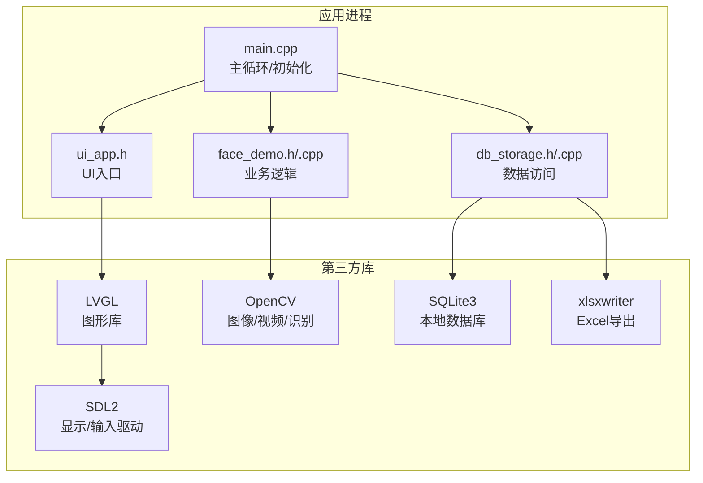
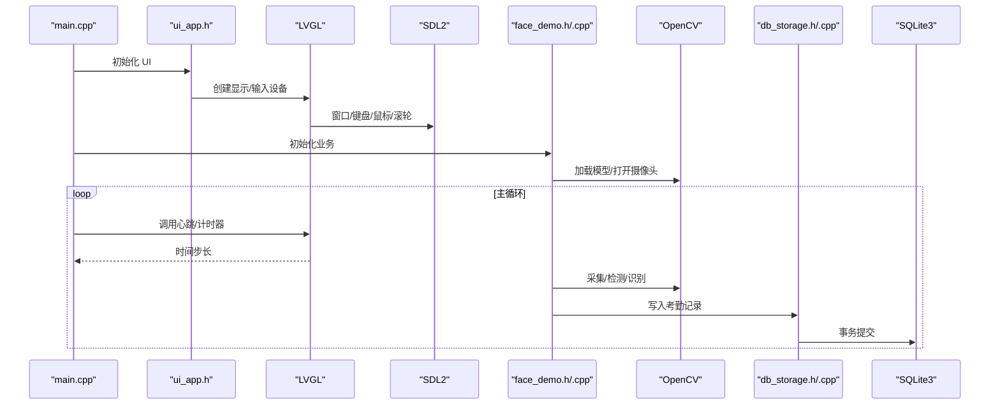
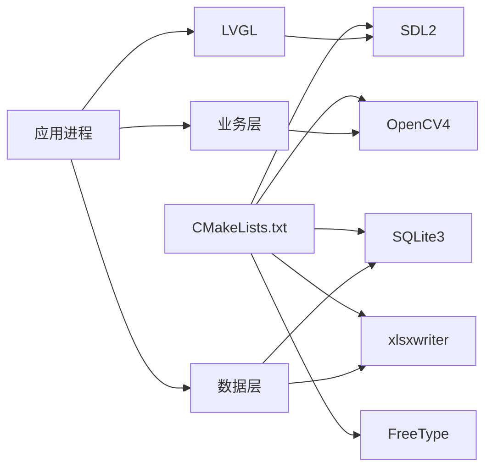

# 技术栈架构

<cite>
**本文引用的文件**
- [CMakeLists.txt](file://CMakeLists.txt)
- [lv_conf.h](file://lv_conf.h)
- [main.cpp](file://src/main.cpp)
- [face_demo.h](file://src/business/face_demo.h)
- [face_demo.cpp](file://src/business/face_demo.cpp)
- [db_storage.h](file://src/data/db_storage.h)
- [db_storage.cpp](file://src/data/db_storage.cpp)
- [ui_app.h](file://src/ui/ui_app.h)
- [lv_sdl_window.c](file://libs/lvgl/src/drivers/sdl/lv_sdl_window.c)
- [lv_sdl_keyboard.c](file://libs/lvgl/src/drivers/sdl/lv_sdl_keyboard.c)
- [lv_sdl_mouse.c](file://libs/lvgl/src/drivers/sdl/lv_sdl_mouse.c)
- [lv_sdl_mousewheel.c](file://libs/lvgl/src/drivers/sdl/lv_sdl_mousewheel.c)
</cite>

## 目录
1. [简介](#简介)
2. [项目结构](#项目结构)
3. [核心组件](#核心组件)
4. [架构总览](#架构总览)
5. [详细组件分析](#详细组件分析)
6. [依赖关系分析](#依赖关系分析)
7. [性能考量](#性能考量)
8. [故障排查指南](#故障排查指南)
9. [结论](#结论)
10. [附录](#附录)

## 简介
本文件面向 SmartAttendance 智能考勤系统，系统采用 C++17 与 CMake 构建，核心技术栈包括：
- LVGL 图形库（配合 SDL2 显示驱动）用于本地嵌入式 UI
- OpenCV 计算机视觉库用于人脸检测与识别
- SQLite3 数据库用于本地持久化
- xlsxwriter 用于生成 Excel 报表

本文档从架构视角阐述技术栈的选型理由、版本兼容性与集成方案，解析各组件职责、性能特性与扩展能力，并提供配置指南、依赖管理与版本控制策略。

## 项目结构
项目采用“三层架构 + 多库协同”的组织方式：
- UI 层：基于 LVGL + SDL2 的本地窗口与输入设备抽象
- 业务层：OpenCV + 人脸识别模型 + 业务规则编排
- 数据层：SQLite3 + 事务与性能调优 + 导出报表

图表来源
- [main.cpp:187-246](file://src/main.cpp#L187-L246)
- [ui_app.h:8-12](file://src/ui/ui_app.h#L8-L12)
- [face_demo.h:34-194](file://src/business/face_demo.h#L34-L194)
- [db_storage.h:195-596](file://src/data/db_storage.h#L195-L596)

章节来源
- [CMakeLists.txt:112-146](file://CMakeLists.txt#L112-L146)
- [main.cpp:187-246](file://src/main.cpp#L187-L246)

## 核心组件
- LVGL + SDL2：负责窗口、输入设备、渲染管线与事件循环，提供 UI 基座
- OpenCV：负责视频采集、人脸检测、预处理与识别推理
- SQLite3：提供 ACID 事务、WAL 模式、索引与外键约束，支撑业务数据持久化
- xlsxwriter：将考勤统计与明细导出为 Excel 报表

章节来源
- [CMakeLists.txt:24-37](file://CMakeLists.txt#L24-L37)
- [lv_conf.h:90-110](file://lv_conf.h#L90-L110)
- [main.cpp:18-23](file://src/main.cpp#L18-L23)

## 架构总览
系统运行时序如下：主程序初始化 UI、业务与数据层，随后进入 LVGL 驱动的心跳循环，业务层在后台线程进行视频采集与识别，识别结果通过 UI 层展示并落库。

图表来源
- [main.cpp:213-238](file://src/main.cpp#L213-L238)
- [face_demo.cpp:31-212](file://src/business/face_demo.cpp#L31-L212)
- [db_storage.cpp:117-136](file://src/data/db_storage.cpp#L117-L136)

## 详细组件分析

### LVGL + SDL2 驱动
- 职责：提供窗口、输入设备抽象与渲染后端；在桌面环境下通过 SDL2 驱动实现显示与事件处理
- 集成要点：
  - 通过 CMake 查找 SDL2 与 FreeType，并将头文件与库链接至 LVGL
  - 通过 LVGL 的配置宏控制操作系统抽象与渲染路径
  - 项目中使用 SDL2 的窗口、键盘、鼠标与滚轮驱动文件
- 性能与扩展：
  - 支持软件渲染与多 draw unit，可根据硬件能力调整
  - 可切换到其他平台驱动（如帧缓冲、嵌入式 GPU），保持 UI 代码一致

章节来源
- [CMakeLists.txt:24-71](file://CMakeLists.txt#L24-L71)
- [lv_conf.h:100-110](file://lv_conf.h#L100-L110)
- [lv_sdl_window.c](file://libs/lvgl/src/drivers/sdl/lv_sdl_window.c)
- [lv_sdl_keyboard.c](file://libs/lvgl/src/drivers/sdl/lv_sdl_keyboard.c)
- [lv_sdl_mouse.c](file://libs/lvgl/src/drivers/sdl/lv_sdl_mouse.c)
- [lv_sdl_mousewheel.c](file://libs/lvgl/src/drivers/sdl/lv_sdl_mousewheel.c)

### OpenCV 计算机视觉
- 职责：视频采集、人脸检测（Haar）、预处理（直方图均衡化/裁剪/缩放）、识别（LBPH）
- 集成要点：
  - CMake 查找 OpenCV4 并启用 core/imgproc/videoio/highgui/objdetect/face/imgcodecs 组件
  - 业务层封装检测与识别流程，支持跳帧跟踪与置信度反馈
- 性能与扩展：
  - 通过参数化预处理配置（裁剪、CLAHE、ROI 增强）平衡准确率与速度
  - 可替换为 DNN 识别或更高精度模型，保持接口不变

章节来源
- [CMakeLists.txt:28-30](file://CMakeLists.txt#L28-L30)
- [face_demo.h:34-194](file://src/business/face_demo.h#L34-L194)
- [face_demo.cpp:175-212](file://src/business/face_demo.cpp#L175-L212)
- [face_demo.cpp:195-204](file://src/business/face_demo.cpp#L195-L204)
- [face_demo.cpp:206-212](file://src/business/face_demo.cpp#L206-L212)

### SQLite3 数据层
- 职责：提供部门、班次、用户、考勤记录、系统配置等表的增删改查与事务
- 集成要点：
  - CMake 查找 SQLite3 并链接；在数据层对 SQLite3 进行性能调优（WAL、synchronous、cache_size、temp_store、foreign_keys）
  - 通过 RAII 封装语句生命周期，提供读写锁保护
- 性能与扩展：
  - WAL 模式提升并发读写；外键约束保障数据一致性
  - 可扩展为远程数据库或分布式存储，保持 DAO 接口一致

章节来源
- [CMakeLists.txt:32-34](file://CMakeLists.txt#L32-L34)
- [db_storage.h:195-596](file://src/data/db_storage.h#L195-L596)
- [db_storage.cpp:117-136](file://src/data/db_storage.cpp#L117-L136)
- [db_storage.cpp:1439-1481](file://src/data/db_storage.cpp#L1439-L1481)

### xlsxwriter 报表导出
- 职责：将考勤统计与明细导出为 Excel 文件，便于人工核对与审计
- 集成要点：
  - CMake 通过 pkg_check_modules 查找 xlsxwriter 并链接
  - 数据层提供批量查询接口，业务层触发导出流程

章节来源
- [CMakeLists.txt:36-37](file://CMakeLists.txt#L36-L37)
- [db_storage.h:580-596](file://src/data/db_storage.h#L580-L596)

### UI 应用入口与主循环
- 职责：初始化 UI、业务与数据层，驱动 LVGL 心跳，处理信号与退出流程
- 集成要点：
  - 禁用系统屏保与休眠，保证设备常亮
  - 通过 LVGL 的计时器与 tick 推进 UI 更新

章节来源
- [ui_app.h:8-12](file://src/ui/ui_app.h#L8-L12)
- [main.cpp:187-246](file://src/main.cpp#L187-L246)

## 依赖关系分析
- 构建时依赖：CMake 通过 pkg_check_modules/find_package 解析 SDL2、FreeType、OpenCV、SQLite3、xlsxwriter
- 运行时依赖：UI 层依赖 LVGL + SDL2；业务层依赖 OpenCV；数据层依赖 SQLite3；报表依赖 xlsxwriter
- 版本与兼容性：
  - OpenCV 4：通过 find_package 自动定位 /usr/include/opencv4
  - SQLite3：使用 SQLite::SQLite3 目标，具备标准头文件与库路径
  - SDL2：通过 pkg-config 获取 include 与 lib 路径
  - xlsxwriter：通过 pkg-config 获取头文件与库

图表来源
- [CMakeLists.txt:19-37](file://CMakeLists.txt#L19-L37)
- [CMakeLists.txt:139-146](file://CMakeLists.txt#L139-L146)

章节来源
- [CMakeLists.txt:19-37](file://CMakeLists.txt#L19-L37)
- [CMakeLists.txt:139-146](file://CMakeLists.txt#L139-L146)

## 性能考量
- LVGL
  - 通过配置宏控制渲染路径与 draw unit 数量，合理设置刷新周期与内存对齐
  - 在桌面环境可启用软件渲染，必要时考虑 GPU 加速（如 VG-Lite/OpenGLES）
- OpenCV
  - 通过预处理配置（裁剪、缩放、直方图均衡化、CLAHE）降低计算开销
  - 采用跳帧跟踪策略，在保证交互体验的同时降低 CPU 占用
- SQLite3
  - WAL 模式 + NORMAL 同步 + 内存临时存储 + 外键约束，兼顾性能与可靠性
  - 大批量导入使用事务接口，显著提升吞吐
- xlsxwriter
  - 导出流程异步化，避免阻塞 UI 主循环

章节来源
- [lv_conf.h:145-167](file://lv_conf.h#L145-L167)
- [face_demo.cpp:145-167](file://src/business/face_demo.cpp#L145-L167)
- [db_storage.cpp:117-136](file://src/data/db_storage.cpp#L117-L136)
- [db_storage.h:464-474](file://src/data/db_storage.h#L464-L474)

## 故障排查指南
- 依赖未找到
  - 确认系统已安装 SDL2、FreeType、OpenCV4、SQLite3、xlsxwriter，并可通过 pkg-config 查到
  - CMake 输出包含各库的路径与版本信息，可据此定位缺失
- OpenCV 模型文件
  - 业务层会在多个路径查找 Haar 分类器 XML 文件，确认文件存在或调整路径
- SQLite3 初始化失败
  - 检查数据库文件权限与路径；查看 PRAGMA 设置是否生效
- UI 无显示或无输入
  - 确认 SDL2 窗口创建成功，键盘/鼠标驱动可用；检查 LVGL 配置与刷新周期

章节来源
- [CMakeLists.txt:149-152](file://CMakeLists.txt#L149-L152)
- [face_demo.cpp:175-184](file://src/business/face_demo.cpp#L175-L184)
- [db_storage.cpp:117-122](file://src/data/db_storage.cpp#L117-L122)
- [lv_conf.h:90-110](file://lv_conf.h#L90-L110)

## 结论
SmartAttendance 采用“LVGL + SDL2 + OpenCV + SQLite3 + xlsxwriter”的组合，形成清晰的 UI、业务与数据分层。该技术栈在桌面环境下具备良好的可移植性与扩展性，满足本地化部署与实时识别需求。后续可在以下方向演进：
- 将 UI 层迁移到嵌入式平台（帧缓冲/触摸屏），保持业务与数据层不变
- 将识别模型升级为 DNN 或更高精度算法，同时保留业务接口
- 将 SQLite3 替换为远程数据库或分布式存储，通过适配层维持 DAO 接口一致

## 附录

### 技术栈选型与替代方案对比
- LVGL vs 其他 UI 框架
  - 优势：轻量、跨平台、事件驱动、可裁剪；适合嵌入式与资源受限场景
  - 替代：Qt/WxWidgets 更适合复杂桌面应用，但体积与资源占用更大
- OpenCV vs 其他 CV 库
  - 优势：生态成熟、模块丰富、跨平台；Haar/LBPH 算法简单易用
  - 替代：MediaPipe/DNN 模型更精准，但部署与性能优化成本更高
- SQLite3 vs 其他数据库
  - 优势：零配置、ACID、WAL 并发、嵌入式友好
  - 替代：MySQL/PostgreSQL 适合高并发场景，但部署与运维复杂度更高
- xlsxwriter vs 其他报表库
  - 优势：纯 C 实现、易于集成、轻量
  - 替代：libreoffice 或在线服务，但增加外部依赖与网络耦合

### 版本兼容性与集成要点
- OpenCV 4：通过 find_package 自动定位头文件与库，组件按需启用
- SQLite3：使用 SQLite::SQLite3 目标，确保头文件与库路径正确
- SDL2：通过 pkg-config 获取 include 与 lib，确保桌面环境可用
- xlsxwriter：通过 pkg-config 获取头文件与库，链接至应用目标

章节来源
- [CMakeLists.txt:28-37](file://CMakeLists.txt#L28-L37)
- [CMakeLists.txt:139-146](file://CMakeLists.txt#L139-L146)