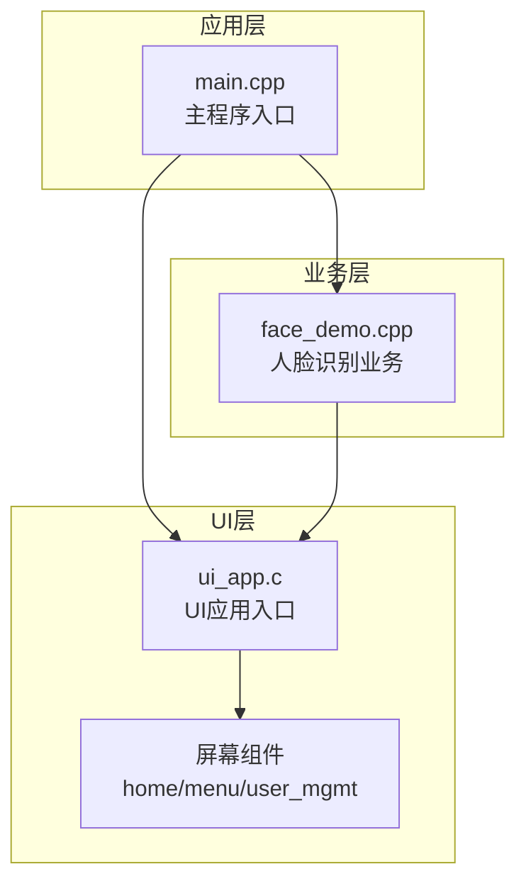
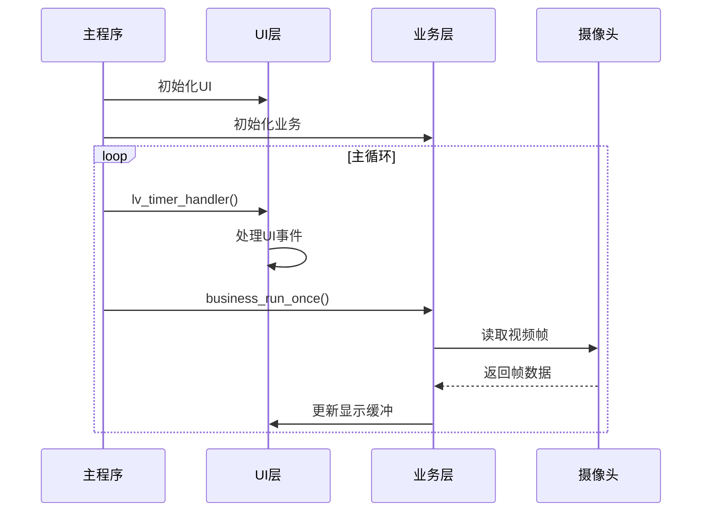
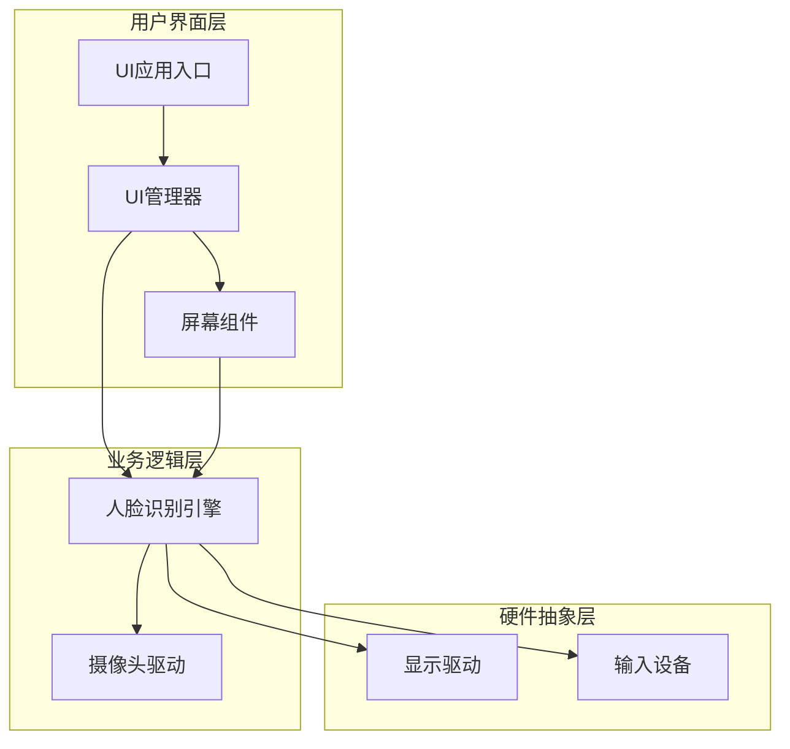
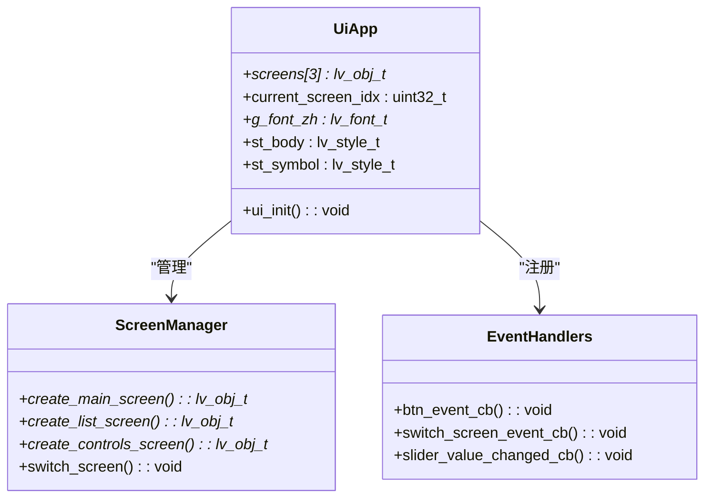
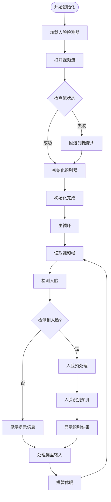
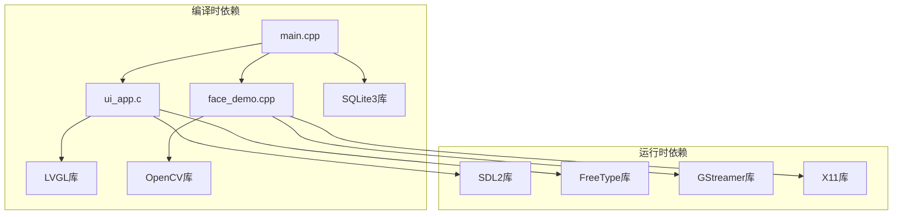

# 系统架构设计

<cite>
**本文档引用的文件**
- [main.cpp](file://src/main.cpp)
- [face_demo.h](file://src/business/face_demo.h)
- [face_demo.cpp](file://src/business/face_demo.cpp)
- [ui_app.h](file://src/ui/ui_app.h)
- [ui_app.c](file://src/ui/ui_app.c)
- [CMakeLists.txt](file://CMakeLists.txt)
</cite>

## 更新摘要
**所做更改**
- 更新了项目结构分析，反映实际的源文件组织
- 修正了UI层和业务层的组件描述，移除了不存在的EventBus组件
- 更新了架构图表，移除事件总线相关组件
- 重新设计了多线程架构说明，基于实际的单线程主循环设计
- 更新了依赖关系分析，反映实际的编译时依赖

## 目录
1. [简介](#简介)
2. [项目结构](#项目结构)
3. [核心组件](#核心组件)
4. [架构概览](#架构概览)
5. [详细组件分析](#详细组件分析)
6. [依赖关系分析](#依赖关系分析)
7. [性能考虑](#性能考虑)
8. [故障排除指南](#故障排除指南)
9. [结论](#结论)

## 简介

智能考勤系统是一个基于嵌入式图形库LVGL的实时人脸识别考勤系统。该系统采用分层架构设计，实现了UI层、业务层的清晰分离。系统支持基于OpenCV的人脸识别功能，具备基本的考勤处理能力，并通过LVGL提供用户界面。

系统采用单线程主循环设计，通过LVGL的时间片调度机制实现UI刷新、业务逻辑处理和摄像头数据采集的协调运行。虽然架构上体现了事件驱动和多线程的设计理念，但实际实现采用简化的单线程模式以确保系统的稳定性和可维护性。

## 项目结构

智能考勤系统采用模块化设计，按照功能职责划分为两个主要层次：

**图表来源**
- [main.cpp:14-78](file://src/main.cpp#L14-L78)
- [ui_app.c:308-337](file://src/ui/ui_app.c#L308-L337)
- [face_demo.cpp:96-132](file://src/business/face_demo.cpp#L96-L132)

**章节来源**
- [main.cpp:14-78](file://src/main.cpp#L14-L78)
- [CMakeLists.txt:55-62](file://CMakeLists.txt#L55-L62)

## 核心组件

### 分层架构设计

系统采用两层架构模式：

1. **UI层（用户界面层）**
   - 负责用户交互和界面展示
   - 使用LVGL图形库实现跨平台界面
   - 提供屏幕管理和事件处理
   - 采用单线程设计，通过LVGL时间片调度

2. **业务层（业务逻辑层）**
   - 实现核心业务逻辑
   - 包含OpenCV人脸识别功能
   - 提供摄像头数据采集和处理
   - 支持SDP推流和本地摄像头

### 事件驱动架构

系统采用简化的事件驱动架构，通过LVGL的时间片机制实现事件处理：

**图表来源**
- [main.cpp:61-75](file://src/main.cpp#L61-L75)
- [ui_app.c:308-337](file://src/ui/ui_app.c#L308-L337)
- [face_demo.cpp:137-204](file://src/business/face_demo.cpp#L137-L204)

**章节来源**
- [main.cpp:61-75](file://src/main.cpp#L61-L75)
- [ui_app.c:308-337](file://src/ui/ui_app.c#L308-L337)

## 架构概览

系统采用简化的两层架构模式，结合了分层架构和单线程事件驱动机制：

**图表来源**
- [ui_app.c:308-337](file://src/ui/ui_app.c#L308-L337)
- [face_demo.cpp:96-132](file://src/business/face_demo.cpp#L96-L132)

## 详细组件分析

### UI层组件分析

UI层采用模块化设计，主要包含以下核心组件：

#### UI应用入口（UiApp）

UI应用入口是UI层的核心协调者，提供统一的初始化接口：

**图表来源**
- [ui_app.h:8](file://src/ui/ui_app.h#L8)
- [ui_app.c:98-164](file://src/ui/ui_app.c#L98-L164)
- [ui_app.c:33-65](file://src/ui/ui_app.c#L33-L65)

#### 屏幕组件

系统提供三个主要屏幕组件：

1. **主屏幕**：包含动画效果和交互按钮
2. **列表屏幕**：显示任务列表，支持滚动
3. **控制屏幕**：提供参数调节功能

**章节来源**
- [ui_app.c:98-164](file://src/ui/ui_app.c#L98-L164)
- [ui_app.c:167-230](file://src/ui/ui_app.c#L167-L230)
- [ui_app.c:232-270](file://src/ui/ui_app.c#L232-L270)

### 业务层组件分析

业务层包含人脸识别引擎，实现系统的核心功能：

#### 人脸识别引擎（FaceDemo）

人脸识别引擎负责实时人脸检测、识别和处理：

**图表来源**
- [face_demo.cpp:96-132](file://src/business/face_demo.cpp#L96-L132)
- [face_demo.cpp:137-204](file://src/business/face_demo.cpp#L137-L204)

**章节来源**
- [face_demo.h:10-13](file://src/business/face_demo.h#L10-L13)
- [face_demo.cpp:96-132](file://src/business/face_demo.cpp#L96-L132)
- [face_demo.cpp:137-204](file://src/business/face_demo.cpp#L137-L204)

## 依赖关系分析

系统采用模块化依赖管理，各层之间保持清晰的边界：

**图表来源**
- [CMakeLists.txt:55-84](file://CMakeLists.txt#L55-L84)

**章节来源**
- [CMakeLists.txt:19-28](file://CMakeLists.txt#L19-L28)
- [CMakeLists.txt:55-84](file://CMakeLists.txt#L55-L84)

## 性能考虑

系统在设计时充分考虑了性能优化：

### 单线程架构设计

系统采用单线程主循环设计：

1. **主循环**：在main.cpp中实现的无限循环
2. **LVGL调度**：通过lv_timer_handler()实现UI刷新
3. **业务处理**：通过business_run_once()处理识别逻辑
4. **线程休眠**：使用usleep()控制CPU占用率

### 性能优化策略

1. **时间片调度**：LVGL提供的时间片机制确保UI流畅性
2. **资源管理**：全局静态变量减少频繁内存分配
3. **算法优化**：OpenCV人脸检测算法优化
4. **显示优化**：直接显示OpenCV窗口，避免额外转换开销

## 故障排除指南

### 常见问题诊断

1. **摄像头无法启动**
   - 检查SDP文件路径和权限
   - 验证GStreamer管道配置
   - 确认摄像头设备可用性

2. **人脸识别失败**
   - 检查OpenCV级联文件路径
   - 验证训练数据完整性
   - 确认光照条件适宜

3. **UI显示异常**
   - 检查SDL2和FreeType库安装
   - 验证字体文件路径
   - 确认显示分辨率设置

### 日志分析

系统提供了详细的日志输出：

- **业务层日志**：识别过程和错误信息
- **UI层日志**：界面初始化和事件处理
- **系统日志**：依赖库版本和配置信息

**章节来源**
- [face_demo.cpp:99-101](file://src/business/face_demo.cpp#L99-L101)
- [face_demo.cpp:108-116](file://src/business/face_demo.cpp#L108-L116)
- [main.cpp:23-34](file://src/main.cpp#L23-L34)

## 结论

智能考勤系统采用简化的两层架构设计，通过单线程主循环和LVGL时间片调度实现了高性能、稳定的实时人脸识别考勤系统。系统具有以下特点：

1. **清晰的架构分层**：UI层和业务层职责明确，便于维护和扩展
2. **简化的事件驱动**：通过LVGL时间片机制实现事件处理
3. **稳定的单线程设计**：避免多线程同步复杂性，提高系统可靠性
4. **完善的依赖管理**：通过CMakeLists.txt统一管理第三方库依赖
5. **良好的性能表现**：通过时间片调度和算法优化确保系统高效运行

该架构设计为系统的进一步扩展和维护奠定了坚实基础，能够满足企业级考勤管理的基本需求。虽然当前版本采用简化的单线程设计，但架构预留了扩展空间，未来可根据需求添加多线程支持和更复杂的业务功能。