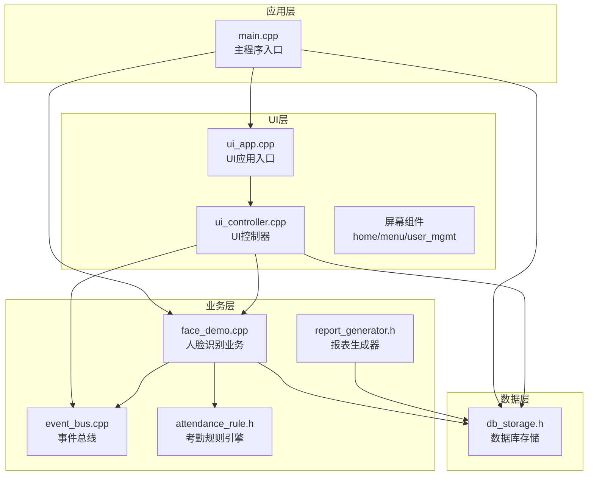
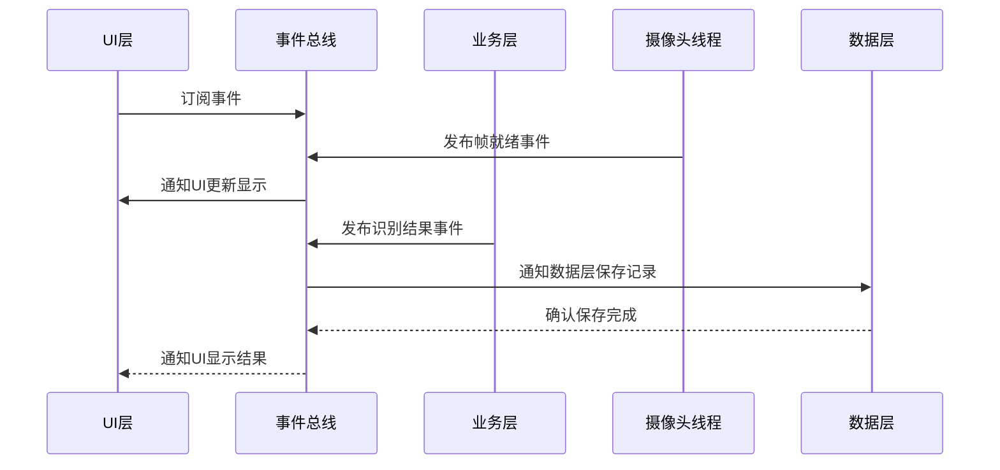
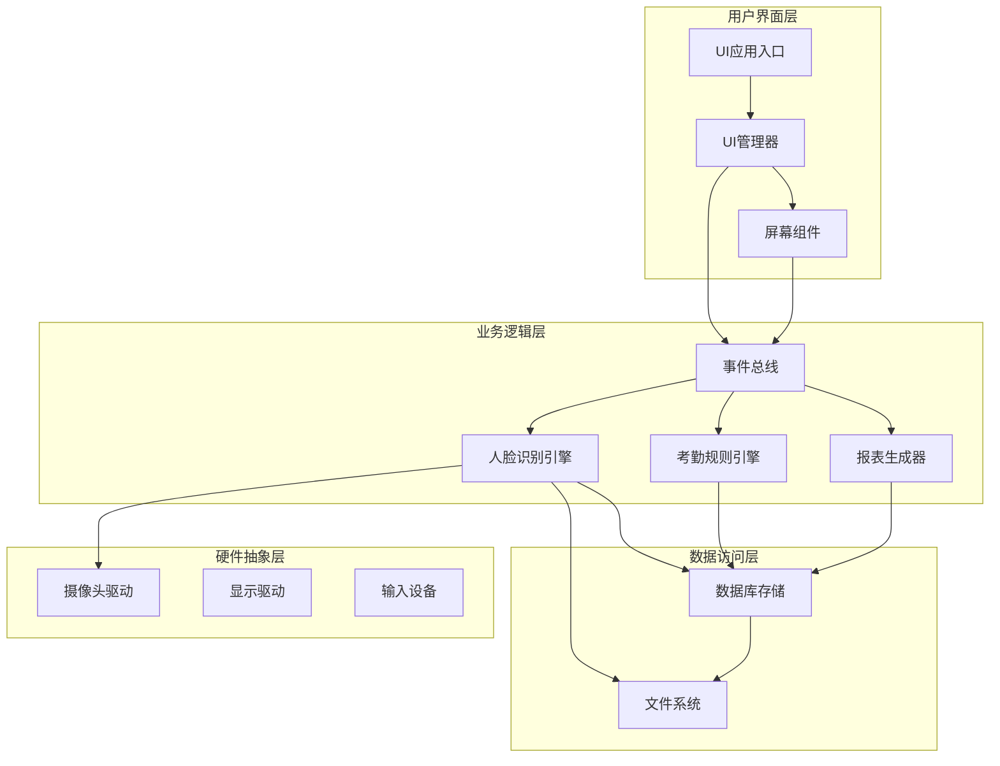
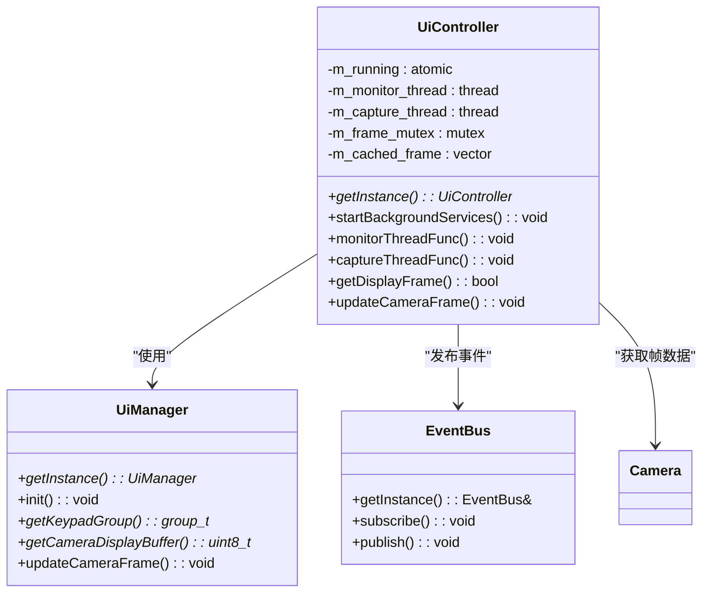
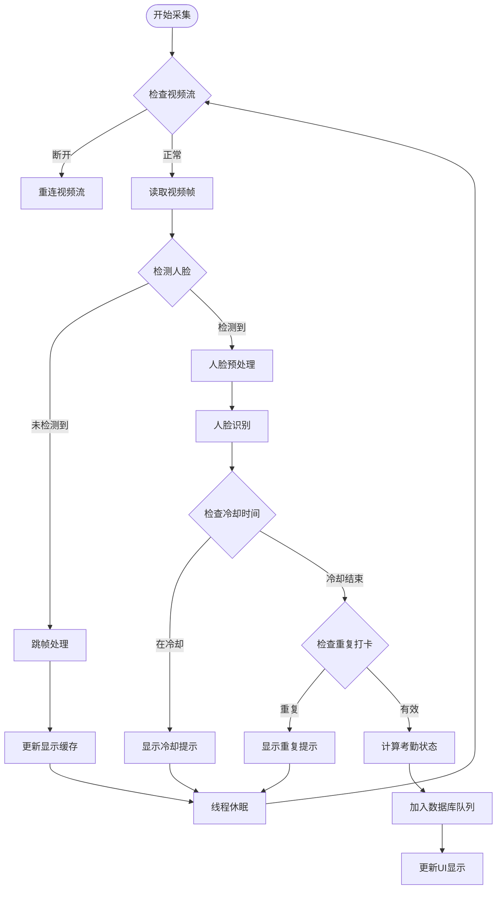
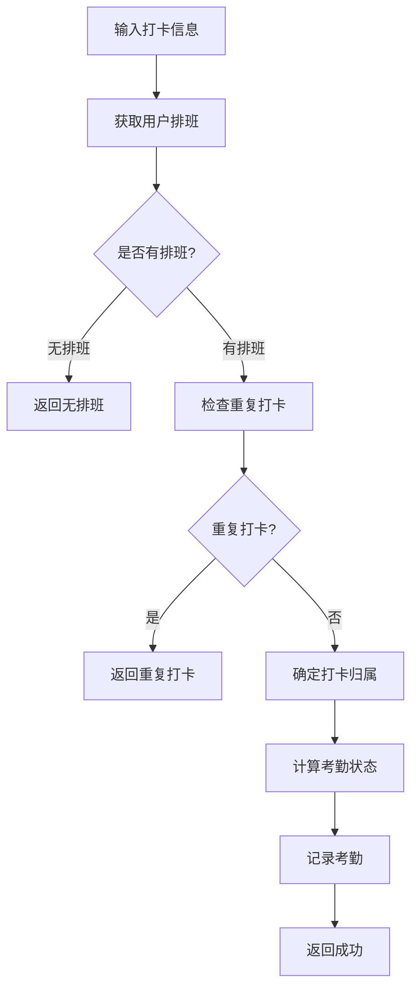
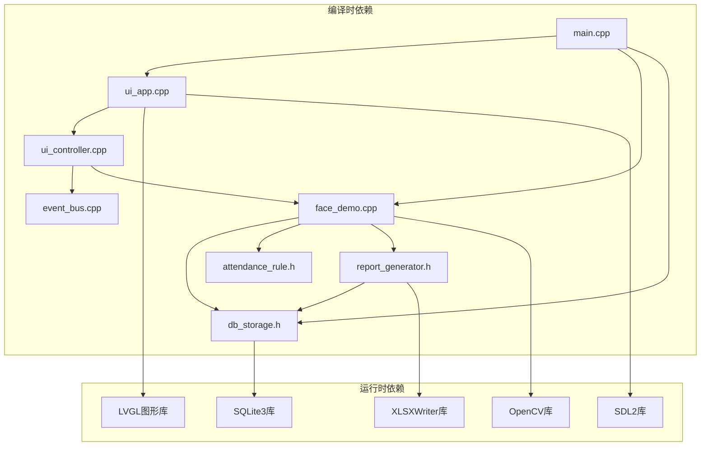

# 系统架构设计

<cite>
**本文档引用的文件**
- [main.cpp](file://src/main.cpp)
- [event_bus.h](file://src/business/event_bus.h)
- [event_bus.cpp](file://src/business/event_bus.cpp)
- [ui_controller.h](file://src/ui/ui_controller.h)
- [ui_controller.cpp](file://src/ui/ui_controller.cpp)
- [face_demo.h](file://src/business/face_demo.h)
- [face_demo.cpp](file://src/business/face_demo.cpp)
- [db_storage.h](file://src/data/db_storage.h)
- [ui_app.h](file://src/ui/ui_app.h)
- [ui_app.cpp](file://src/ui/ui_app.cpp)
- [attendance_rule.h](file://src/business/attendance_rule.h)
- [report_generator.h](file://src/business/report_generator.h)
- [CMakeLists.txt](file://CMakeLists.txt)
</cite>

## 目录
1. [简介](#简介)
2. [项目结构](#项目结构)
3. [核心组件](#核心组件)
4. [架构概览](#架构概览)
5. [详细组件分析](#详细组件分析)
6. [依赖关系分析](#依赖关系分析)
7. [性能考虑](#性能考虑)
8. [故障排除指南](#故障排除指南)
9. [结论](#结论)

## 简介

智能考勤系统是一个基于嵌入式图形库LVGL的实时人脸识别考勤系统。该系统采用分层架构设计，实现了UI层、业务层、数据层的清晰分离，同时采用了事件驱动架构和多线程并发处理机制，确保系统的实时性、可靠性和可扩展性。

系统支持多种认证方式（人脸识别、刷卡、指纹），具备完整的考勤规则引擎、报表生成功能和设备管理能力。通过事件总线实现组件间的松耦合通信，通过多线程架构确保摄像头采集、人脸识别、UI渲染和数据处理的并行执行。

## 项目结构

智能考勤系统采用模块化设计，按照功能职责划分为三个主要层次：



**图表来源**
- [main.cpp:187-246](file://src/main.cpp#L187-L246)
- [ui_app.cpp:34-94](file://src/ui/ui_app.cpp#L34-L94)
- [ui_controller.cpp:380-391](file://src/ui/ui_controller.cpp#L380-L391)

**章节来源**
- [main.cpp:187-246](file://src/main.cpp#L187-L246)
- [CMakeLists.txt:84-112](file://CMakeLists.txt#L84-L112)

## 核心组件

### 分层架构设计

系统采用经典的三层架构模式：

1. **UI层（用户界面层）**
   - 负责用户交互和界面展示
   - 使用LVGL图形库实现跨平台界面
   - 提供屏幕管理和事件处理

2. **业务层（业务逻辑层）**
   - 实现核心业务逻辑
   - 包含人脸识别、考勤规则计算、报表生成等功能
   - 提供线程安全的数据访问接口

3. **数据层（数据访问层）**
   - 封装数据库操作
   - 提供DAO模式的数据访问接口
   - 支持SQLite数据库和文件系统

### 事件驱动架构

系统采用事件驱动架构，通过EventBus实现组件间的松耦合通信：



**图表来源**
- [event_bus.cpp:14-28](file://src/business/event_bus.cpp#L14-L28)
- [face_demo.cpp:522-527](file://src/business/face_demo.cpp#L522-L527)
- [ui_controller.cpp:394-410](file://src/ui/ui_controller.cpp#L394-L410)

**章节来源**
- [event_bus.h:23-41](file://src/business/event_bus.h#L23-L41)
- [event_bus.cpp:3-28](file://src/business/event_bus.cpp#L3-L28)

## 架构概览

系统采用混合架构模式，结合了分层架构、事件驱动架构和多线程架构：



**图表来源**
- [ui_app.cpp:34-94](file://src/ui/ui_app.cpp#L34-L94)
- [face_demo.cpp:557-694](file://src/business/face_demo.cpp#L557-L694)
- [db_storage.h:213-683](file://src/data/db_storage.h#L213-L683)

## 详细组件分析

### UI层组件分析

UI层采用模块化设计，主要包含以下核心组件：

#### UI控制器（UiController）

UI控制器是UI层的核心协调者，提供统一的业务接口：



**图表来源**
- [ui_controller.h:21-108](file://src/ui/ui_controller.h#L21-L108)
- [ui_controller.cpp:380-680](file://src/ui/ui_controller.cpp#L380-L680)

#### 事件总线（EventBus）

事件总线实现线程安全的事件发布订阅机制：

```mermaid
classDiagram
class EventBus {
-subscribers : map<EventType, vector<EventCallback>>
-mutex : mutex
+getInstance() : EventBus&
+subscribe(type, callback) : void
+publish(type, data) : void
}
class EventType {
<<enumeration>>
TIME_UPDATE
DISK_FULL
DISK_NORMAL
CAMERA_FRAME_READY
ENTER_HOME_SCREEN
LEAVE_HOME_SCREEN
}
class EventCallback {
<<typedef>>
function<void*(void*)>
}
EventBus --> EventType : "使用"
EventBus --> EventCallback : "存储"
```

**图表来源**
- [event_bus.h:10-41](file://src/business/event_bus.h#L10-L41)
- [event_bus.cpp:3-28](file://src/business/event_bus.cpp#L3-L28)

**章节来源**
- [ui_controller.h:21-108](file://src/ui/ui_controller.h#L21-L108)
- [ui_controller.cpp:380-680](file://src/ui/ui_controller.cpp#L380-L680)
- [event_bus.h:10-41](file://src/business/event_bus.h#L10-L41)

### 业务层组件分析

业务层包含多个核心模块，实现系统的主要业务逻辑：

#### 人脸识别引擎（FaceDemo）

人脸识别引擎是业务层的核心组件，负责实时人脸检测、识别和考勤处理：



**图表来源**
- [face_demo.cpp:291-549](file://src/business/face_demo.cpp#L291-L549)

#### 考勤规则引擎（AttendanceRule）

考勤规则引擎实现复杂的考勤计算逻辑：



**图表来源**
- [attendance_rule.h:43-89](file://src/business/attendance_rule.h#L43-L89)

**章节来源**
- [face_demo.cpp:291-549](file://src/business/face_demo.cpp#L291-L549)
- [attendance_rule.h:43-89](file://src/business/attendance_rule.h#L43-L89)

### 数据层组件分析

数据层提供统一的数据访问接口，封装了SQLite数据库操作：

#### 数据存储接口（DBStorage）

数据存储接口定义了完整的DAO模式：

```mermaid
erDiagram
USERS {
int id PK
string name
string password
string card_id
int role
int dept_id
int default_shift_id
string avatar_path
}
DEPARTMENTS {
int id PK
string name
}
SHIFTS {
int id PK
string name
string s1_start
string s1_end
string s2_start
string s2_end
string s3_start
string s3_end
int cross_day
}
ATTENDANCE {
int id PK
int user_id FK
long long timestamp
int status
string image_path
int minutes_late
int minutes_early
}
USERS ||--o{ ATTENDANCE : "has"
DEPARTMENTS ||--o{ USERS : "contains"
SHIFTS ||--o{ USERS : "default_shift"
```

**图表来源**
- [db_storage.h:16-212](file://src/data/db_storage.h#L16-L212)

**章节来源**
- [db_storage.h:213-683](file://src/data/db_storage.h#L213-L683)

## 依赖关系分析

系统采用模块化依赖管理，各层之间保持清晰的边界：



**图表来源**
- [CMakeLists.txt:107-148](file://CMakeLists.txt#L107-L148)

**章节来源**
- [CMakeLists.txt:107-148](file://CMakeLists.txt#L107-L148)

## 性能考虑

系统在设计时充分考虑了性能优化：

### 多线程架构设计

系统采用多线程并发处理机制：

1. **UI线程**：负责界面渲染和用户交互
2. **业务线程**：处理人脸识别和考勤逻辑
3. **摄像头线程**：专门负责视频流采集
4. **数据库线程**：异步处理数据写入

### 线程同步机制

系统使用多种同步机制确保线程安全：

- **互斥锁**：保护共享数据访问
- **原子变量**：实现无锁的线程间通信
- **条件变量**：实现生产者-消费者模式
- **线程池**：管理后台任务

### 性能优化策略

1. **跳帧处理**：减少CPU负载，提高识别效率
2. **异步写入**：数据库操作异步化，避免阻塞主线程
3. **缓存机制**：用户信息和模型数据缓存
4. **内存管理**：智能内存分配和回收

## 故障排除指南

### 常见问题诊断

1. **摄像头无法启动**
   - 检查视频流连接状态
   - 验证GStreamer管道配置
   - 确认权限设置

2. **人脸识别失败**
   - 检查光照条件
   - 验证模型文件完整性
   - 确认训练数据质量

3. **UI响应缓慢**
   - 检查线程同步问题
   - 监控内存使用情况
   - 优化渲染频率

### 日志分析

系统提供了详细的日志输出，便于问题诊断：

- **业务层日志**：识别过程和错误信息
- **数据层日志**：数据库操作和性能指标
- **UI层日志**：界面交互和事件处理

**章节来源**
- [face_demo.cpp:537-548](file://src/business/face_demo.cpp#L537-L548)

## 结论

智能考勤系统采用先进的分层架构设计，通过事件驱动和多线程技术实现了高性能、高可靠性的实时人脸识别考勤系统。系统具有以下特点：

1. **清晰的架构分层**：UI层、业务层、数据层职责明确，便于维护和扩展
2. **灵活的事件驱动**：通过EventBus实现组件间松耦合通信
3. **高效的多线程处理**：合理分配线程职责，确保系统实时性
4. **完善的错误处理**：全面的异常捕获和恢复机制
5. **良好的性能表现**：通过多种优化策略确保系统高效运行

该架构设计为系统的进一步扩展和维护奠定了坚实基础，能够满足企业级考勤管理的需求。