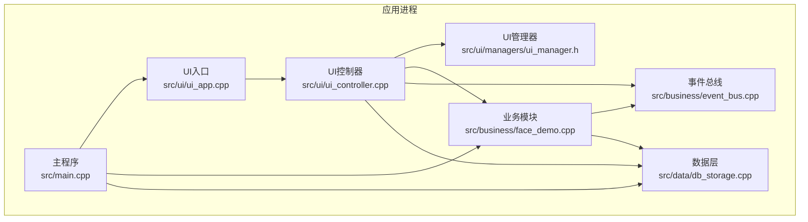
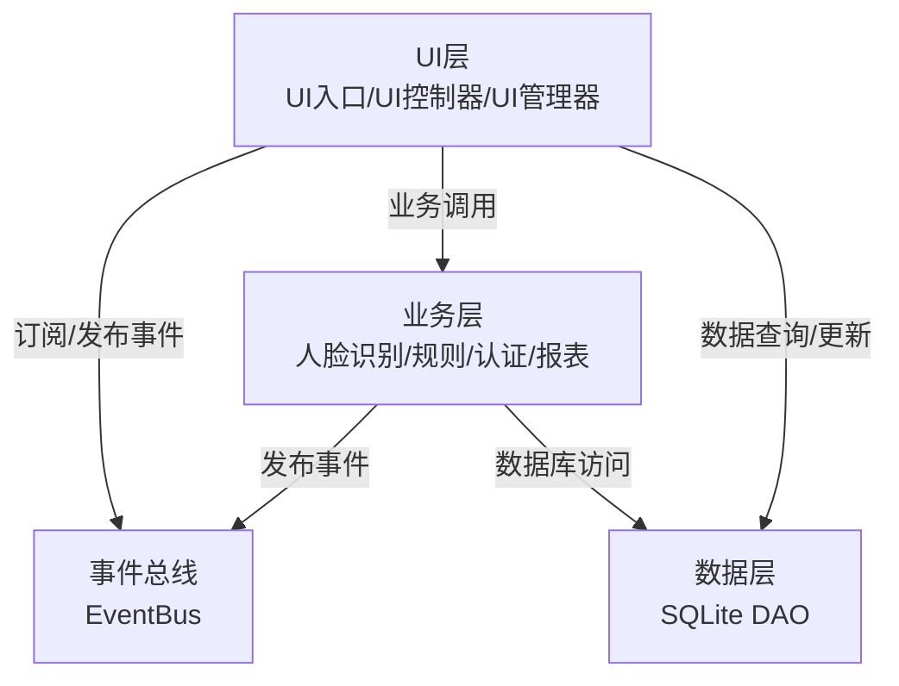
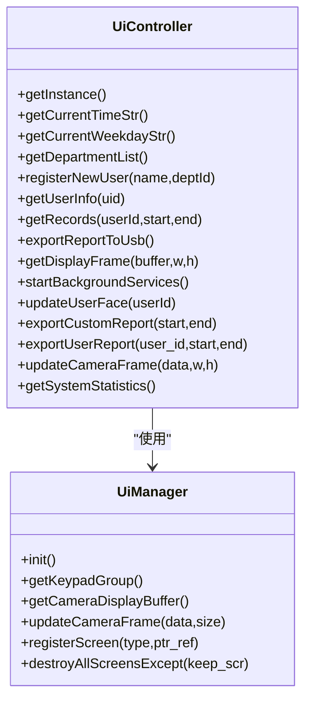
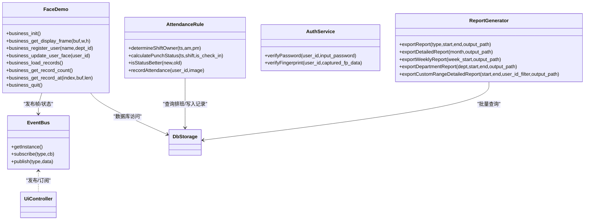
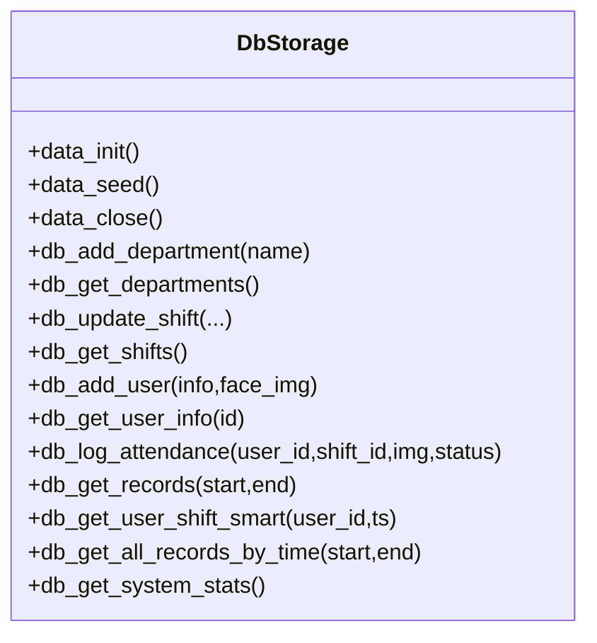
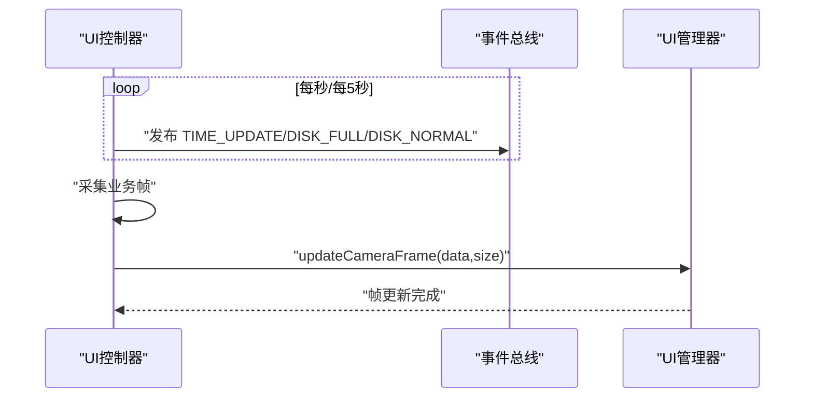
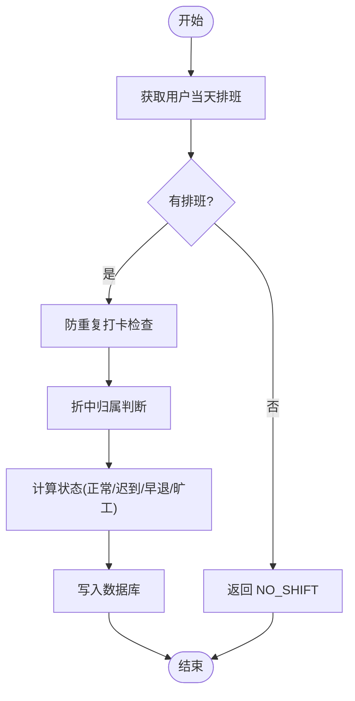
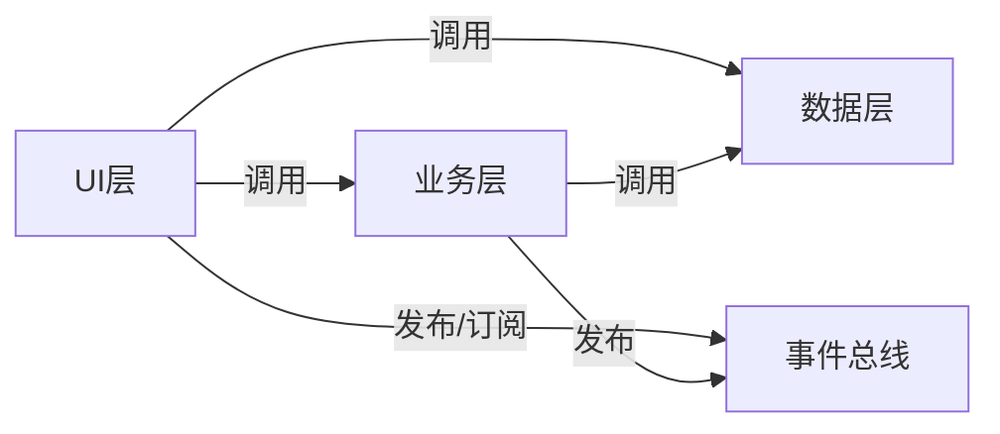

# 系统架构设计

<cite>
**本文引用的文件**
- [src/main.cpp](file://src/main.cpp)
- [src/ui/ui_app.h](file://src/ui/ui_app.h)
- [src/ui/ui_app.cpp](file://src/ui/ui_app.cpp)
- [src/ui/ui_controller.h](file://src/ui/ui_controller.h)
- [src/ui/ui_controller.cpp](file://src/ui/ui_controller.cpp)
- [src/ui/managers/ui_manager.h](file://src/ui/managers/ui_manager.h)
- [src/business/event_bus.h](file://src/business/event_bus.h)
- [src/business/event_bus.cpp](file://src/business/event_bus.cpp)
- [src/business/face_demo.h](file://src/business/face_demo.h)
- [src/business/face_demo.cpp](file://src/business/face_demo.cpp)
- [src/business/report_generator.h](file://src/business/report_generator.h)
- [src/business/auth_service.h](file://src/business/auth_service.h)
- [src/business/attendance_rule.h](file://src/business/attendance_rule.h)
- [src/data/db_storage.h](file://src/data/db_storage.h)
- [src/data/db_storage.cpp](file://src/data/db_storage.cpp)
</cite>

## 目录
1. [简介](#简介)
2. [项目结构](#项目结构)
3. [核心组件](#核心组件)
4. [架构总览](#架构总览)
5. [详细组件分析](#详细组件分析)
6. [依赖分析](#依赖分析)
7. [性能考量](#性能考量)
8. [故障排查指南](#故障排查指南)
9. [结论](#结论)
10. [附录](#附录)

## 简介
本文件为 SmartAttendance 智能考勤系统的架构文档，面向工程实践与技术演进需求，系统性阐述三层架构（UI层、业务层、数据层）的职责划分与交互机制，深入解析事件驱动架构（事件总线）如何实现模块解耦与扩展性，梳理系统边界、组件关系与数据流向，并总结技术决策、权衡与约束。文档同时给出系统上下文图、组件分解图与关键序列图，帮助读者快速把握系统全貌与落地细节。

## 项目结构
SmartAttendance 采用清晰的分层组织方式：
- UI层：负责图形界面、输入设备与屏幕管理，使用 LVGL 与 SDL 驱动仿真显示与输入。
- 业务层：封装人脸识别、考勤规则、报表生成、认证服务等核心业务逻辑。
- 数据层：基于 SQLite 的 DAO 层，提供部门、班次、用户、考勤记录等数据持久化能力。

图表来源
- [src/main.cpp:187-246](file://src/main.cpp#L187-L246)
- [src/ui/ui_app.cpp:34-94](file://src/ui/ui_app.cpp#L34-L94)
- [src/ui/ui_controller.cpp:362-417](file://src/ui/ui_controller.cpp#L362-L417)
- [src/business/event_bus.cpp:1-28](file://src/business/event_bus.cpp#L1-L28)
- [src/data/db_storage.cpp:108-285](file://src/data/db_storage.cpp#L108-L285)

章节来源
- [src/main.cpp:187-246](file://src/main.cpp#L187-L246)
- [src/ui/ui_app.cpp:34-94](file://src/ui/ui_app.cpp#L34-L94)
- [src/ui/ui_controller.cpp:362-417](file://src/ui/ui_controller.cpp#L362-L417)
- [src/business/event_bus.cpp:1-28](file://src/business/event_bus.cpp#L1-L28)
- [src/data/db_storage.cpp:108-285](file://src/data/db_storage.cpp#L108-L285)

## 核心组件
- 主程序入口：负责系统初始化、环境检查、UI与业务初始化、主循环与资源回收。
- UI层：UI入口负责 LVGL/SDL 初始化与屏幕加载；UI控制器封装业务调用、线程与事件发布；UI管理器负责屏幕与摄像头缓冲区管理。
- 业务层：事件总线提供线程安全的发布/订阅；人脸识别模块负责采集、预处理、识别与打卡写库；考勤规则引擎负责状态计算；认证服务负责密码/指纹验证；报表生成器负责导出 Excel。
- 数据层：SQLite + C++/C 接口，提供完整的 DAO 能力与播种初始化。

章节来源
- [src/main.cpp:187-246](file://src/main.cpp#L187-L246)
- [src/ui/ui_app.cpp:34-94](file://src/ui/ui_app.cpp#L34-L94)
- [src/ui/ui_controller.h:21-106](file://src/ui/ui_controller.h#L21-L106)
- [src/ui/ui_controller.cpp:1-417](file://src/ui/ui_controller.cpp#L1-L417)
- [src/ui/managers/ui_manager.h:71-156](file://src/ui/managers/ui_manager.h#L71-L156)
- [src/business/event_bus.h:21-41](file://src/business/event_bus.h#L21-L41)
- [src/business/event_bus.cpp:1-28](file://src/business/event_bus.cpp#L1-L28)
- [src/business/face_demo.h:34-196](file://src/business/face_demo.h#L34-L196)
- [src/business/face_demo.cpp:1-200](file://src/business/face_demo.cpp#L1-L200)
- [src/business/attendance_rule.h:43-92](file://src/business/attendance_rule.h#L43-L92)
- [src/business/auth_service.h:23-46](file://src/business/auth_service.h#L23-L46)
- [src/business/report_generator.h:33-221](file://src/business/report_generator.h#L33-L221)
- [src/data/db_storage.h:18-596](file://src/data/db_storage.h#L18-L596)
- [src/data/db_storage.cpp:108-285](file://src/data/db_storage.cpp#L108-L285)

## 架构总览
SmartAttendance 采用典型的三层架构与事件驱动解耦：
- UI层：仅负责展示与交互，通过 UI 控制器封装业务调用，避免直接依赖业务/数据层。
- 业务层：集中处理人脸识别、规则计算、认证与报表生成，通过事件总线对外广播系统事件。
- 数据层：提供统一的 DAO 接口，内置播种与性能优化（WAL、索引、预编译语句）。
- 事件驱动：UI 控制器与业务模块通过事件总线解耦，实现时间、磁盘状态与摄像头帧的异步分发。

图表来源
- [src/ui/ui_controller.cpp:376-417](file://src/ui/ui_controller.cpp#L376-L417)
- [src/business/event_bus.h:21-41](file://src/business/event_bus.h#L21-L41)
- [src/business/event_bus.cpp:1-28](file://src/business/event_bus.cpp#L1-L28)
- [src/data/db_storage.cpp:108-285](file://src/data/db_storage.cpp#L108-L285)

## 详细组件分析

### UI层组件
- UI入口：负责 LVGL/SDL 初始化、输入设备绑定、样式与管理器初始化、加载主页。
- UI控制器：封装系统状态、用户管理、记录查询、报表导出、摄像头帧获取与更新、后台线程启动与事件订阅。
- UI管理器：提供屏幕注册与销毁、按键组管理、摄像头帧缓冲区与原子帧标记，保障多线程安全。

图表来源
- [src/ui/managers/ui_manager.h:71-156](file://src/ui/managers/ui_manager.h#L71-L156)
- [src/ui/ui_controller.h:21-106](file://src/ui/ui_controller.h#L21-L106)
- [src/ui/ui_controller.cpp:1-417](file://src/ui/ui_controller.cpp#L1-L417)

章节来源
- [src/ui/ui_app.cpp:34-94](file://src/ui/ui_app.cpp#L34-L94)
- [src/ui/ui_controller.h:21-106](file://src/ui/ui_controller.h#L21-L106)
- [src/ui/ui_controller.cpp:1-417](file://src/ui/ui_controller.cpp#L1-L417)
- [src/ui/managers/ui_manager.h:71-156](file://src/ui/managers/ui_manager.h#L71-L156)

### 业务层组件
- 事件总线：单例、线程安全，支持订阅/发布系统事件（时间更新、磁盘状态、摄像头帧）。
- 人脸识别模块：负责摄像头采集、人脸检测与预处理、LBPH识别、训练样本管理、打卡任务队列与数据库写入线程。
- 考勤规则引擎：根据排班与时间计算打卡状态，支持折中归属与防重复打卡。
- 认证服务：提供密码与指纹 1:1 验证。
- 报表生成器：基于 xlsxwriter 导出汇总/明细/异常/部门等报表。

图表来源
- [src/business/event_bus.h:21-41](file://src/business/event_bus.h#L21-L41)
- [src/business/event_bus.cpp:1-28](file://src/business/event_bus.cpp#L1-L28)
- [src/business/face_demo.h:34-196](file://src/business/face_demo.h#L34-L196)
- [src/business/face_demo.cpp:1-200](file://src/business/face_demo.cpp#L1-L200)
- [src/business/attendance_rule.h:43-92](file://src/business/attendance_rule.h#L43-L92)
- [src/business/auth_service.h:23-46](file://src/business/auth_service.h#L23-L46)
- [src/business/report_generator.h:33-221](file://src/business/report_generator.h#L33-L221)
- [src/data/db_storage.h:18-596](file://src/data/db_storage.h#L18-L596)

章节来源
- [src/business/event_bus.h:21-41](file://src/business/event_bus.h#L21-L41)
- [src/business/event_bus.cpp:1-28](file://src/business/event_bus.cpp#L1-L28)
- [src/business/face_demo.h:34-196](file://src/business/face_demo.h#L34-L196)
- [src/business/face_demo.cpp:1-200](file://src/business/face_demo.cpp#L1-L200)
- [src/business/attendance_rule.h:43-92](file://src/business/attendance_rule.h#L43-L92)
- [src/business/auth_service.h:23-46](file://src/business/auth_service.h#L23-L46)
- [src/business/report_generator.h:33-221](file://src/business/report_generator.h#L33-L221)

### 数据层组件
- 数据层提供统一的 DAO 接口：部门、班次、用户、考勤记录、排班、系统配置、节假日等。
- 初始化流程包含 WAL 模式、索引、预编译语句与播种，确保性能与可用性。
- 采用共享/互斥锁实现读写分离，保障并发安全。

图表来源
- [src/data/db_storage.h:18-596](file://src/data/db_storage.h#L18-L596)
- [src/data/db_storage.cpp:108-285](file://src/data/db_storage.cpp#L108-L285)

章节来源
- [src/data/db_storage.h:18-596](file://src/data/db_storage.h#L18-L596)
- [src/data/db_storage.cpp:108-285](file://src/data/db_storage.cpp#L108-L285)

### 事件驱动与模块解耦
UI 控制器在后台线程中周期性发布系统事件（时间、磁盘状态），并通过事件总线将摄像头帧传递给 UI 管理器进行显示更新，实现 UI 与业务/数据层的解耦。

图表来源
- [src/ui/ui_controller.cpp:376-417](file://src/ui/ui_controller.cpp#L376-L417)
- [src/business/event_bus.cpp:1-28](file://src/business/event_bus.cpp#L1-L28)
- [src/ui/managers/ui_manager.h:84-103](file://src/ui/managers/ui_manager.h#L84-L103)

章节来源
- [src/ui/ui_controller.cpp:376-417](file://src/ui/ui_controller.cpp#L376-L417)
- [src/business/event_bus.cpp:1-28](file://src/business/event_bus.cpp#L1-L28)
- [src/ui/managers/ui_manager.h:84-103](file://src/ui/managers/ui_manager.h#L84-L103)

### 考勤流程与规则引擎
考勤规则引擎根据用户当天排班与打卡时间计算状态，遵循“无排班不写库”的原则，并支持防重复打卡与折中归属。

图表来源
- [src/business/attendance_rule.h:43-92](file://src/business/attendance_rule.h#L43-L92)
- [src/data/db_storage.cpp:503-504](file://src/data/db_storage.cpp#L503-L504)

章节来源
- [src/business/attendance_rule.h:43-92](file://src/business/attendance_rule.h#L43-L92)
- [src/data/db_storage.cpp:503-504](file://src/data/db_storage.cpp#L503-L504)

## 依赖分析
- 外部依赖：LVGL、OpenCV、SQLite3、xlsxwriter、SDL2。
- 内部耦合：UI 控制器依赖数据层与业务层；业务层依赖数据层与事件总线；UI 管理器仅依赖 UI 控制器提供的接口。
- 并发与线程：UI 控制器与业务模块各自维护后台线程，通过事件总线与互斥锁/原子变量协调。

图表来源
- [src/ui/ui_controller.cpp:1-417](file://src/ui/ui_controller.cpp#L1-L417)
- [src/business/event_bus.cpp:1-28](file://src/business/event_bus.cpp#L1-L28)
- [src/data/db_storage.cpp:108-285](file://src/data/db_storage.cpp#L108-L285)

章节来源
- [src/ui/ui_controller.cpp:1-417](file://src/ui/ui_controller.cpp#L1-L417)
- [src/business/event_bus.cpp:1-28](file://src/business/event_bus.cpp#L1-L28)
- [src/data/db_storage.cpp:108-285](file://src/data/db_storage.cpp#L108-L285)

## 性能考量
- 数据层性能优化：WAL 模式、索引、预编译语句、读写锁分离，降低锁竞争。
- UI与业务解耦：事件总线与后台线程避免阻塞主循环，保证 LVGL 响应。
- 图像处理：预处理配置可选直方图均衡化与 ROI 增强，兼顾识别精度与实时性。
- 报表导出：批量查询与分表写入，避免 UI 阻塞。

## 故障排查指南
- 依赖检查失败：确认 OpenCV、SQLite3、LVGL 版本与头文件路径。
- SDL 窗口创建失败：检查 WSLg/桌面环境与 SDL2 开发包安装。
- 数据库初始化失败：检查权限与磁盘空间，查看日志输出。
- 人脸识别模型缺失：确认级联分类器文件路径存在。
- 报表导出失败：检查输出目录权限与 xlsxwriter 安装。

章节来源
- [src/main.cpp:49-59](file://src/main.cpp#L49-L59)
- [src/ui/ui_app.cpp:43-54](file://src/ui/ui_app.cpp#L43-L54)
- [src/data/db_storage.cpp:108-135](file://src/data/db_storage.cpp#L108-L135)
- [src/business/face_demo.cpp:175-184](file://src/business/face_demo.cpp#L175-L184)
- [src/business/report_generator.h:100-103](file://src/business/report_generator.h#L100-L103)

## 结论
SmartAttendance 通过清晰的三层架构与事件驱动解耦，实现了 UI、业务与数据的有效分离；数据层的性能优化与业务层的规则引擎共同保障了系统的稳定性与可扩展性。建议后续持续完善认证与安全策略、细化异常处理与日志体系，并在 CI 中集成自动化测试与性能基准。

## 附录
- 技术栈与版本兼容：LVGL、OpenCV、SQLite3、xlsxwriter、SDL2。
- 第三方依赖：通过 CMake/Makefile 管理，确保头文件与库路径正确。
- 系统上下文：主程序作为入口协调 UI、业务与数据模块，事件总线贯穿各层，形成松耦合的协作关系。