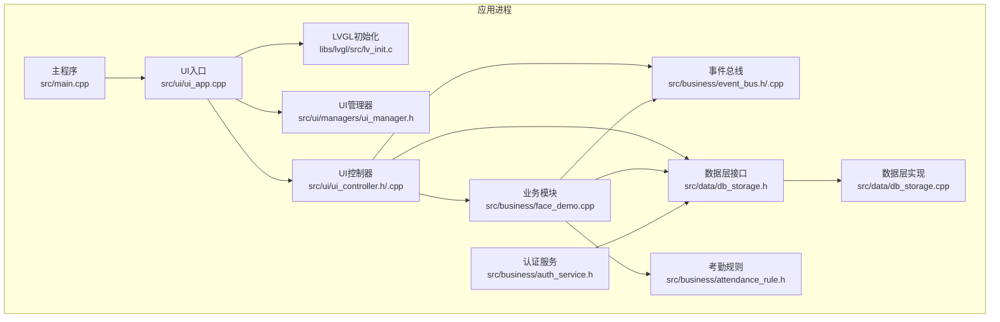
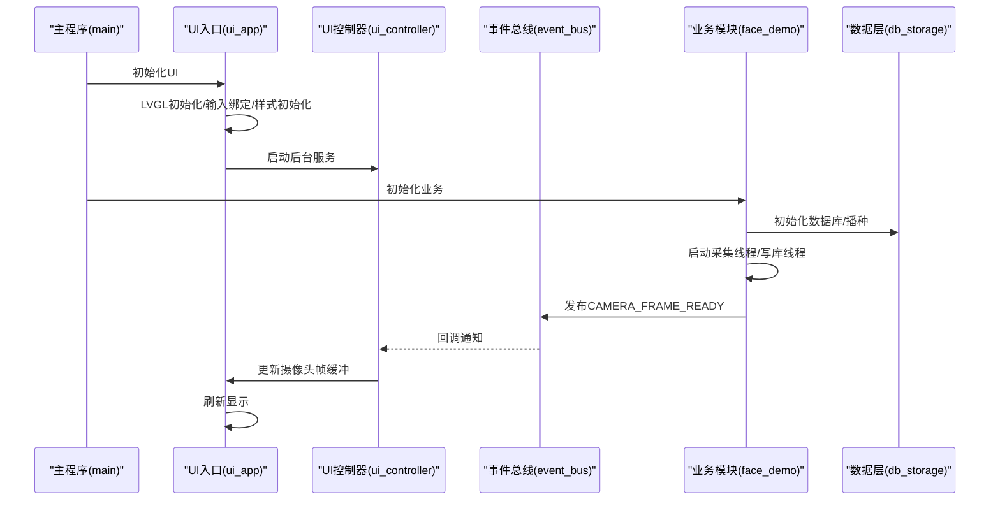
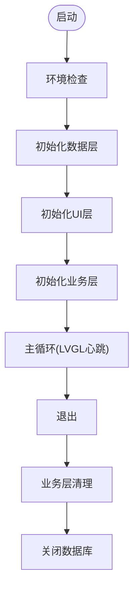
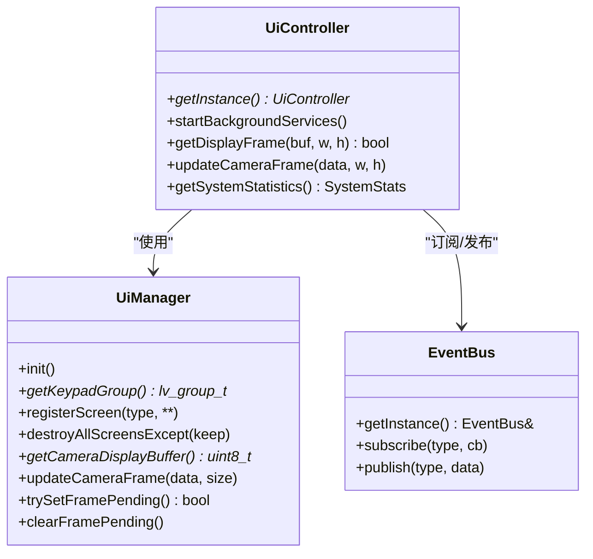
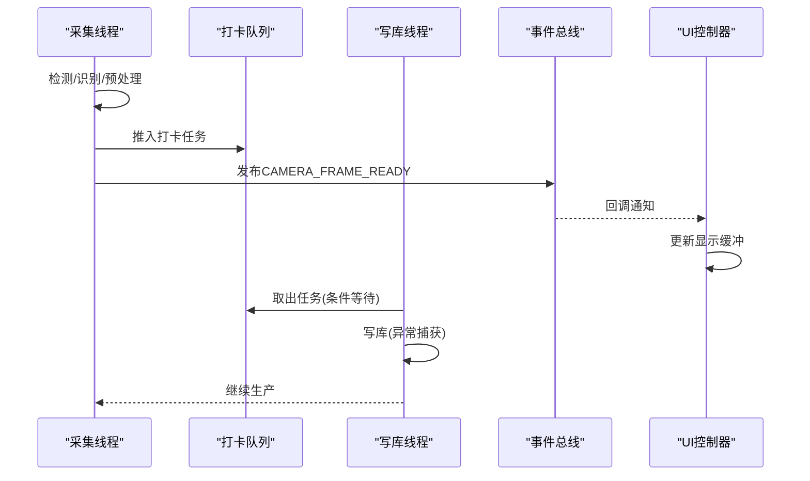
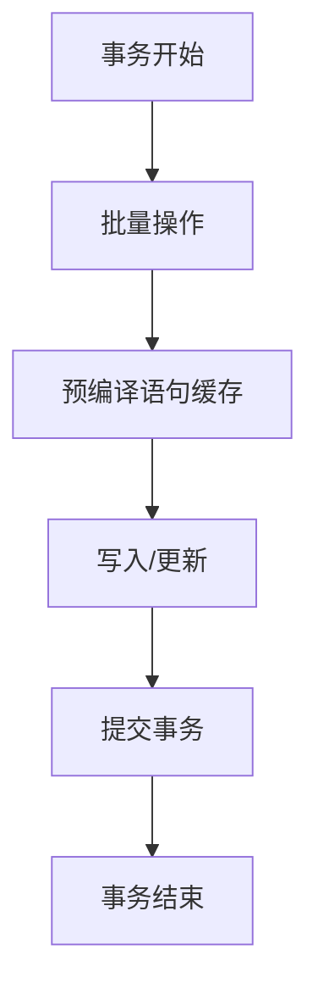
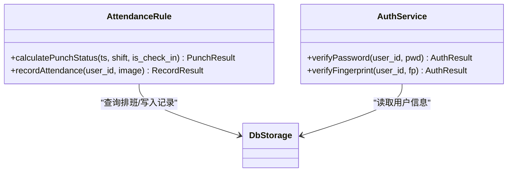
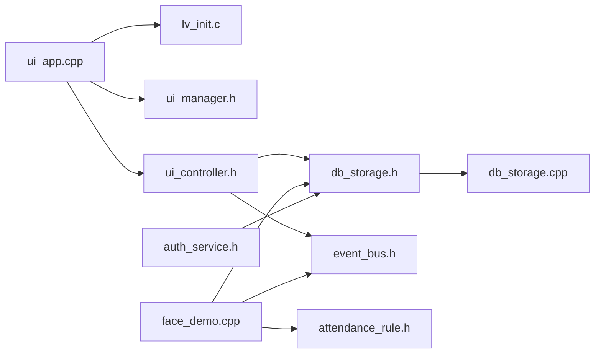

# 组件交互机制

<cite>
**本文档引用的文件**
- [src/main.cpp](file://src/main.cpp)
- [src/ui/ui_app.cpp](file://src/ui/ui_app.cpp)
- [src/ui/managers/ui_manager.h](file://src/ui/managers/ui_manager.h)
- [src/ui/ui_controller.h](file://src/ui/ui_controller.h)
- [src/ui/ui_controller.cpp](file://src/ui/ui_controller.cpp)
- [src/ui/screens/home/ui_scr_home.h](file://src/ui/screens/home/ui_scr_home.h)
- [src/business/face_demo.cpp](file://src/business/face_demo.cpp)
- [src/business/event_bus.h](file://src/business/event_bus.h)
- [src/business/event_bus.cpp](file://src/business/event_bus.cpp)
- [src/business/attendance_rule.h](file://src/business/attendance_rule.h)
- [src/business/auth_service.h](file://src/business/auth_service.h)
- [src/data/db_storage.h](file://src/data/db_storage.h)
- [src/data/db_storage.cpp](file://src/data/db_storage.cpp)
- [libs/lvgl/src/lv_init.c](file://libs/lvgl/src/lv_init.c)
</cite>

## 目录
1. [简介](#简介)
2. [项目结构](#项目结构)
3. [核心组件](#核心组件)
4. [架构总览](#架构总览)
5. [详细组件分析](#详细组件分析)
6. [依赖关系分析](#依赖关系分析)
7. [性能考量](#性能考量)
8. [故障排查指南](#故障排查指南)
9. [结论](#结论)
10. [附录](#附录)

## 简介
本文件系统性梳理 SmartAttendance 系统的组件交互机制，聚焦以下方面：
- 系统各组件之间的协作关系、通信协议与数据流向
- 主程序初始化顺序、组件生命周期管理与资源协调
- UI 层、业务层、数据层之间的依赖关系与调用链
- 系统启动流程图、组件交互序列图与数据流图
- 组件间错误处理机制、异常传播与恢复策略
- 组件集成最佳实践与常见问题解决方案

## 项目结构
系统采用三层架构：
- UI 层：基于 LVGL 的图形界面，负责事件绑定、屏幕管理与显示更新
- 业务层：负责人脸识别、考勤规则计算、事件总线与多线程数据处理
- 数据层：基于 SQLite 的持久化存储，提供统一的 DAO 接口

图表来源
- [src/main.cpp:187-246](file://src/main.cpp#L187-L246)
- [src/ui/ui_app.cpp:34-94](file://src/ui/ui_app.cpp#L34-L94)
- [src/ui/managers/ui_manager.h:71-156](file://src/ui/managers/ui_manager.h#L71-L156)
- [src/ui/ui_controller.h:21-106](file://src/ui/ui_controller.h#L21-L106)
- [src/business/event_bus.h:10-41](file://src/business/event_bus.h#L10-L41)
- [src/business/face_demo.cpp:559-684](file://src/business/face_demo.cpp#L559-L684)
- [src/business/attendance_rule.h:43-92](file://src/business/attendance_rule.h#L43-L92)
- [src/business/auth_service.h:23-46](file://src/business/auth_service.h#L23-L46)
- [src/data/db_storage.h:187-596](file://src/data/db_storage.h#L187-L596)
- [libs/lvgl/src/lv_init.c:178-420](file://libs/lvgl/src/lv_init.c#L178-L420)

章节来源
- [src/main.cpp:187-246](file://src/main.cpp#L187-L246)
- [src/ui/ui_app.cpp:34-94](file://src/ui/ui_app.cpp#L34-L94)
- [src/ui/managers/ui_manager.h:71-156](file://src/ui/managers/ui_manager.h#L71-L156)
- [src/ui/ui_controller.h:21-106](file://src/ui/ui_controller.h#L21-L106)
- [src/business/event_bus.h:10-41](file://src/business/event_bus.h#L10-L41)
- [src/business/face_demo.cpp:559-684](file://src/business/face_demo.cpp#L559-L684)
- [src/business/attendance_rule.h:43-92](file://src/business/attendance_rule.h#L43-L92)
- [src/business/auth_service.h:23-46](file://src/business/auth_service.h#L23-L46)
- [src/data/db_storage.h:187-596](file://src/data/db_storage.h#L187-L596)
- [libs/lvgl/src/lv_init.c:178-420](file://libs/lvgl/src/lv_init.c#L178-L420)

## 核心组件
- 主程序（main）：负责系统初始化顺序、信号处理、主循环与资源回收
- UI 层：LVGL 初始化、输入设备绑定、屏幕加载与事件订阅
- 业务层：人脸识别、队列化写库、事件发布、规则计算与认证服务
- 数据层：SQLite 连接、表结构创建、播种、事务与并发控制
- 事件总线：线程安全的订阅/发布机制，驱动 UI 与业务解耦

章节来源
- [src/main.cpp:187-246](file://src/main.cpp#L187-L246)
- [src/ui/ui_app.cpp:34-94](file://src/ui/ui_app.cpp#L34-L94)
- [src/business/event_bus.cpp:1-28](file://src/business/event_bus.cpp#L1-L28)
- [src/data/db_storage.cpp:108-285](file://src/data/db_storage.cpp#L108-L285)

## 架构总览
系统采用“UI-业务-数据”三层解耦，通过事件总线实现松耦合通信。UI 层通过控制器访问业务与数据层，业务层通过事件总线通知 UI 更新，数据层提供统一的持久化接口。

图表来源
- [src/main.cpp:213-224](file://src/main.cpp#L213-L224)
- [src/ui/ui_app.cpp:34-94](file://src/ui/ui_app.cpp#L34-L94)
- [src/ui/ui_controller.cpp:362-365](file://src/ui/ui_controller.cpp#L362-L365)
- [src/business/event_bus.cpp:14-28](file://src/business/event_bus.cpp#L14-L28)
- [src/business/face_demo.cpp:248-287](file://src/business/face_demo.cpp#L248-L287)
- [src/data/db_storage.cpp:108-285](file://src/data/db_storage.cpp#L108-L285)

## 详细组件分析

### 主程序与启动流程
- 初始化顺序：数据层 → UI 层 → 业务层
- 主循环：驱动 LVGL 心跳，维持 UI 响应
- 退出流程：业务层清理 → 数据层关闭

图表来源
- [src/main.cpp:199-246](file://src/main.cpp#L199-L246)

章节来源
- [src/main.cpp:199-246](file://src/main.cpp#L199-L246)

### UI 层：LVGL 初始化与屏幕管理
- LVGL 初始化：调用 LVGL 初始化函数，创建显示与输入设备
- 输入绑定：将键盘绑定到全局组，支持方向键导航
- 屏幕管理：UI 管理器维护屏幕生命周期，提供线程安全的摄像头帧缓冲

图表来源
- [src/ui/managers/ui_manager.h:71-156](file://src/ui/managers/ui_manager.h#L71-L156)
- [src/ui/ui_controller.h:21-106](file://src/ui/ui_controller.h#L21-L106)
- [src/business/event_bus.h:21-41](file://src/business/event_bus.h#L21-L41)

章节来源
- [src/ui/ui_app.cpp:34-94](file://src/ui/ui_app.cpp#L34-L94)
- [src/ui/managers/ui_manager.h:71-156](file://src/ui/managers/ui_manager.h#L71-L156)
- [src/ui/ui_controller.h:21-106](file://src/ui/ui_controller.h#L21-L106)
- [libs/lvgl/src/lv_init.c:178-420](file://libs/lvgl/src/lv_init.c#L178-L420)

### 业务层：人脸识别与事件发布
- 后台采集线程：采集视频帧、人脸检测与识别、帧缓存与 UI 刷新
- 写库线程：消费打卡任务队列，串行写入数据库，避免并发冲突
- 事件发布：发布摄像头帧就绪事件，驱动 UI 刷新

图表来源
- [src/business/face_demo.cpp:293-551](file://src/business/face_demo.cpp#L293-L551)
- [src/business/face_demo.cpp:248-287](file://src/business/face_demo.cpp#L248-L287)
- [src/business/event_bus.cpp:14-28](file://src/business/event_bus.cpp#L14-L28)
- [src/ui/ui_controller.cpp:319-331](file://src/ui/ui_controller.cpp#L319-L331)

章节来源
- [src/business/face_demo.cpp:248-287](file://src/business/face_demo.cpp#L248-L287)
- [src/business/face_demo.cpp:293-551](file://src/business/face_demo.cpp#L293-L551)
- [src/business/event_bus.cpp:1-28](file://src/business/event_bus.cpp#L1-L28)
- [src/ui/ui_controller.cpp:319-331](file://src/ui/ui_controller.cpp#L319-L331)

### 数据层：并发与事务
- 线程安全：读写锁分离，读多写少场景提升吞吐
- 事务：批量导入与播种使用事务，保证一致性
- 预编译语句：高频写入使用预编译，降低解析开销

图表来源
- [src/data/db_storage.cpp:35-65](file://src/data/db_storage.cpp#L35-L65)
- [src/data/db_storage.cpp:108-285](file://src/data/db_storage.cpp#L108-L285)

章节来源
- [src/data/db_storage.cpp:35-65](file://src/data/db_storage.cpp#L35-L65)
- [src/data/db_storage.cpp:108-285](file://src/data/db_storage.cpp#L108-L285)

### 考勤规则与认证服务
- 考勤规则：根据班次与时间计算状态（正常/迟到/早退/旷工）
- 认证服务：密码与指纹验证，与考勤记录解耦

图表来源
- [src/business/attendance_rule.h:43-92](file://src/business/attendance_rule.h#L43-L92)
- [src/business/auth_service.h:23-46](file://src/business/auth_service.h#L23-L46)
- [src/data/db_storage.h:421-461](file://src/data/db_storage.h#L421-L461)

章节来源
- [src/business/attendance_rule.h:43-92](file://src/business/attendance_rule.h#L43-L92)
- [src/business/auth_service.h:23-46](file://src/business/auth_service.h#L23-L46)
- [src/data/db_storage.h:421-461](file://src/data/db_storage.h#L421-L461)

## 依赖关系分析
- 组件耦合：UI 通过控制器间接依赖业务与数据；业务通过事件总线与 UI 解耦
- 外部依赖：OpenCV（人脸识别）、SQLite（持久化）、LVGL（UI）

图表来源
- [src/ui/ui_app.cpp:34-94](file://src/ui/ui_app.cpp#L34-L94)
- [libs/lvgl/src/lv_init.c:178-420](file://libs/lvgl/src/lv_init.c#L178-L420)
- [src/ui/managers/ui_manager.h:71-156](file://src/ui/managers/ui_manager.h#L71-L156)
- [src/ui/ui_controller.h:21-106](file://src/ui/ui_controller.h#L21-L106)
- [src/business/face_demo.cpp:559-684](file://src/business/face_demo.cpp#L559-L684)
- [src/business/event_bus.h:10-41](file://src/business/event_bus.h#L10-L41)
- [src/business/attendance_rule.h:43-92](file://src/business/attendance_rule.h#L43-L92)
- [src/business/auth_service.h:23-46](file://src/business/auth_service.h#L23-L46)
- [src/data/db_storage.h:187-596](file://src/data/db_storage.h#L187-L596)
- [src/data/db_storage.cpp:108-285](file://src/data/db_storage.cpp#L108-L285)

章节来源
- [src/ui/ui_app.cpp:34-94](file://src/ui/ui_app.cpp#L34-L94)
- [src/business/event_bus.h:10-41](file://src/business/event_bus.h#L10-L41)
- [src/data/db_storage.h:187-596](file://src/data/db_storage.h#L187-L596)

## 性能考量
- UI 响应：主循环限制心跳间隔，避免过快轮询
- 数据库：WAL 模式、读写锁、预编译语句与事务批处理
- 人脸识别：跳帧检测、冷却时间、队列长度限制与异常隔离

章节来源
- [src/main.cpp:229-238](file://src/main.cpp#L229-L238)
- [src/data/db_storage.cpp:123-135](file://src/data/db_storage.cpp#L123-L135)
- [src/business/face_demo.cpp:293-551](file://src/business/face_demo.cpp#L293-L551)

## 故障排查指南
- UI 无画面：确认 LVGL 初始化与 SDL 窗口创建成功
- 识别不工作：检查模型加载与训练状态、摄像头重连逻辑
- 写库失败：查看写库线程异常捕获与队列长度告警
- 数据库异常：检查事务提交、预编译语句与锁粒度

章节来源
- [src/ui/ui_app.cpp:45-53](file://src/ui/ui_app.cpp#L45-L53)
- [src/business/face_demo.cpp:248-287](file://src/business/face_demo.cpp#L248-L287)
- [src/business/face_demo.cpp:538-550](file://src/business/face_demo.cpp#L538-L550)
- [src/data/db_storage.cpp:108-285](file://src/data/db_storage.cpp#L108-L285)

## 结论
SmartAttendance 通过清晰的三层架构与事件总线实现了 UI、业务与数据的解耦。主程序严格控制初始化顺序与主循环节奏，业务层采用多线程与队列化写库保障实时性与一致性，数据层通过并发控制与事务机制确保可靠性。整体设计兼顾性能与稳定性，具备良好的扩展性与可维护性。

## 附录
- 组件集成最佳实践
  - UI 与业务解耦：通过事件总线与控制器封装
  - 数据访问：统一 DAO 接口，避免跨层直接访问
  - 并发控制：读写锁与队列化写库，避免竞争
  - 错误隔离：线程内 try-catch，异常不传播到主线程
- 常见问题
  - LVGL 初始化失败：检查 SDL 环境与配置
  - OpenCV 模型缺失：确保模型文件存在或触发重新训练
  - 数据库写入阻塞：检查队列长度与写库线程状态