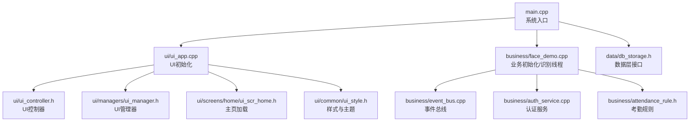
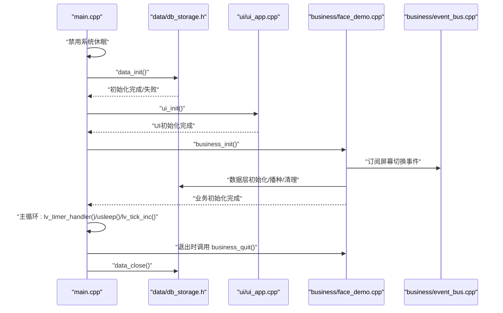
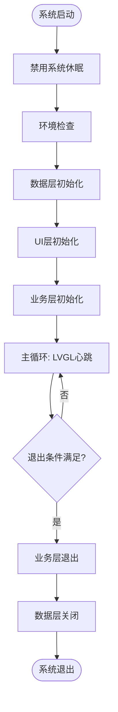
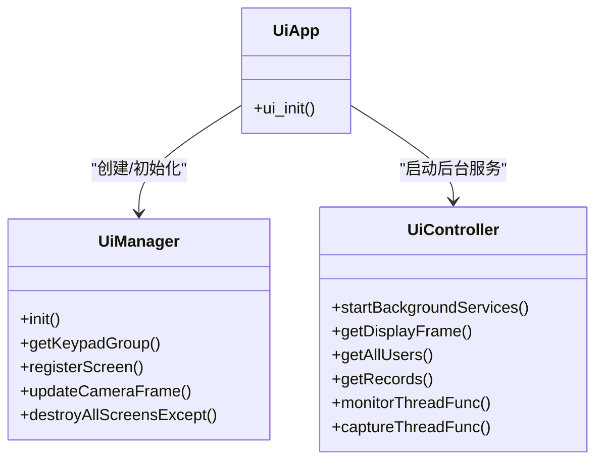
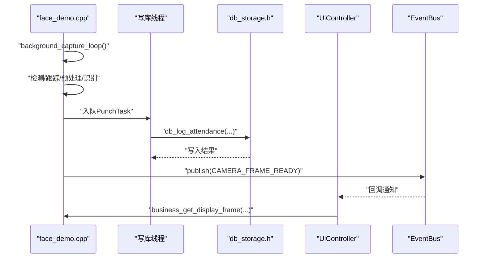
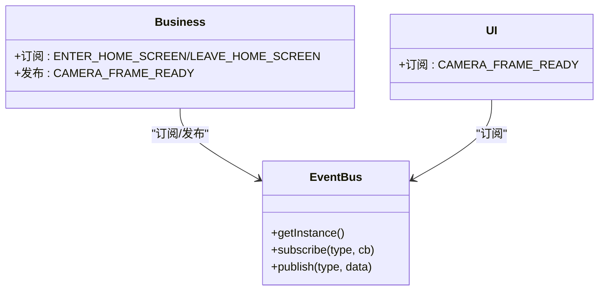
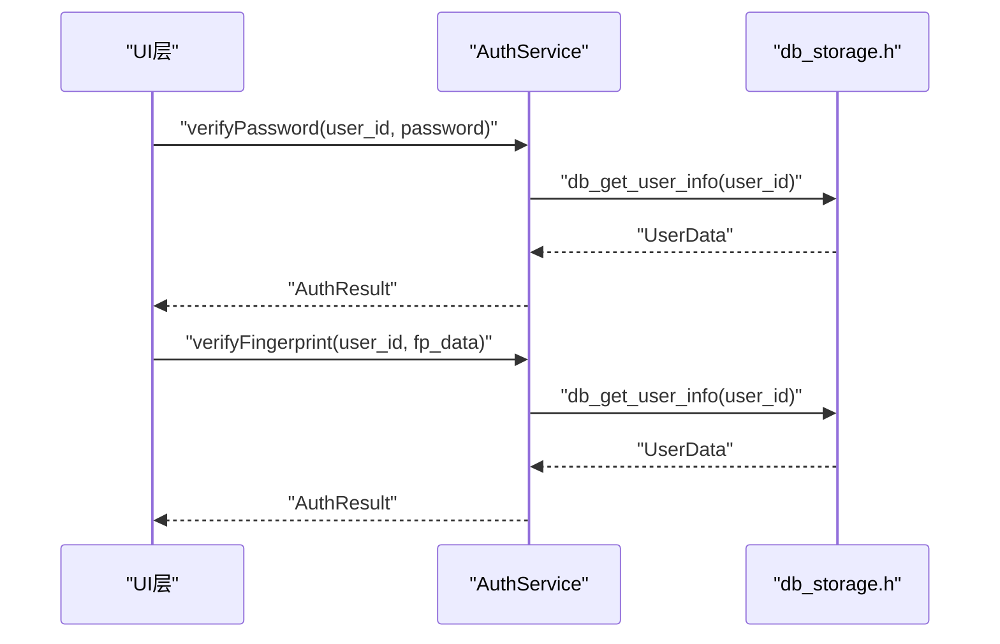
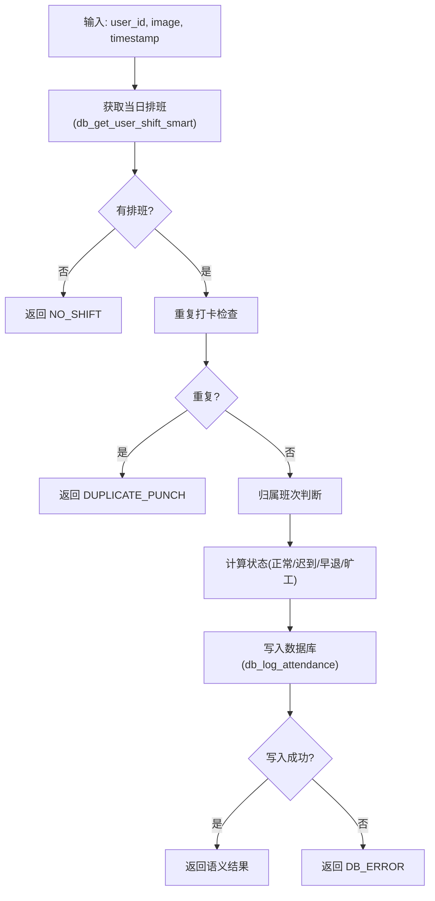
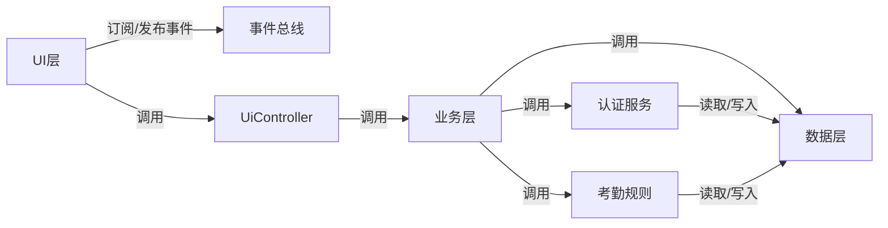

# 组件交互流程

<cite>
**本文引用的文件**
- [src/main.cpp](file://src/main.cpp)
- [src/ui/ui_app.h](file://src/ui/ui_app.h)
- [src/ui/ui_app.cpp](file://src/ui/ui_app.cpp)
- [src/ui/ui_controller.h](file://src/ui/ui_controller.h)
- [src/ui/managers/ui_manager.h](file://src/ui/managers/ui_manager.h)
- [src/ui/screens/home/ui_scr_home.h](file://src/ui/screens/home/ui_scr_home.h)
- [src/ui/common/ui_style.h](file://src/ui/common/ui_style.h)
- [src/business/face_demo.h](file://src/business/face_demo.h)
- [src/business/face_demo.cpp](file://src/business/face_demo.cpp)
- [src/business/event_bus.h](file://src/business/event_bus.h)
- [src/business/event_bus.cpp](file://src/business/event_bus.cpp)
- [src/business/auth_service.h](file://src/business/auth_service.h)
- [src/business/auth_service.cpp](file://src/business/auth_service.cpp)
- [src/business/attendance_rule.h](file://src/business/attendance_rule.h)
- [src/data/db_storage.h](file://src/data/db_storage.h)
</cite>

## 目录
1. [简介](#简介)
2. [项目结构](#项目结构)
3. [核心组件](#核心组件)
4. [架构总览](#架构总览)
5. [详细组件分析](#详细组件分析)
6. [依赖分析](#依赖分析)
7. [性能考虑](#性能考虑)
8. [故障排查指南](#故障排查指南)
9. [结论](#结论)
10. [附录](#附录)

## 简介
本文件面向智能考勤系统的开发者与维护者，系统性梳理组件交互流程，重点覆盖：
- 系统启动流程与组件初始化顺序
- 各组件间的依赖关系与时序
- 完整的系统生命周期流程图（从 main 入口到主循环）
- 关键业务场景的组件协作（用户登录、人脸识别、考勤记录）
- 错误处理与异常恢复机制

## 项目结构
系统采用分层架构：UI 层、业务层、数据层，辅以事件总线解耦。核心文件组织如下：
- 入口与生命周期：src/main.cpp
- UI 层：src/ui/*（应用入口、控制器、管理器、样式、屏幕）
- 业务层：src/business/*（人脸识别、事件总线、认证、考勤规则）
- 数据层：src/data/*（数据库接口与数据模型）

图表来源
- [src/main.cpp:187-246](file://src/main.cpp#L187-L246)
- [src/ui/ui_app.cpp:34-94](file://src/ui/ui_app.cpp#L34-L94)
- [src/business/face_demo.cpp:557-694](file://src/business/face_demo.cpp#L557-L694)
- [src/business/event_bus.cpp:1-28](file://src/business/event_bus.cpp#L1-L28)
- [src/business/auth_service.cpp:1-90](file://src/business/auth_service.cpp#L1-L90)
- [src/business/attendance_rule.h:1-92](file://src/business/attendance_rule.h#L1-L92)
- [src/data/db_storage.h:1-683](file://src/data/db_storage.h#L1-L683)

章节来源
- [src/main.cpp:187-246](file://src/main.cpp#L187-L246)
- [src/ui/ui_app.cpp:34-94](file://src/ui/ui_app.cpp#L34-L94)
- [src/business/face_demo.cpp:557-694](file://src/business/face_demo.cpp#L557-L694)
- [src/business/event_bus.cpp:1-28](file://src/business/event_bus.cpp#L1-L28)
- [src/business/auth_service.cpp:1-90](file://src/business/auth_service.cpp#L1-L90)
- [src/business/attendance_rule.h:1-92](file://src/business/attendance_rule.h#L1-L92)
- [src/data/db_storage.h:1-683](file://src/data/db_storage.h#L1-L683)

## 核心组件
- 系统入口与主循环：负责信号处理、禁用休眠、环境检查、分层初始化与主循环驱动。
- UI 子系统：负责 LVGL 初始化、SDL 设备、样式、管理器、主页加载与后台服务启动。
- 业务子系统：负责摄像头采集、人脸检测/识别、预处理、识别线程、数据库写入线程、事件发布。
- 事件总线：提供线程安全的订阅/发布机制，支撑 UI 与业务解耦。
- 认证服务：提供密码/指纹验证能力，输出标准化结果。
- 考勤规则：提供打卡归属班次、状态计算、重复打卡防护等规则。
- 数据层：提供部门/班次/用户/考勤记录等 DAO 接口与系统配置。

章节来源
- [src/main.cpp:187-246](file://src/main.cpp#L187-L246)
- [src/ui/ui_app.cpp:34-94](file://src/ui/ui_app.cpp#L34-L94)
- [src/business/face_demo.cpp:557-694](file://src/business/face_demo.cpp#L557-L694)
- [src/business/event_bus.h:1-43](file://src/business/event_bus.h#L1-L43)
- [src/business/auth_service.h:1-46](file://src/business/auth_service.h#L1-L46)
- [src/business/attendance_rule.h:1-92](file://src/business/attendance_rule.h#L1-L92)
- [src/data/db_storage.h:1-683](file://src/data/db_storage.h#L1-L683)

## 架构总览
系统采用“入口驱动 + 分层初始化 + 事件驱动”的模式：
- 入口层：main 负责环境检查、数据层初始化、UI 初始化、业务初始化、主循环。
- UI 层：ui_app 负责 LVGL/SDL 初始化、管理器与样式、主页加载、后台服务启动。
- 业务层：face_demo 负责识别线程、数据库写入线程、事件发布、配置缓存。
- 事件总线：统一订阅/发布，降低耦合。
- 数据层：提供稳定的数据访问接口，支持播种与清理。

图表来源
- [src/main.cpp:187-246](file://src/main.cpp#L187-L246)
- [src/data/db_storage.h:221-239](file://src/data/db_storage.h#L221-L239)
- [src/ui/ui_app.cpp:34-94](file://src/ui/ui_app.cpp#L34-L94)
- [src/business/face_demo.cpp:557-694](file://src/business/face_demo.cpp#L557-L694)
- [src/business/event_bus.cpp:1-28](file://src/business/event_bus.cpp#L1-L28)

## 详细组件分析

### 系统启动与生命周期
- 启动阶段
  - 禁用系统休眠，避免 UI 黑屏/休眠影响。
  - 环境检查（OpenCV/SQLite/LVGL 版本）。
  - 数据层初始化（创建表、播种默认数据）。
  - UI 层初始化（LVGL/SDL、样式、管理器、键盘绑定、主页加载、后台服务）。
  - 业务层初始化（订阅屏幕事件、加载/训练模型、启动采集与写库线程）。
- 主循环阶段
  - 驱动 LVGL 心跳、限制休眠时间、推进 tick。
- 退出阶段
  - 业务层资源清理、数据层关闭。

图表来源
- [src/main.cpp:187-246](file://src/main.cpp#L187-L246)
- [src/ui/ui_app.cpp:34-94](file://src/ui/ui_app.cpp#L34-L94)
- [src/business/face_demo.cpp:557-694](file://src/business/face_demo.cpp#L557-L694)
- [src/data/db_storage.h:221-239](file://src/data/db_storage.h#L221-L239)

章节来源
- [src/main.cpp:187-246](file://src/main.cpp#L187-L246)

### UI 子系统
- 职责
  - LVGL/SDL 初始化、输入设备绑定、样式与主题、管理器与屏幕资源管理、主页加载、后台服务启动。
- 关键接口
  - ui_init：完成 HAL 初始化、管理器与样式、键盘绑定、加载主页、启动后台服务。
  - UiManager：提供全局输入组、摄像头帧缓冲区、屏幕注册与异步销毁。
  - UiController：封装业务调用、时间/磁盘监控、摄像头帧获取、后台线程管理。
- 与业务层交互
  - 通过 EventBus 订阅/发布事件（如摄像头帧就绪、屏幕切换）。
  - 通过业务层接口获取显示帧、用户列表、考勤记录等。

图表来源
- [src/ui/ui_app.cpp:34-94](file://src/ui/ui_app.cpp#L34-L94)
- [src/ui/managers/ui_manager.h:71-156](file://src/ui/managers/ui_manager.h#L71-L156)
- [src/ui/ui_controller.h:21-110](file://src/ui/ui_controller.h#L21-L110)

章节来源
- [src/ui/ui_app.cpp:34-94](file://src/ui/ui_app.cpp#L34-L94)
- [src/ui/managers/ui_manager.h:71-156](file://src/ui/managers/ui_manager.h#L71-L156)
- [src/ui/ui_controller.h:21-110](file://src/ui/ui_controller.h#L21-L110)

### 业务子系统（人脸识别与考勤）
- 职责
  - 后台采集线程：读取视频帧、人脸检测/跟踪、预处理、识别、状态计算、异步写库。
  - 数据库写入线程：消费识别线程的任务队列，串行写库，避免多线程竞争。
  - 事件发布：摄像头帧就绪、屏幕切换等。
  - 配置与缓存：全局规则、班次、用户列表、记录缓存、显示帧缓存。
- 关键接口
  - business_init：订阅屏幕事件、加载模型、训练/加载识别器、启动线程。
  - business_get_display_frame：提供 UI 显示帧。
  - business_load_records/get_record_count/get_record_at：考勤记录缓存与查询。
  - business_set_recognition_enabled：识别开关。
- 与数据层交互
  - 写库：db_log_attendance。
  - 清理：db_cleanup_old_attendance_images。
  - 训练：db_get_all_users_light、db_get_all_users。
- 与 UI 层交互
  - 通过 EventBus 发布 CAMERA_FRAME_READY，驱动 UI 刷新。
  - 通过 UiController 提供的接口（如 getDisplayFrame）向 UI 提供数据。

图表来源
- [src/business/face_demo.cpp:246-285](file://src/business/face_demo.cpp#L246-L285)
- [src/business/face_demo.cpp:291-549](file://src/business/face_demo.cpp#L291-L549)
- [src/business/face_demo.cpp:557-694](file://src/business/face_demo.cpp#L557-L694)
- [src/data/db_storage.h:458-458](file://src/data/db_storage.h#L458-L458)
- [src/business/event_bus.cpp:14-28](file://src/business/event_bus.cpp#L14-L28)

章节来源
- [src/business/face_demo.cpp:246-285](file://src/business/face_demo.cpp#L246-L285)
- [src/business/face_demo.cpp:291-549](file://src/business/face_demo.cpp#L291-L549)
- [src/business/face_demo.cpp:557-694](file://src/business/face_demo.cpp#L557-L694)
- [src/data/db_storage.h:458-458](file://src/data/db_storage.h#L458-L458)
- [src/business/event_bus.cpp:14-28](file://src/business/event_bus.cpp#L14-L28)

### 事件总线
- 职责
  - 提供线程安全的订阅/发布机制，支持时间更新、磁盘状态、摄像头帧就绪、屏幕切换等事件。
- 交互
  - 业务层订阅屏幕切换事件，控制识别开关。
  - 业务层在帧就绪时发布事件，UI 层监听并刷新显示。

图表来源
- [src/business/event_bus.h:23-41](file://src/business/event_bus.h#L23-L41)
- [src/business/event_bus.cpp:8-28](file://src/business/event_bus.cpp#L8-L28)
- [src/business/face_demo.cpp:557-568](file://src/business/face_demo.cpp#L557-L568)

章节来源
- [src/business/event_bus.h:23-41](file://src/business/event_bus.h#L23-L41)
- [src/business/event_bus.cpp:8-28](file://src/business/event_bus.cpp#L8-L28)
- [src/business/face_demo.cpp:557-568](file://src/business/face_demo.cpp#L557-L568)

### 认证服务
- 职责
  - 提供密码与指纹验证，返回标准化结果。
- 交互
  - UI 层调用认证服务进行身份验证，成功后再由考勤规则引擎记录考勤。

图表来源
- [src/business/auth_service.h:23-44](file://src/business/auth_service.h#L23-L44)
- [src/business/auth_service.cpp:9-37](file://src/business/auth_service.cpp#L9-L37)
- [src/business/auth_service.cpp:42-69](file://src/business/auth_service.cpp#L42-L69)
- [src/data/db_storage.h:374-374](file://src/data/db_storage.h#L374-L374)

章节来源
- [src/business/auth_service.h:23-44](file://src/business/auth_service.h#L23-L44)
- [src/business/auth_service.cpp:9-37](file://src/business/auth_service.cpp#L9-L37)
- [src/business/auth_service.cpp:42-69](file://src/business/auth_service.cpp#L42-L69)
- [src/data/db_storage.h:374-374](file://src/data/db_storage.h#L374-L374)

### 考勤规则引擎
- 职责
  - 根据用户排班、打卡时间与阈值计算状态（正常/迟到/早退/旷工），并处理重复打卡与覆盖逻辑。
- 交互
  - UI 层在认证成功后调用规则引擎记录考勤，返回语义化结果供 UI 展示。

图表来源
- [src/business/attendance_rule.h:43-88](file://src/business/attendance_rule.h#L43-L88)
- [src/data/db_storage.h:529-529](file://src/data/db_storage.h#L529-L529)
- [src/data/db_storage.h:458-458](file://src/data/db_storage.h#L458-L458)

章节来源
- [src/business/attendance_rule.h:43-88](file://src/business/attendance_rule.h#L43-L88)
- [src/data/db_storage.h:529-529](file://src/data/db_storage.h#L529-L529)
- [src/data/db_storage.h:458-458](file://src/data/db_storage.h#L458-L458)

### 数据层
- 职责
  - 提供部门/班次/用户/考勤记录等 DAO 接口，支持播种、事务、清理过期图片等。
- 关键接口
  - data_init、data_seed、data_close。
  - 用户与考勤相关接口：db_add_user、db_log_attendance、db_get_records、db_get_records_by_user、db_cleanup_old_attendance_images。

章节来源
- [src/data/db_storage.h:221-239](file://src/data/db_storage.h#L221-L239)
- [src/data/db_storage.h:350-350](file://src/data/db_storage.h#L350-L350)
- [src/data/db_storage.h:458-458](file://src/data/db_storage.h#L458-L458)
- [src/data/db_storage.h:467-467](file://src/data/db_storage.h#L467-L467)
- [src/data/db_storage.h:479-479](file://src/data/db_storage.h#L479-L479)
- [src/data/db_storage.h:486-486](file://src/data/db_storage.h#L486-L486)

## 依赖分析
- 组件耦合
  - UI 与业务通过 EventBus 解耦；UI 通过 UiController 封装业务调用。
  - 业务与数据通过 DAO 接口解耦；业务内部使用队列与线程隔离写库压力。
  - 认证与规则相互独立，UI 层先认证再调用规则。
- 外部依赖
  - OpenCV：图像处理、检测与识别。
  - SQLite3：持久化存储。
  - LVGL + SDL：图形界面与输入设备。

图表来源
- [src/business/event_bus.cpp:14-28](file://src/business/event_bus.cpp#L14-L28)
- [src/ui/ui_controller.h:21-110](file://src/ui/ui_controller.h#L21-L110)
- [src/business/face_demo.cpp:557-694](file://src/business/face_demo.cpp#L557-L694)
- [src/business/auth_service.cpp:1-90](file://src/business/auth_service.cpp#L1-L90)
- [src/business/attendance_rule.h:1-92](file://src/business/attendance_rule.h#L1-L92)
- [src/data/db_storage.h:1-683](file://src/data/db_storage.h#L1-L683)

章节来源
- [src/business/event_bus.cpp:14-28](file://src/business/event_bus.cpp#L14-L28)
- [src/ui/ui_controller.h:21-110](file://src/ui/ui_controller.h#L21-L110)
- [src/business/face_demo.cpp:557-694](file://src/business/face_demo.cpp#L557-L694)
- [src/business/auth_service.cpp:1-90](file://src/business/auth_service.cpp#L1-L90)
- [src/business/attendance_rule.h:1-92](file://src/business/attendance_rule.h#L1-L92)
- [src/data/db_storage.h:1-683](file://src/data/db_storage.h#L1-L683)

## 性能考虑
- 识别与显示分离
  - 识别线程高频处理（约 60 FPS），UI 刷新限流（约 60 FPS），避免 UI 队列爆炸。
- 线程隔离
  - 识别线程负责检测/识别/预处理，写库线程串行写库，避免 SQLite 多线程竞争。
- 资源管理
  - 业务层使用互斥锁保护共享数据，原子标志标记帧待更新，减少锁粒度。
- I/O 优化
  - 数据层提供事务接口与清理过期图片，降低磁盘压力。

章节来源
- [src/business/face_demo.cpp:291-549](file://src/business/face_demo.cpp#L291-L549)
- [src/business/face_demo.cpp:246-285](file://src/business/face_demo.cpp#L246-L285)
- [src/business/face_demo.cpp:68-77](file://src/business/face_demo.cpp#L68-L77)
- [src/data/db_storage.h:486-486](file://src/data/db_storage.h#L486-L486)

## 故障排查指南
- 启动失败
  - 检查环境变量与依赖版本（OpenCV/SQLite/LVGL）。
  - 确认数据层初始化成功，播种默认数据。
- UI 无画面
  - 检查 SDL 窗口创建与键盘绑定。
  - 确认 EventBus 发布 CAMERA_FRAME_READY，UI 订阅并刷新。
- 识别异常
  - 检查摄像头/视频流连接与重连逻辑。
  - 确认模型加载/训练状态，识别开关。
- 写库失败
  - 检查写库线程是否运行，队列长度与异常捕获。
  - 核对数据库权限与磁盘空间。

章节来源
- [src/main.cpp:187-246](file://src/main.cpp#L187-L246)
- [src/ui/ui_app.cpp:34-94](file://src/ui/ui_app.cpp#L34-L94)
- [src/business/face_demo.cpp:312-344](file://src/business/face_demo.cpp#L312-L344)
- [src/business/face_demo.cpp:246-285](file://src/business/face_demo.cpp#L246-L285)
- [src/data/db_storage.h:221-239](file://src/data/db_storage.h#L221-L239)

## 结论
本系统通过清晰的分层与事件驱动，实现了 UI 与业务的低耦合、高可靠性。启动流程严谨，主循环稳定，关键业务场景（登录、识别、考勤）均有明确的组件协作路径与异常处理策略。建议持续关注摄像头稳定性、SQLite 写入性能与 UI 刷新一致性。

## 附录
- 关键业务场景交互示例（用户登录）
  - UI 层调用认证服务进行密码/指纹验证，返回结果后决定是否允许进入系统。
- 关键业务场景交互示例（人脸识别）
  - 业务层后台线程采集帧、检测/识别、预处理，发布帧就绪事件，UI 订阅并刷新显示。
- 关键业务场景交互示例（考勤记录）
  - 识别线程将识别结果与抓拍图入队，写库线程串行写库，规则引擎计算状态并返回语义化结果。

章节来源
- [src/business/auth_service.cpp:9-37](file://src/business/auth_service.cpp#L9-L37)
- [src/business/auth_service.cpp:42-69](file://src/business/auth_service.cpp#L42-L69)
- [src/business/face_demo.cpp:522-527](file://src/business/face_demo.cpp#L522-L527)
- [src/business/face_demo.cpp:468-478](file://src/business/face_demo.cpp#L468-L478)
- [src/business/attendance_rule.h:87-87](file://src/business/attendance_rule.h#L87-L87)