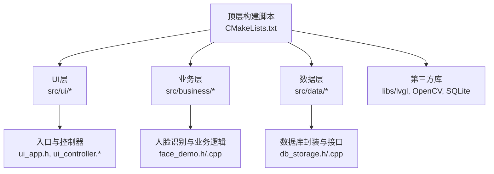
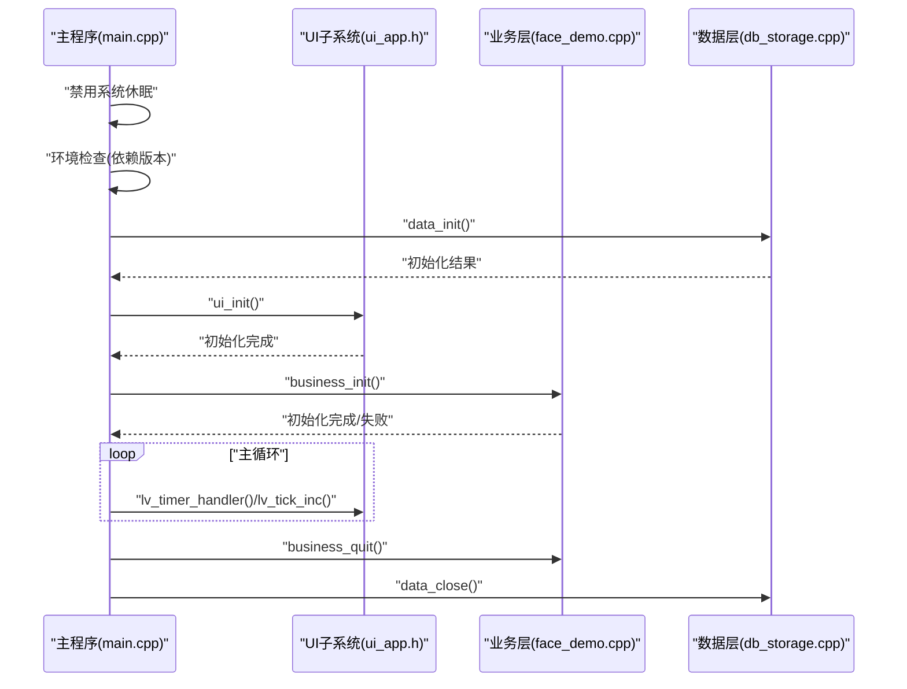
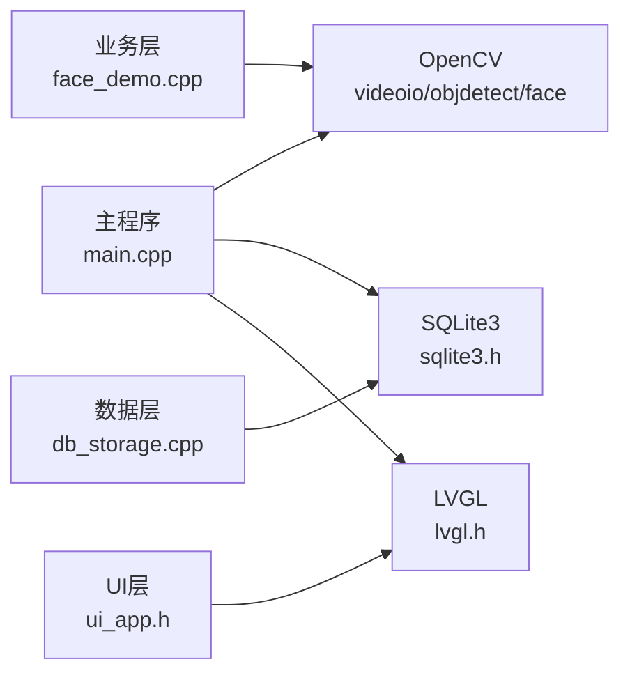

# 故障排查

<cite>
**本文引用的文件**
- [src/main.cpp](file://src/main.cpp)
- [CMakeLists.txt](file://CMakeLists.txt)
- [lv_conf.h](file://lv_conf.h)
- [src/data/db_storage.h](file://src/data/db_storage.h)
- [src/data/db_storage.cpp](file://src/data/db_storage.cpp)
- [src/business/face_demo.h](file://src/business/face_demo.h)
- [src/business/face_demo.cpp](file://src/business/face_demo.cpp)
- [src/ui/ui_app.h](file://src/ui/ui_app.h)
- [docs/SmartAttendance框架结构.txt](file://docs/SmartAttendance框架结构.txt)
</cite>

## 目录
1. [简介](#简介)
2. [项目结构](#项目结构)
3. [核心组件](#核心组件)
4. [架构总览](#架构总览)
5. [详细组件分析](#详细组件分析)
6. [依赖关系分析](#依赖关系分析)
7. [性能考量](#性能考量)
8. [故障排查指南](#故障排查指南)
9. [结论](#结论)
10. [附录](#附录)

## 简介
本指南面向SmartAttendance项目的运维与开发人员，聚焦于系统在编译、运行、性能、人脸识别、数据库与UI界面等方面的常见问题与排查方法。内容涵盖：
- 编译错误与依赖缺失的定位与修复
- 运行时异常与日志分析技巧
- 人脸识别模块的摄像头、OpenCV与检测失败的排查
- SQLite连接、一致性与备份恢复流程
- UI渲染、事件与内存问题的诊断
- 系统恢复与紧急处理流程

## 项目结构
SmartAttendance采用分层架构：UI层、业务层、数据层，配合第三方库（LVGL、OpenCV、SQLite）。顶层构建脚本集中管理依赖与编译选项。

图表来源
- [docs/SmartAttendance框架结构.txt:1-68](file://docs/SmartAttendance框架结构.txt#L1-L68)
- [CMakeLists.txt:1-153](file://CMakeLists.txt#L1-L153)

章节来源
- [docs/SmartAttendance框架结构.txt:1-68](file://docs/SmartAttendance框架结构.txt#L1-L68)
- [CMakeLists.txt:1-153](file://CMakeLists.txt#L1-L153)

## 核心组件
- 主程序入口与主循环：负责系统初始化、信号处理、UI与业务初始化、LVGL心跳驱动与优雅退出。
- UI子系统：负责图形环境初始化、事件与渲染驱动。
- 业务层：封装人脸识别（检测、预处理、识别）、用户注册/更新、考勤记录落库与后台写库线程。
- 数据层：封装SQLite访问、表结构创建与升级、事务、性能调优与错误日志输出。

章节来源
- [src/main.cpp:187-246](file://src/main.cpp#L187-L246)
- [src/ui/ui_app.h:1-18](file://src/ui/ui_app.h#L1-L18)
- [src/business/face_demo.h:1-196](file://src/business/face_demo.h#L1-L196)
- [src/business/face_demo.cpp:1-200](file://src/business/face_demo.cpp#L1-L200)
- [src/data/db_storage.h:1-596](file://src/data/db_storage.h#L1-L596)
- [src/data/db_storage.cpp:108-136](file://src/data/db_storage.cpp#L108-L136)

## 架构总览
系统启动顺序与关键交互如下：

图表来源
- [src/main.cpp:187-246](file://src/main.cpp#L187-L246)
- [src/ui/ui_app.h:1-18](file://src/ui/ui_app.h#L1-L18)
- [src/business/face_demo.cpp:1-200](file://src/business/face_demo.cpp#L1-L200)
- [src/data/db_storage.cpp:108-136](file://src/data/db_storage.cpp#L108-L136)

## 详细组件分析

### 组件A：主程序与系统初始化
- 关键职责：信号处理、系统休眠禁用、依赖自检、数据层初始化、UI与业务初始化、主循环与资源回收。
- 常见问题：依赖未满足导致初始化失败、主循环卡死、退出流程不干净。
- 排查要点：查看依赖版本输出、确认数据层初始化返回值、检查UI与业务初始化返回值、确认主循环内LVGL心跳与tick调用。

章节来源
- [src/main.cpp:41-246](file://src/main.cpp#L41-L246)

### 组件B：UI子系统
- 关键职责：SDL/FB初始化、输入设备配置、事件与渲染驱动。
- 常见问题：窗口/显示初始化失败、输入无响应、渲染卡顿。
- 排查要点：确认SDL与FreeType可用性、检查LVGL配置（颜色深度、刷新周期、线程栈等）、验证事件回调链路。

章节来源
- [src/ui/ui_app.h:1-18](file://src/ui/ui_app.h#L1-L18)
- [lv_conf.h:29-95](file://lv_conf.h#L29-L95)

### 组件C：业务层（人脸识别）
- 关键职责：摄像头/视频流管理、人脸检测（Haar）、预处理（裁剪、尺寸归一化、直方图均衡化、ROI增强）、识别（LBPH）、注册/更新用户、后台写库队列。
- 常见问题：摄像头无法打开、检测失败、识别率低、注册失败、后台写库阻塞。
- 排查要点：确认模型与级联分类器文件存在、检查预处理参数、验证识别器训练状态、核对后台写库线程与队列容量。

章节来源
- [src/business/face_demo.h:1-196](file://src/business/face_demo.h#L1-L196)
- [src/business/face_demo.cpp:175-204](file://src/business/face_demo.cpp#L175-L204)

### 组件D：数据层（SQLite）
- 关键职责：数据库连接、表结构创建/升级、事务、性能调优（WAL、同步模式、缓存、外键）、错误日志输出。
- 常见问题：数据库无法打开、SQL执行失败、并发写入冲突、性能瓶颈。
- 排查要点：检查数据库文件权限与路径、确认WAL与foreign_keys已启用、核对事务边界、关注错误消息与返回值。

章节来源
- [src/data/db_storage.h:1-596](file://src/data/db_storage.h#L1-L596)
- [src/data/db_storage.cpp:108-136](file://src/data/db_storage.cpp#L108-L136)

## 依赖关系分析
- 构建脚本集中管理依赖：SDL2、FreeType、OpenCV（含face模块）、SQLite3、xlsxwriter、线程库。
- 头文件包含路径与链接库在构建脚本中统一配置，确保编译期与链接期依赖一致。

图表来源
- [CMakeLists.txt:18-38](file://CMakeLists.txt#L18-L38)
- [src/main.cpp:18-33](file://src/main.cpp#L18-L33)

章节来源
- [CMakeLists.txt:18-38](file://CMakeLists.txt#L18-L38)

## 性能考量
- SQLite性能调优：启用WAL模式、NORMAL同步、内存临时存储、缓存大小、外键约束。
- UI渲染：刷新周期、绘制线程栈与优先级、软件渲染配置。
- 人脸识别：预处理参数（裁剪、尺寸、均衡化、ROI增强）与识别器训练质量直接影响吞吐与准确率。

章节来源
- [src/data/db_storage.cpp:123-135](file://src/data/db_storage.cpp#L123-L135)
- [lv_conf.h:90-167](file://lv_conf.h#L90-L167)

## 故障排查指南

### 一、编译错误与依赖问题
- 症状：CMake阶段找不到依赖、链接失败、头文件包含错误。
- 排查步骤：
  - 确认系统已安装OpenCV（含videoio/objdetect/face）、SQLite3、SDL2、FreeType、xlsxwriter。
  - 检查构建脚本中的find_package与pkg_check_modules配置，确保路径与版本满足要求。
  - 核对头文件包含路径与链接库列表，特别是OpenCV4标准路径与LVGL配置宏。
  - 关注构建输出中的依赖路径与编译命令导出信息。
- 常见原因：
  - OpenCV未安装或组件缺失（如face模块）。
  - SQLite3未安装或版本过低。
  - LVGL配置文件路径未正确传递至编译定义。
- 修复建议：
  - 使用包管理器安装缺失组件，或在构建脚本中显式指定路径。
  - 确保CMake导出compile_commands.json以便IDE正确解析头文件。

章节来源
- [CMakeLists.txt:18-38](file://CMakeLists.txt#L18-L38)
- [CMakeLists.txt:114-146](file://CMakeLists.txt#L114-L146)

### 二、运行时异常与日志分析
- 症状：程序崩溃、初始化失败、功能异常。
- 排查步骤：
  - 依赖自检：确认OpenCV、SQLite3、LVGL版本输出正常。
  - 数据层初始化：检查数据库打开与表结构创建日志，关注错误消息。
  - 业务层初始化：检查摄像头/模型/识别器初始化状态。
  - UI层：确认渲染与事件回调链路。
- 日志解读：
  - 数据层错误日志包含SQL标签与sqlite3错误消息，便于定位SQL执行失败。
  - 业务层调试日志按帧频率输出状态，可用于定位识别/检测异常。
- 常见原因：
  - 数据库文件权限不足或损坏。
  - 摄像头被占用或驱动异常。
  - LVGL配置不当导致渲染异常。
- 修复建议：
  - 修正数据库权限与路径，必要时重建数据库。
  - 更换摄像头或检查驱动，确保OpenCV可用。
  - 调整LVGL配置参数，降低刷新周期或渲染复杂度。

章节来源
- [src/main.cpp:49-59](file://src/main.cpp#L49-L59)
- [src/data/db_storage.cpp:118-121](file://src/data/db_storage.cpp#L118-L121)
- [src/business/face_demo.cpp:788-798](file://src/business/face_demo.cpp#L788-L798)

### 三、人脸识别模块故障排查
- 摄像头连接问题：
  - 确认OpenCV视频IO可用，检查摄像头设备是否被其他进程占用。
  - 核对级联分类器与模型文件是否存在，必要时指定绝对路径。
- OpenCV库配置：
  - 确保安装了videoio/objdetect/face组件，且版本兼容。
  - 检查预处理参数（裁剪、尺寸、均衡化、ROI增强），逐步调整以提升鲁棒性。
- 人脸检测失败：
  - 降低最小人脸尺寸、调整检测缩放因子与邻居数。
  - 检查光照条件与人脸朝向，必要时增加直方图均衡化或CLAHE。
- 识别率低或失败：
  - 确认识别器已训练，样本充足且质量良好。
  - 检查预处理一致性与识别阈值设置。
- 后台写库阻塞：
  - 检查写库线程与队列容量，避免任务堆积。
  - 核对事务边界与锁竞争，必要时拆分写入批次。

章节来源
- [src/business/face_demo.cpp:175-184](file://src/business/face_demo.cpp#L175-L184)
- [src/business/face_demo.cpp:195-204](file://src/business/face_demo.cpp#L195-L204)
- [src/business/face_demo.cpp:140-167](file://src/business/face_demo.cpp#L140-L167)

### 四、数据库相关问题诊断
- SQLite连接问题：
  - 检查数据库文件是否存在与权限是否正确。
  - 确认WAL模式、同步模式、缓存与外键约束已按预期启用。
- 数据一致性检查：
  - 使用SQLite pragma查询当前设置，核对外键约束与journal模式。
  - 对关键表执行完整性检查（如PRAGMA integrity_check）。
- 备份与恢复：
  - 备份策略：定期复制数据库文件与图片目录，确保WAL模式下可安全复制。
  - 恢复流程：停止服务后替换数据库文件，重启服务验证初始化与表结构。
- 事务与并发：
  - 批量写入使用事务以提升性能与一致性。
  - 注意读写锁的使用，避免长时间持有排他锁。

章节来源
- [src/data/db_storage.cpp:108-136](file://src/data/db_storage.cpp#L108-L136)
- [src/data/db_storage.cpp:1313-1347](file://src/data/db_storage.cpp#L1313-L1347)

### 五、UI界面问题排查
- LVGL渲染问题：
  - 检查颜色深度、刷新周期与绘制线程配置。
  - 降低渲染复杂度或减少动画，观察性能改善。
- 事件处理异常：
  - 确认事件回调注册与分发链路，检查事件类型与目标控件。
  - 避免在事件回调中进行耗时操作，必要时异步处理。
- 内存泄漏检测：
  - 关注LVGL对象生命周期与样式缓存，避免重复创建与未释放。
  - 使用静态分析工具与内存检测工具辅助定位。

章节来源
- [lv_conf.h:29-95](file://lv_conf.h#L29-L95)
- [lv_conf.h:412-451](file://lv_conf.h#L412-L451)

### 六、系统恢复与紧急处理流程
- 紧急退出：
  - 使用信号处理捕获中断，确保业务与数据层资源有序释放。
- 恢复出厂设置：
  - 清空数据库与图片目录，重新初始化表结构与默认数据。
- 数据清理：
  - 清理过期抓拍图片，释放磁盘空间。
- 紧急降级：
  - 临时禁用高负载功能（如识别、报表生成），维持基本UI与数据读取。

章节来源
- [src/main.cpp:41-44](file://src/main.cpp#L41-L44)
- [src/data/db_storage.h:520-530](file://src/data/db_storage.h#L520-L530)
- [src/data/db_storage.cpp:460-461](file://src/data/db_storage.cpp#L460-L461)

## 结论
本指南提供了从编译、运行、性能到人脸识别、数据库与UI的全栈故障排查方法。建议在日常维护中：
- 建立标准化的日志与监控体系
- 定期备份数据库与图片目录
- 优化预处理参数与SQLite性能配置
- 保持依赖版本与配置文件的稳定性

## 附录

### A. 常见错误代码与含义（摘自数据层）
- 数据库打开失败：检查数据库文件路径与权限，确认sqlite3错误消息。
- SQL执行失败：根据标签定位具体SQL，检查语法与参数绑定。
- 外键约束失败：确认关联数据存在且符合约束。

章节来源
- [src/data/db_storage.cpp:118-121](file://src/data/db_storage.cpp#L118-L121)
- [src/data/db_storage.cpp:96-104](file://src/data/db_storage.cpp#L96-L104)

### B. 依赖自检清单
- OpenCV：core、imgproc、videoio、highgui、objdetect、face
- SQLite3：sqlite3.h
- LVGL：SDL2、FreeType
- xlsxwriter：生成报表所需

章节来源
- [CMakeLists.txt:28-37](file://CMakeLists.txt#L28-L37)