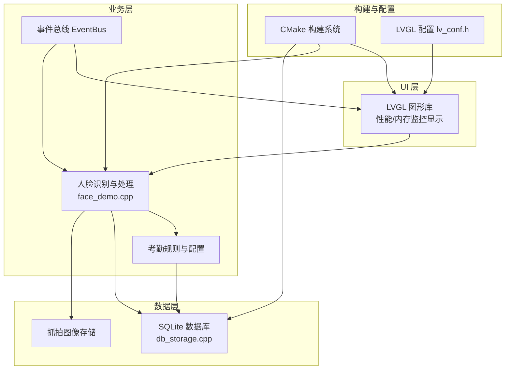
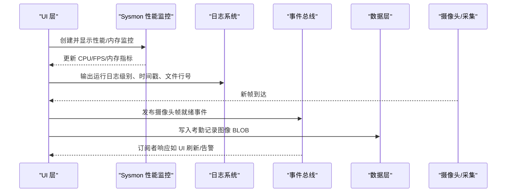
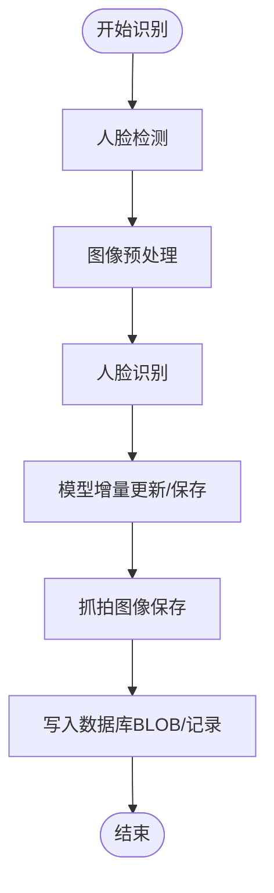
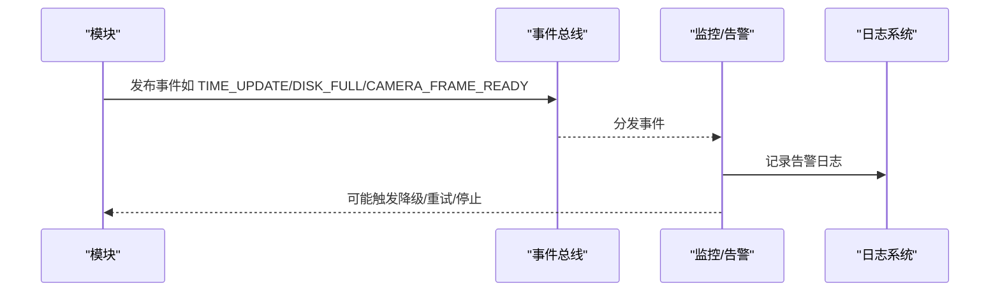
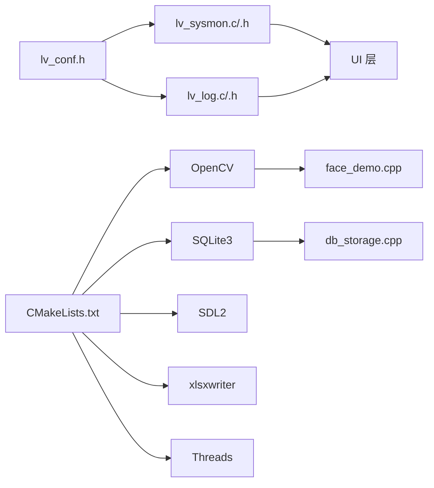

# 系统监控

<cite>
**本文引用的文件**
- [CMakeLists.txt](file://CMakeLists.txt)
- [lv_conf.h](file://lv_conf.h)
- [lv_log.c](file://libs/lvgl/src/misc/lv_log.c)
- [lv_log.h](file://libs/lvgl/src/misc/lv_log.h)
- [lv_sysmon.c](file://libs/lvgl/src/others/sysmon/lv_sysmon.c)
- [lv_sysmon.h](file://libs/lvgl/src/others/sysmon/lv_sysmon.h)
- [face_demo.cpp](file://src/business/face_demo.cpp)
- [db_storage.cpp](file://src/data/db_storage.cpp)
- [event_bus.h](file://src/business/event_bus.h)
- [event_bus.cpp](file://src/business/event_bus.cpp)
</cite>

## 目录
1. [简介](#简介)
2. [项目结构](#项目结构)
3. [核心组件](#核心组件)
4. [架构总览](#架构总览)
5. [详细组件分析](#详细组件分析)
6. [依赖关系分析](#依赖关系分析)
7. [性能考量](#性能考量)
8. [故障排查指南](#故障排查指南)
9. [结论](#结论)
10. [附录](#附录)

## 简介
本指南面向 SmartAttendance 项目的系统监控与运维监控，围绕以下目标展开：
- 日志管理策略：日志级别配置、日志输出与可扩展性、日志轮转机制现状与建议
- 性能监控指标：CPU 使用率、内存占用、数据库查询性能、人脸识别处理时间
- 健康检查机制：系统状态监控、组件可用性检查、告警机制
- 监控工具配置与使用：系统资源监控与应用性能监控
- 监控数据采集、存储与分析：采集点位、存储位置、分析方法与仪表板设计

## 项目结构
SmartAttendance 采用分层架构：
- UI 层：基于 LVGL 的嵌入式图形界面，支持性能/内存监控显示
- 业务层：人脸识别、考勤规则、事件总线等
- 数据层：SQLite 存储、图像持久化、事务与并发控制
- 构建与配置：CMake 配置第三方库与 LVGL 配置文件路径

图表来源
- [CMakeLists.txt:1-153](file://CMakeLists.txt#L1-L153)
- [lv_conf.h:410-451](file://lv_conf.h#L410-L451)
- [face_demo.cpp:1-200](file://src/business/face_demo.cpp#L1-L200)
- [db_storage.cpp:1-200](file://src/data/db_storage.cpp#L1-L200)
- [event_bus.h:1-41](file://src/business/event_bus.h#L1-L41)

章节来源
- [CMakeLists.txt:1-153](file://CMakeLists.txt#L1-L153)
- [lv_conf.h:410-451](file://lv_conf.h#L410-L451)

## 核心组件
- 日志系统（LVGL）：提供日志级别、时间戳、文件行号、自定义打印回调等能力，便于统一输出与扩展
- 系统监控（LVGL Sysmon）：在界面上实时显示 CPU 百分比、FPS、渲染/刷新耗时、内存占用与碎片
- 人脸识别与处理：包含摄像头帧采集、人脸检测与识别、模型增量更新、抓拍图像保存
- 数据层：SQLite 初始化、WAL 模式、并发优化、BLOB 图像存储、预编译语句缓存
- 事件总线：跨模块解耦的事件发布/订阅机制，可用于健康检查与告警触发

章节来源
- [lv_log.c:1-150](file://libs/lvgl/src/misc/lv_log.c#L1-L150)
- [lv_log.h:1-163](file://libs/lvgl/src/misc/lv_log.h#L1-L163)
- [lv_sysmon.c:1-413](file://libs/lvgl/src/others/sysmon/lv_sysmon.c#L1-L413)
- [lv_sysmon.h:1-114](file://libs/lvgl/src/others/sysmon/lv_sysmon.h#L1-L114)
- [face_demo.cpp:1-200](file://src/business/face_demo.cpp#L1-L200)
- [db_storage.cpp:1-200](file://src/data/db_storage.cpp#L1-L200)
- [event_bus.h:1-41](file://src/business/event_bus.h#L1-L41)
- [event_bus.cpp:1-28](file://src/business/event_bus.cpp#L1-L28)

## 架构总览
系统监控与运维监控涉及多组件协作：
- 日志：统一由 LVGL 日志模块输出，支持回调扩展，便于接入外部日志系统
- 性能：Sysmon 实时统计 CPU/FPS/渲染/刷新耗时，内存占用与碎片
- 业务：人脸识别处理链路包含检测、预处理、识别、模型更新、抓拍与入库
- 数据：SQLite 采用 WAL 模式与多项性能优化，图像以 BLOB 存储
- 健康：事件总线用于跨模块通知，可作为告警与状态上报的通道

图表来源
- [lv_sysmon.c:82-198](file://libs/lvgl/src/others/sysmon/lv_sysmon.c#L82-L198)
- [lv_log.c:67-122](file://libs/lvgl/src/misc/lv_log.c#L67-L122)
- [event_bus.h:10-29](file://src/business/event_bus.h#L10-L29)
- [db_storage.cpp:108-136](file://src/data/db_storage.cpp#L108-L136)

## 详细组件分析

### 日志管理策略
- 日志级别与输出
  - 支持 Trace/Info/Warn/Error/User/None 级别，可通过配置项设置默认级别
  - 可选择通过 printf 输出或注册自定义打印回调，便于对接文件/网络/串口等
  - 可开启时间戳与文件行号，便于定位问题
- 日志文件管理与轮转
  - 当前仓库未见内置日志轮转实现；建议结合外部工具（如 systemd-journald、logrotate、rsyslog）进行轮转与归档
  - 若需内建轮转，可在自定义打印回调中实现按大小/时间切分与压缩归档
- 推荐实践
  - 生产环境建议使用 Warn/Error 至少，必要时临时提升到 Info/Trace
  - 将关键路径（识别失败、数据库错误、模型保存异常）标记为 Error/Warn
  - 为 UI 与业务分别建立独立日志通道，便于分层排查

章节来源
- [lv_conf.h:412-451](file://lv_conf.h#L412-L451)
- [lv_log.c:67-122](file://libs/lvgl/src/misc/lv_log.c#L67-L122)
- [lv_log.h:24-156](file://libs/lvgl/src/misc/lv_log.h#L24-L156)

### 性能监控指标
- CPU 使用率
  - Sysmon 基于系统空闲时间计算 CPU 百分比，支持进程级 CPU 统计（若可用）
- FPS 与渲染/刷新耗时
  - Sysmon 统计刷新周期、渲染耗时、刷新等待耗时，计算平均 FPS 与各阶段耗时
- 内存占用与碎片
  - Sysmon 通过内存监控接口获取已用内存、最大使用峰值与碎片百分比
- 人脸识别处理时间
  - 建议在业务层对“检测+预处理+识别+入库”关键步骤打点，形成端到端处理时延分布

图表来源
- [face_demo.cpp:1166-1213](file://src/business/face_demo.cpp#L1166-L1213)
- [db_storage.cpp:108-136](file://src/data/db_storage.cpp#L108-L136)

章节来源
- [lv_sysmon.c:258-307](file://libs/lvgl/src/others/sysmon/lv_sysmon.c#L258-L307)
- [lv_sysmon.c:385-410](file://libs/lvgl/src/others/sysmon/lv_sysmon.c#L385-L410)
- [face_demo.cpp:1166-1213](file://src/business/face_demo.cpp#L1166-L1213)
- [db_storage.cpp:108-136](file://src/data/db_storage.cpp#L108-L136)

### 健康检查机制
- 系统状态监控
  - Sysmon 实时暴露 CPU/FPS/内存/耗时指标，作为系统健康“仪表盘”
- 组件可用性检查
  - 事件总线：模块间解耦，订阅者可作为“可用性探测”的回调载体
  - 数据库：SQLite 初始化成功、WAL 模式生效、预编译语句缓存可用
  - 摄像头：帧到达事件可作为输入可用性信号
- 告警机制
  - 建议基于事件总线发布“磁盘空间不足”“数据库写入失败”“识别耗时超阈值”等事件
  - 订阅者负责记录日志、触发 UI 提示或远程上报

图表来源
- [event_bus.h:10-29](file://src/business/event_bus.h#L10-L29)
- [event_bus.cpp:8-27](file://src/business/event_bus.cpp#L8-L27)
- [lv_log.c:67-122](file://libs/lvgl/src/misc/lv_log.c#L67-L122)

章节来源
- [event_bus.h:1-41](file://src/business/event_bus.h#L1-L41)
- [event_bus.cpp:1-28](file://src/business/event_bus.cpp#L1-L28)
- [db_storage.cpp:108-136](file://src/data/db_storage.cpp#L108-L136)

### 监控工具配置与使用
- 系统资源监控
  - 使用 Sysmon 在 UI 上显示 CPU/FPS/内存/耗时，便于现场观察
  - 可通过自定义打印回调将 Sysmon 输出重定向到文件或网络
- 应用性能监控
  - 在业务关键路径（检测、预处理、识别、入库）埋点，形成端到端时延与吞吐统计
  - 结合日志系统输出 Trace/Info，定位热点与瓶颈
- 工具集成建议
  - 日志：结合外部轮转工具进行日志轮转与归档
  - 性能：将 Sysmon 指标导出到时序数据库（如 Prometheus Pushgateway/InfluxDB），用于长期趋势分析

章节来源
- [lv_sysmon.c:82-198](file://libs/lvgl/src/others/sysmon/lv_sysmon.c#L82-L198)
- [lv_log.c:67-122](file://libs/lvgl/src/misc/lv_log.c#L67-L122)
- [face_demo.cpp:1-200](file://src/business/face_demo.cpp#L1-L200)

### 监控数据采集、存储与分析
- 采集点位
  - Sysmon：CPU/FPS/内存/耗时
  - 业务：识别耗时、抓拍写入耗时、模型保存耗时
  - 数据库：SQL 执行耗时、写入吞吐、BLOB 大小
- 存储位置
  - 日志：stdout/stderr 或自定义回调输出到文件/网络
  - 图像：本地目录（抓拍图像目录）
  - 指标：可导出到时序数据库或 CSV 文件
- 分析方法
  - 统计均值/分位数/峰值，绘制趋势图与热力图
  - 关键阈值告警（CPU>90%/FPS<10/FPS>异常波动/识别耗时>阈值）

章节来源
- [db_storage.cpp:108-136](file://src/data/db_storage.cpp#L108-L136)
- [face_demo.cpp:1166-1213](file://src/business/face_demo.cpp#L1166-L1213)

### 监控仪表板设计与关键指标可视化
- 仪表板建议布局
  - 左侧：CPU 使用率、FPS、内存占用与碎片
  - 中部：识别处理时延分布、吞吐量
  - 右侧：数据库写入耗时、BLOB 大小、抓拍数量
  - 底部：告警事件列表与日志入口
- 关键指标
  - CPU 使用率：反映系统负载
  - FPS：反映渲染性能
  - 内存占用/碎片：反映内存压力
  - 识别耗时：反映算法与硬件性能
  - 数据库写入耗时：反映 I/O 与并发

## 依赖关系分析
- LVGL 配置与日志/监控
  - 通过 lv_conf.h 启用日志与 Sysmon，并设置刷新周期与输出模式
- 构建系统与第三方库
  - CMake 链接 OpenCV、SQLite、SDL2、xlsxwriter、线程库，确保摄像头、图像处理、数据库与 UI 正常工作
- 业务与数据层
  - 人脸识别依赖 OpenCV 与 SQLite；图像以 BLOB 存储，采用 WAL 模式提升并发

图表来源
- [lv_conf.h:412-451](file://lv_conf.h#L412-L451)
- [lv_sysmon.c:1-413](file://libs/lvgl/src/others/sysmon/lv_sysmon.c#L1-L413)
- [lv_log.c:1-150](file://libs/lvgl/src/misc/lv_log.c#L1-L150)
- [CMakeLists.txt:1-153](file://CMakeLists.txt#L1-L153)
- [face_demo.cpp:1-200](file://src/business/face_demo.cpp#L1-L200)
- [db_storage.cpp:1-200](file://src/data/db_storage.cpp#L1-L200)

章节来源
- [lv_conf.h:412-451](file://lv_conf.h#L412-L451)
- [CMakeLists.txt:1-153](file://CMakeLists.txt#L1-L153)

## 性能考量
- 数据库性能
  - WAL 模式、NORMAL 同步、内存临时表、缓存大小、外键约束均已启用，有助于提升并发与稳定性
- 图像处理与存储
  - 抓拍图像编码为 JPEG 以减小体积，识别使用灰度图以提升效率
- UI 渲染
  - Sysmon 通过定时器与观察者模式更新指标，避免阻塞主线程
- 建议
  - 在高并发场景下，考虑将数据库写入异步化（已有队列与线程基础）
  - 对识别耗时进行分段统计，定位瓶颈（检测/预处理/识别/写库）

章节来源
- [db_storage.cpp:108-136](file://src/data/db_storage.cpp#L108-L136)
- [face_demo.cpp:1-200](file://src/business/face_demo.cpp#L1-L200)
- [lv_sysmon.c:309-314](file://libs/lvgl/src/others/sysmon/lv_sysmon.c#L309-L314)

## 故障排查指南
- 日志级别与输出
  - 若日志为空，检查 lv_conf.h 中日志开关与级别设置
  - 若需落盘或远程上报，注册自定义打印回调并实现文件/网络输出
- 性能异常
  - 若 FPS 波动大，检查 Sysmon 输出的刷新/渲染/刷新等待耗时
  - 若 CPU 高，检查是否存在阻塞操作或过度重绘
- 数据库问题
  - 若写入失败，查看数据库初始化与 WAL 模式是否生效
  - 若图像过大导致写入慢，检查 JPEG 编码质量与尺寸
- 事件总线
  - 若告警未触发，确认订阅者是否正确注册与回调执行

章节来源
- [lv_conf.h:412-451](file://lv_conf.h#L412-L451)
- [lv_log.c:67-122](file://libs/lvgl/src/misc/lv_log.c#L67-L122)
- [lv_sysmon.c:258-307](file://libs/lvgl/src/others/sysmon/lv_sysmon.c#L258-L307)
- [db_storage.cpp:108-136](file://src/data/db_storage.cpp#L108-L136)
- [event_bus.h:1-41](file://src/business/event_bus.h#L1-L41)

## 结论
SmartAttendance 已具备完善的日志与系统监控基础设施（LVGL 日志与 Sysmon），并结合业务层与数据层的关键路径埋点，能够满足日常运维与性能优化需求。建议在生产环境中完善日志轮转、指标导出与时序数据库集成，并通过事件总线实现统一告警与状态上报，以形成闭环的监控体系。

## 附录
- 快速参考
  - 日志配置：lv_conf.h 中的日志开关与级别
  - Sysmon 启用：lv_conf.h 中的 Sysmon/Perf/Mem 相关宏
  - 构建依赖：CMake 链接 OpenCV/SQLite/SDL2/xlsxwriter/Threads
  - 识别流程：检测→预处理→识别→模型更新→抓拍→入库

章节来源
- [lv_conf.h:412-451](file://lv_conf.h#L412-L451)
- [lv_sysmon.c:82-198](file://libs/lvgl/src/others/sysmon/lv_sysmon.c#L82-L198)
- [CMakeLists.txt:1-153](file://CMakeLists.txt#L1-L153)
- [face_demo.cpp:1-200](file://src/business/face_demo.cpp#L1-L200)
- [db_storage.cpp:1-200](file://src/data/db_storage.cpp#L1-L200)