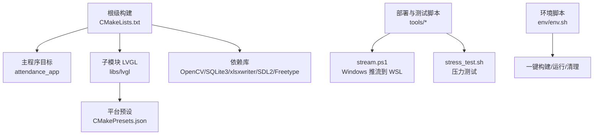
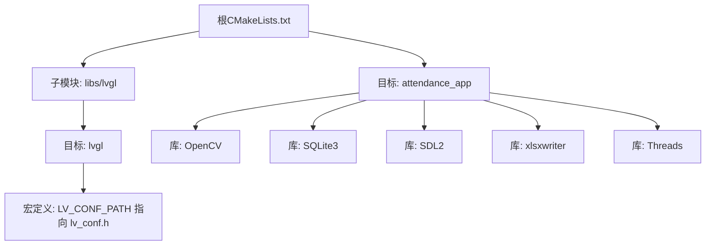
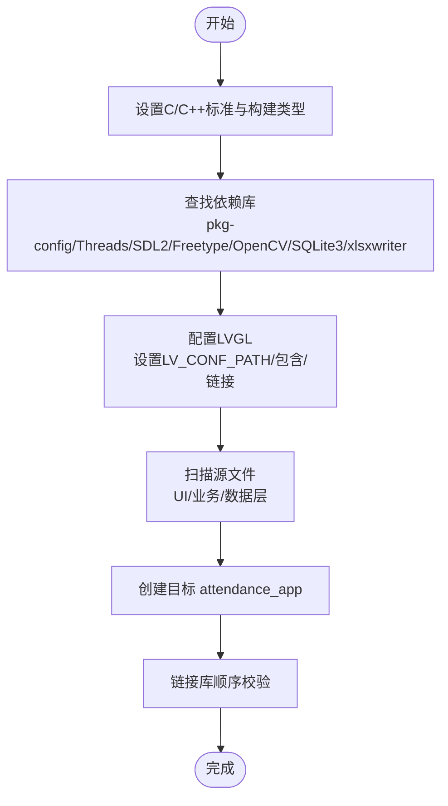
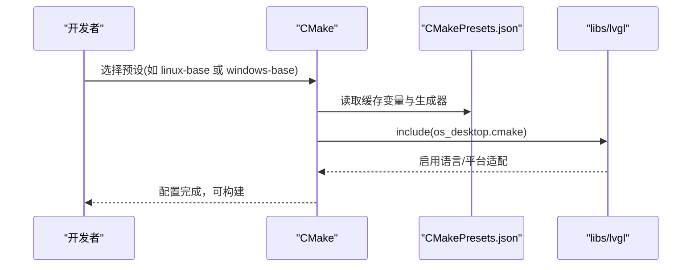
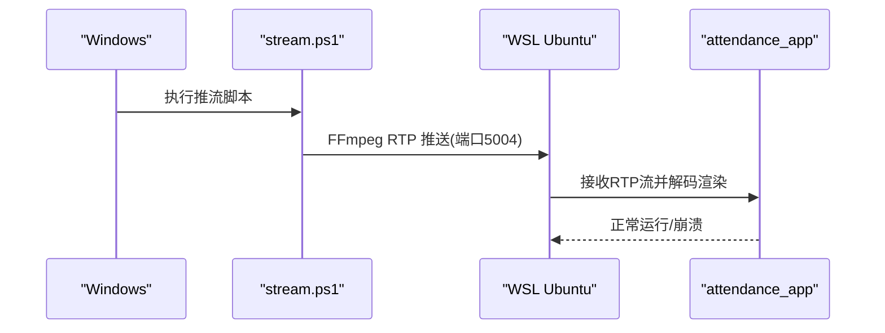
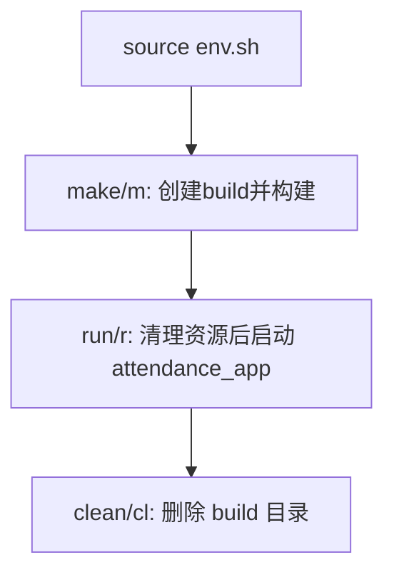
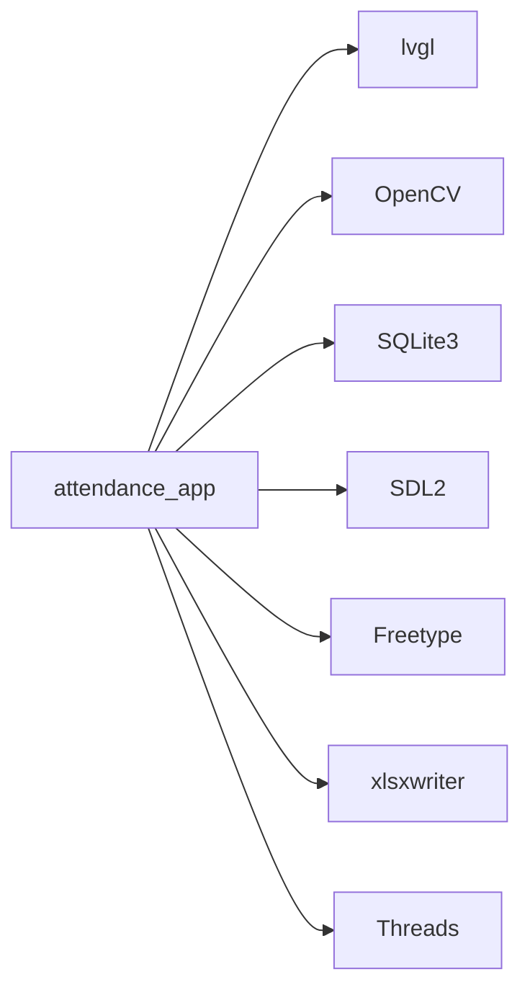

# 编译与部署

<cite>
**本文引用的文件**   
- [CMakeLists.txt](file://CMakeLists.txt)
- [lv_conf.h](file://lv_conf.h)
- [libs/lvgl/CMakeLists.txt](file://libs/lvgl/CMakeLists.txt)
- [libs/lvgl/CMakePresets.json](file://libs/lvgl/CMakePresets.json)
- [tools/stream/stream.ps1](file://tools/stream/stream.ps1)
- [tools/stress_test.sh](file://tools/stress_test.sh)
- [env/env.sh](file://env/env.sh)
- [libs/lvgl/scripts/install-prerequisites.sh](file://libs/lvgl/scripts/install-prerequisites.sh)
- [libs/lvgl/scripts/prerequisites-apt.txt](file://libs/lvgl/scripts/prerequisites-apt.txt)
</cite>

## 目录
1. [简介](#简介)
2. [项目结构](#项目结构)
3. [核心组件](#核心组件)
4. [架构总览](#架构总览)
5. [详细组件分析](#详细组件分析)
6. [依赖关系分析](#依赖关系分析)
7. [性能考虑](#性能考虑)
8. [故障排查指南](#故障排查指南)
9. [结论](#结论)
10. [附录](#附录)

## 简介
本指南面向SmartAttendance项目的编译与部署，覆盖以下内容：
- CMake构建系统配置项：标准版本、编译类型、导出编译命令、依赖查找与链接。
- 平台编译步骤：Linux、Windows、WSL2的差异与注意事项。
- 交叉编译与目标平台适配：通过预设与缓存变量实现多配置管理。
- 编译命令示例与常见错误定位。
- 部署脚本使用：stream.ps1（Windows推流至WSL）与stress_test.sh（压力测试）。
- 优化选项、调试配置与发布版本构建流程。

## 项目结构
SmartAttendance采用分层模块化组织：
- 根级CMakeLists.txt负责顶层构建配置、依赖查找、主程序目标与LVGL集成。
- libs/lvgl为UI子系统，提供桌面端OS适配与多平台预设。
- tools目录包含部署与测试脚本。
- env/env.sh提供一键构建、运行与清理的Shell封装。
- lv_conf.h为LVGL配置文件，影响渲染与功能开关。

**图表来源**
- [CMakeLists.txt:1-153](file://CMakeLists.txt#L1-L153)
- [libs/lvgl/CMakeLists.txt:1-45](file://libs/lvgl/CMakeLists.txt#L1-L45)
- [libs/lvgl/CMakePresets.json:1-161](file://libs/lvgl/CMakePresets.json#L1-L161)

**章节来源**
- [CMakeLists.txt:1-153](file://CMakeLists.txt#L1-L153)
- [libs/lvgl/CMakeLists.txt:1-45](file://libs/lvgl/CMakeLists.txt#L1-L45)
- [libs/lvgl/CMakePresets.json:1-161](file://libs/lvgl/CMakePresets.json#L1-L161)

## 核心组件
- 构建系统与编译选项
  - C++17/C11标准、默认Debug构建、导出compile_commands.json便于IDE索引。
- 依赖库与链接
  - 基础工具：pkg-config、线程库。
  - UI与图形：SDL2、Freetype；LVGL作为子模块集成。
  - 视觉与图像：OpenCV（含face、imgcodecs等组件）、libxlsxwriter。
  - 数据存储：SQLite3。
- 目标与包含路径
  - attendance_app聚合src各层代码，包含路径覆盖src、include、libs/lvgl及OpenCV、SDL2、xlsxwriter等。
  - LVGL目标通过宏与包含路径注入配置文件路径。

**章节来源**
- [CMakeLists.txt:7-14](file://CMakeLists.txt#L7-L14)
- [CMakeLists.txt:18-38](file://CMakeLists.txt#L18-L38)
- [CMakeLists.txt:56-71](file://CMakeLists.txt#L56-L71)
- [CMakeLists.txt:114-146](file://CMakeLists.txt#L114-L146)

## 架构总览
下图展示从根构建到最终可执行文件的依赖与链接关系：

**图表来源**
- [CMakeLists.txt:56-71](file://CMakeLists.txt#L56-L71)
- [CMakeLists.txt:114-146](file://CMakeLists.txt#L114-L146)
- [libs/lvgl/CMakeLists.txt:19-27](file://libs/lvgl/CMakeLists.txt#L19-L27)

## 详细组件分析

### 组件A：根级CMake构建配置
- 关键点
  - 标准与构建类型：C++17/C11、默认Debug、导出compile_commands.json。
  - 依赖查找：pkg-config、线程库、SDL2、Freetype、OpenCV(含face组件)、SQLite3、xlsxwriter。
  - LVGL集成：设置LV_CONF_PATH并引入子目录，为目标添加包含与链接。
  - 源码收集：递归匹配src目录下的UI、业务、数据层源文件。
  - 链接顺序：lvgl优先，随后OpenCV、SQLite3、SDL2、xlsxwriter、Threads。
- 常见问题
  - OpenCV路径：Linux/WSL需确保/usr/include/opencv4存在，find_package可自动发现。
  - db_storage.h缺失：若不存在会触发致命错误，请检查路径。

**图表来源**
- [CMakeLists.txt:7-14](file://CMakeLists.txt#L7-L14)
- [CMakeLists.txt:18-38](file://CMakeLists.txt#L18-L38)
- [CMakeLists.txt:56-71](file://CMakeLists.txt#L56-L71)
- [CMakeLists.txt:84-110](file://CMakeLists.txt#L84-L110)
- [CMakeLists.txt:114-146](file://CMakeLists.txt#L114-L146)

**章节来源**
- [CMakeLists.txt:7-14](file://CMakeLists.txt#L7-L14)
- [CMakeLists.txt:18-38](file://CMakeLists.txt#L18-L38)
- [CMakeLists.txt:56-71](file://CMakeLists.txt#L56-L71)
- [CMakeLists.txt:84-110](file://CMakeLists.txt#L84-L110)
- [CMakeLists.txt:114-146](file://CMakeLists.txt#L114-L146)

### 组件B：LVGL子模块与平台预设
- 子模块行为
  - 根据环境选择os_desktop.cmake，启用C/CXX/ASM语言（非MSVC）。
  - Windows共享库导出控制（DLL导入/导出宏）。
- 平台预设
  - Windows：Visual Studio 17 2022，x64，BUILD_SHARED_LIBS=ON。
  - Linux：Ninja Multi-Config，多配置Debug/Release，支持Kconfig变体。
  - 可通过configurePreset与buildPreset组合快速切换。

**图表来源**
- [libs/lvgl/CMakeLists.txt:19-27](file://libs/lvgl/CMakeLists.txt#L19-L27)
- [libs/lvgl/CMakePresets.json:32-97](file://libs/lvgl/CMakePresets.json#L32-L97)

**章节来源**
- [libs/lvgl/CMakeLists.txt:1-45](file://libs/lvgl/CMakeLists.txt#L1-L45)
- [libs/lvgl/CMakePresets.json:1-161](file://libs/lvgl/CMakePresets.json#L1-L161)

### 组件C：部署脚本与工作流
- stream.ps1（Windows推流至WSL）
  - 功能：通过FFmpeg将摄像头视频以RTP推送至WSL内指定IP的5004端口，并生成SDP文件。
  - 关键参数：设备名、分辨率、帧率、像素格式、RTP载荷类型、包大小等。
  - 适用场景：在Windows上采集视频并通过网络传输给WSL中的应用进行测试。
- stress_test.sh（Linux压力测试）
  - 功能：启动attendance_app，每5秒记录一次RSS与内存占比，持续1小时，检测崩溃并退出。
  - 适用场景：验证长时间运行稳定性与内存泄漏风险。

**图表来源**
- [tools/stream/stream.ps1:1-47](file://tools/stream/stream.ps1#L1-L47)
- [tools/stress_test.sh:1-20](file://tools/stress_test.sh#L1-L20)

**章节来源**
- [tools/stream/stream.ps1:1-47](file://tools/stream/stream.ps1#L1-L47)
- [tools/stress_test.sh:1-20](file://tools/stress_test.sh#L1-L20)

### 组件D：环境脚本与一键构建
- env/env.sh
  - 提供make/m、run/r、clean/cl等快捷命令。
  - 构建：进入build目录，执行cmake ..与make -j$(nproc)。
  - 运行：清理UDP与/dev/video0占用，杀掉僵尸进程，再启动attendance_app。
- 依赖准备
  - install-prerequisites.sh与prerequisites-apt.txt提供Linux依赖清单，便于快速搭建开发环境。

**图表来源**
- [env/env.sh:48-99](file://env/env.sh#L48-L99)
- [libs/lvgl/scripts/install-prerequisites.sh:1-16](file://libs/lvgl/scripts/install-prerequisites.sh#L1-L16)
- [libs/lvgl/scripts/prerequisites-apt.txt:1-39](file://libs/lvgl/scripts/prerequisites-apt.txt#L1-L39)

**章节来源**
- [env/env.sh:1-102](file://env/env.sh#L1-L102)
- [libs/lvgl/scripts/install-prerequisites.sh:1-16](file://libs/lvgl/scripts/install-prerequisites.sh#L1-L16)
- [libs/lvgl/scripts/prerequisites-apt.txt:1-39](file://libs/lvgl/scripts/prerequisites-apt.txt#L1-L39)

## 依赖关系分析
- 外部依赖
  - OpenCV：核心图像处理与人脸识别。
  - SQLite3：本地数据库存储。
  - xlsxwriter：报表导出。
  - SDL2+Freetype：桌面端显示与字体渲染。
  - 线程库：跨平台并发支持。
- 内部依赖
  - LVGL作为UI基础库被attendance_app链接。
  - LV_CONF_PATH宏确保LVGL使用项目根目录的配置文件。

**图表来源**
- [CMakeLists.txt:139-146](file://CMakeLists.txt#L139-L146)

**章节来源**
- [CMakeLists.txt:139-146](file://CMakeLists.txt#L139-L146)

## 性能考虑
- 构建类型
  - Debug便于调试但性能较低；Release适合发布与性能测试。
- LVGL渲染
  - lv_conf.h中DRAW相关配置可按需求调整，例如软件渲染单元数量、图层缓冲策略等。
- 并发与线程
  - Threads::Threads已链接，可在业务层合理使用多线程提升吞吐。
- 依赖库优化
  - OpenCV、SDL2等库的编译选项与链接顺序会影响最终性能，建议在Release模式下开启相应优化标志。

[本节为通用指导，无需具体文件引用]

## 故障排查指南
- 依赖未找到
  - 症状：CMake报错找不到OpenCV/SDL2/SQLite3/xlsxwriter。
  - 处理：确认系统已安装对应开发包，Linux可参考prerequisites-apt.txt；必要时设置PKG_CONFIG_PATH或库路径。
- OpenCV路径问题
  - 症状：Linux/WSL找不到/usr/include/opencv4。
  - 处理：确保OpenCV安装在标准路径或手动指定OpenCV_DIR。
- db_storage.h缺失
  - 症状：CMake直接报致命错误。
  - 处理：检查src/data目录是否存在该头文件，修正路径。
- Windows共享库导出
  - 症状：链接时报符号导入/导出错误。
  - 处理：按预设使用Visual Studio生成器并保持BUILD_SHARED_LIBS=ON。
- WSL推流失败
  - 症状：RTP无法到达WSL或黑屏。
  - 处理：确认stream.ps1中设备名、分辨率、端口与WSL IP一致；检查防火墙与端口占用。
- 压力测试异常
  - 症状：应用崩溃或内存持续增长。
  - 处理：使用stress_test.sh监控RSS与PMEM，结合日志定位问题。

**章节来源**
- [CMakeLists.txt:73-78](file://CMakeLists.txt#L73-L78)
- [libs/lvgl/CMakePresets.json:16-29](file://libs/lvgl/CMakePresets.json#L16-L29)
- [tools/stream/stream.ps1:19-34](file://tools/stream/stream.ps1#L19-L34)
- [tools/stress_test.sh:8-18](file://tools/stress_test.sh#L8-L18)

## 结论
通过根级CMakeLists.txt统一管理编译标准、依赖与链接，配合libs/lvgl的平台预设与环境脚本，SmartAttendance可在Linux、Windows与WSL2环境下高效构建与部署。结合stream.ps1与stress_test.sh，可快速完成从推流到稳定性验证的闭环测试。

[本节为总结性内容，无需具体文件引用]

## 附录

### A. 平台编译步骤与命令示例
- Linux/WSL2
  - 一键构建：source env.sh后执行make或m。
  - 手动构建：mkdir -p build && cd build && cmake .. && make -j$(nproc)。
  - 运行：source env.sh后执行run或r。
- Windows
  - 使用Visual Studio 17 2022生成器，按预设选择Debug/Release。
  - 也可使用Ninja Multi-Config，通过configurePreset与buildPreset切换。
- 交叉编译
  - 通过自定义CMakeToolchain或第三方SDK，在根CMakeLists.txt中传入目标三元组与工具链文件即可。

**章节来源**
- [env/env.sh:48-99](file://env/env.sh#L48-L99)
- [libs/lvgl/CMakePresets.json:32-97](file://libs/lvgl/CMakePresets.json#L32-L97)

### B. 编译优化与调试配置
- 调试配置
  - 默认Debug，便于断点与符号追踪；建议在IDE中使用导出的compile_commands.json。
- 发布配置
  - 切换CMAKE_BUILD_TYPE为Release，启用编译器优化标志（如-O3/-DNDEBUG），并链接Release版依赖库。
- LVGL优化
  - 在lv_conf.h中根据目标硬件调整DRAW相关参数，减少带宽与CPU占用。

**章节来源**
- [CMakeLists.txt:11](file://CMakeLists.txt#L11)
- [lv_conf.h:145-167](file://lv_conf.h#L145-L167)

### C. LVGL配置要点
- LV_CONF_PATH宏确保LVGL使用项目根目录的配置文件。
- OS选择：桌面端可按需启用SDL2或None；DRAW后端按需启用软件/硬件加速。
- 字体与文本：根据界面语言选择合适的字体与编码。

**章节来源**
- [CMakeLists.txt:61](file://CMakeLists.txt#L61)
- [lv_conf.h:110](file://lv_conf.h#L110)
- [lv_conf.h:647](file://lv_conf.h#L647)