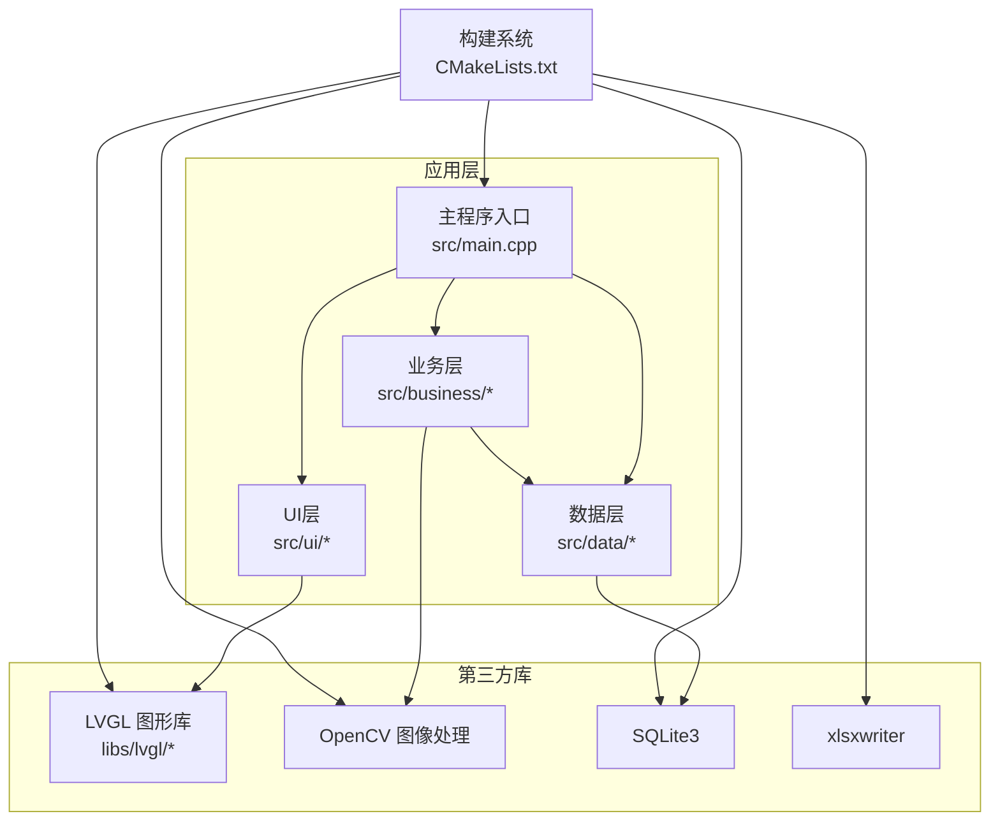
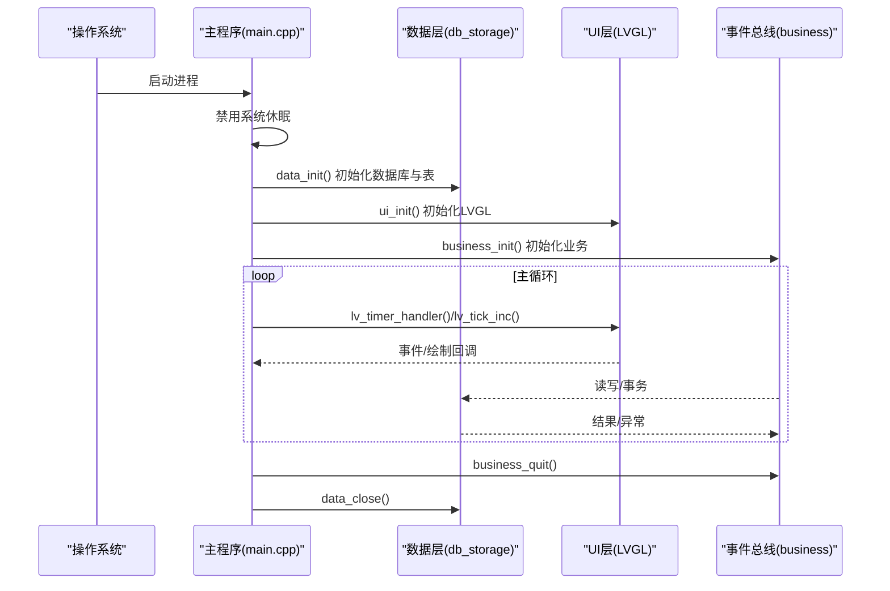
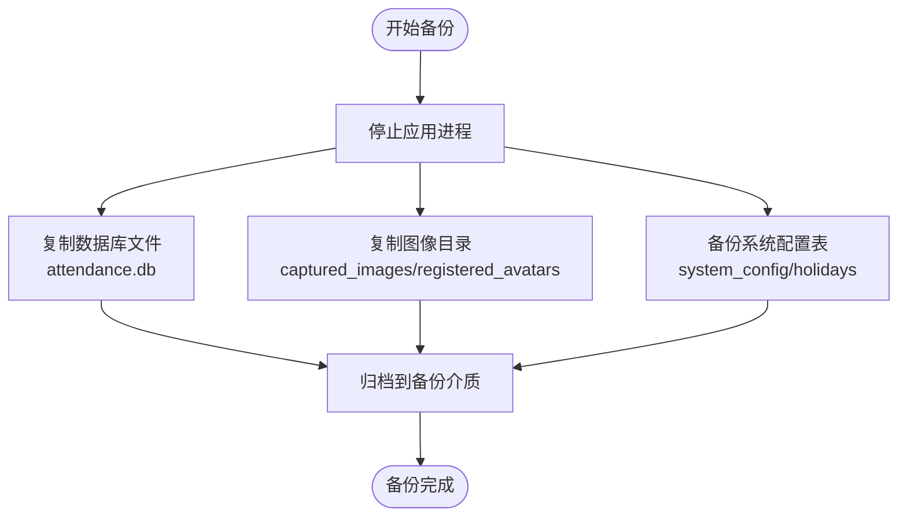
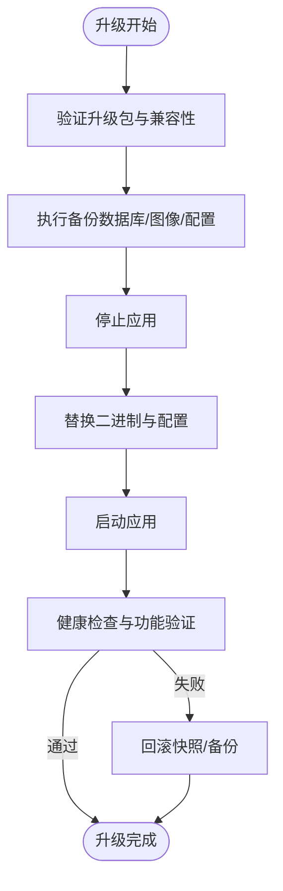
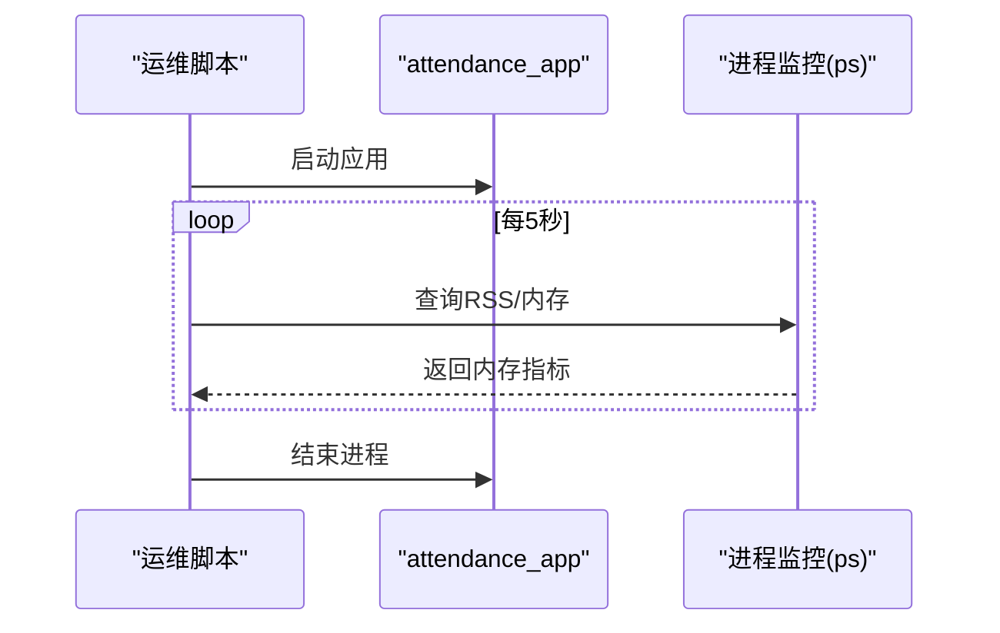
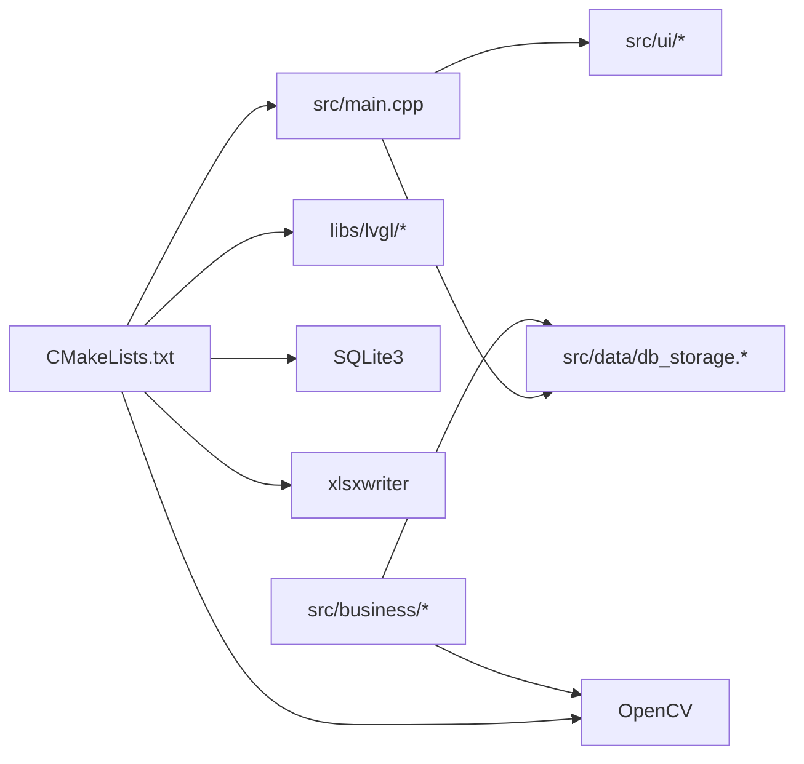

# 运维最佳实践

<cite>
**本文引用的文件**
- [CMakeLists.txt](file://CMakeLists.txt)
- [main.cpp](file://src/main.cpp)
- [db_storage.h](file://src/data/db_storage.h)
- [db_storage.cpp](file://src/data/db_storage.cpp)
- [lv_conf.h](file://lv_conf.h)
- [env.sh](file://env/env.sh)
- [stress_test.sh](file://tools/stress_test.sh)
- [stream.ps1](file://tools/stream/stream.ps1)
- [SmartAttendance框架结构.txt](file://docs/SmartAttendance框架结构.txt)
</cite>

## 目录
1. [简介](#简介)
2. [项目结构](#项目结构)
3. [核心组件](#核心组件)
4. [架构总览](#架构总览)
5. [详细组件分析](#详细组件分析)
6. [依赖关系分析](#依赖关系分析)
7. [性能考虑](#性能考虑)
8. [故障排查指南](#故障排查指南)
9. [结论](#结论)
10. [附录](#附录)

## 简介
本指南面向SmartAttendance项目的运维团队，聚焦生产环境的升级与回滚、数据备份与恢复、安全加固、性能优化、自动化运维工具使用、文档与变更管理以及合规性要求。内容基于仓库现有实现进行提炼与扩展，帮助团队建立标准化的运维流程与风险控制措施。

## 项目结构
项目采用分层架构：UI层、业务层、数据层，配合LVGL图形库与SQLite数据库，构建桌面端考勤应用。构建系统使用CMake，运行环境通过shell脚本进行便捷编译与运行。

**图表来源**
- [CMakeLists.txt:1-153](file://CMakeLists.txt#L1-L153)
- [main.cpp:187-246](file://src/main.cpp#L187-L246)
- [SmartAttendance框架结构.txt:1-68](file://docs/SmartAttendance框架结构.txt#L1-L68)

**章节来源**
- [CMakeLists.txt:1-153](file://CMakeLists.txt#L1-L153)
- [SmartAttendance框架结构.txt:1-68](file://docs/SmartAttendance框架结构.txt#L1-L68)

## 核心组件
- 构建与依赖管理：CMake集中管理第三方库（OpenCV、SQLite、xlsxwriter）与LVGL集成，导出编译命令以便IDE识别头文件。
- 主程序生命周期：初始化系统（禁用休眠）、数据层、UI层、业务层，进入主循环驱动LVGL心跳。
- 数据层（SQLite）：提供DAO接口、事务支持、播种默认数据、性能调优（WAL、索引、缓存）。
- UI层（LVGL）：通过配置文件lv_conf.h控制渲染、内存与线程参数。
- 运行环境脚本：env.sh提供一键构建、运行与资源清理；tools目录提供压力测试与视频推流脚本。

**章节来源**
- [CMakeLists.txt:10-153](file://CMakeLists.txt#L10-L153)
- [main.cpp:187-246](file://src/main.cpp#L187-L246)
- [db_storage.h:187-596](file://src/data/db_storage.h#L187-L596)
- [db_storage.cpp:108-285](file://src/data/db_storage.cpp#L108-L285)
- [lv_conf.h:1-800](file://lv_conf.h#L1-L800)
- [env.sh:16-102](file://env/env.sh#L16-L102)

## 架构总览
系统采用“主程序驱动 + 分层模块 + 数据持久化”的结构。主程序负责系统初始化与事件循环，业务层负责认证与考勤规则，数据层负责SQLite读写与文件存储，UI层负责图形界面渲染。

**图表来源**
- [main.cpp:187-246](file://src/main.cpp#L187-L246)
- [db_storage.cpp:108-285](file://src/data/db_storage.cpp#L108-L285)

## 详细组件分析

### 数据层（SQLite）与备份恢复策略
- 数据库存储：数据库文件名为“attendance.db”，图像与头像分别保存在“captured_images”和“registered_avatars”目录。
- 性能调优：启用WAL模式、NORMAL同步、内存临时存储、缓存大小、外键约束。
- 并发控制：读写锁（shared_mutex）保护高频读写，预编译语句提升插入性能。
- 备份策略（建议）：
  - 全量备份：停止应用后复制“attendance.db”与图像目录。
  - 增量备份：基于WAL模式的归档（需结合SQLite工具），或定期复制新增图像。
  - 配置备份：系统配置表“system_config”与节假日表“holidays”需纳入备份。
- 恢复策略（建议）：
  - 先恢复数据库文件，再恢复图像目录，最后重启应用。
  - 恢复出厂设置：调用工厂重置接口，删除数据库与图像目录后重新播种。
- 回滚机制（建议）：
  - 升级前创建快照（文件系统快照或数据库备份）。
  - 升级失败时回滚至快照，确保业务连续性。

**图表来源**
- [db_storage.cpp:24-30](file://src/data/db_storage.cpp#L24-L30)
- [db_storage.cpp:123-135](file://src/data/db_storage.cpp#L123-L135)
- [db_storage.h:525-530](file://src/data/db_storage.h#L525-L530)

**章节来源**
- [db_storage.h:187-596](file://src/data/db_storage.h#L187-L596)
- [db_storage.cpp:108-285](file://src/data/db_storage.cpp#L108-L285)
- [db_storage.cpp:1864-1879](file://src/data/db_storage.cpp#L1864-L1879)

### 系统升级流程与回滚机制
- 版本管理：建议以Git标签或分支区分版本，构建产物置于独立目录，便于回滚。
- 升级策略：
  - 滚动升级：先停止应用，备份数据库与图像，替换二进制，启动验证。
  - 蓝绿部署：准备两套环境，切换流量后回滚。
- 回滚机制：
  - 快照回滚：文件系统快照或容器卷快照。
  - 备份回滚：恢复数据库与图像目录，重启应用。
- 升级验证：运行压力测试脚本与UI功能验证。

**图表来源**
- [env.sh:67-99](file://env/env.sh#L67-L99)
- [stress_test.sh:1-20](file://tools/stress_test.sh#L1-L20)

**章节来源**
- [env.sh:16-102](file://env/env.sh#L16-L102)
- [stress_test.sh:1-20](file://tools/stress_test.sh#L1-L20)

### 安全加固方法
- 系统安全配置：
  - 禁用系统休眠与屏保，避免黑屏导致的界面异常（已在主程序中实现）。
  - 运行前清理UDP端口与摄像头设备占用，降低资源冲突风险。
- 访问控制：
  - 用户认证采用密码与指纹双因子（AuthService），建议在生产环境对密码进行哈希存储与校验。
- 数据加密：
  - 建议对敏感配置与日志进行加密存储；数据库层面可启用SQLite加密扩展（需额外配置）。
- 权限与隔离：
  - 应用以最小权限运行；数据库与图像目录设置严格文件权限。

**章节来源**
- [main.cpp:156-182](file://src/main.cpp#L156-L182)
- [env.sh:81-93](file://env/env.sh#L81-L93)
- [auth_service.h:1-46](file://src/business/auth_service.h#L1-L46)

### 性能优化建议
- 系统调优：
  - SQLite：WAL模式、NORMAL同步、内存临时存储、缓存大小、外键约束已启用；建议根据负载调整缓存大小与同步级别。
  - LVGL：根据硬件能力调整刷新周期、内存池大小与渲染线程栈大小。
- 资源分配：
  - OpenCV与LVGL线程栈大小、渲染缓冲区大小需与目标设备匹配。
- 缓存策略：
  - 预编译SQL语句、共享读锁与写锁分离、索引优化（联合索引）降低延迟。

**章节来源**
- [db_storage.cpp:123-135](file://src/data/db_storage.cpp#L123-L135)
- [lv_conf.h:70-84](file://lv_conf.h#L70-L84)
- [lv_conf.h:154-167](file://lv_conf.h#L154-L167)

### 自动化运维工具使用
- 压力测试脚本（stress_test.sh）：
  - 启动应用，每5秒记录一次RSS与CPU使用，持续1小时，检测崩溃与内存泄漏。
- 流媒体处理脚本（stream.ps1）：
  - 通过FFmpeg将Windows摄像头视频推送到WSL中的RTP端口，便于离线测试与集成验证。

**图表来源**
- [stress_test.sh:1-20](file://tools/stress_test.sh#L1-L20)

**章节来源**
- [stress_test.sh:1-20](file://tools/stress_test.sh#L1-L20)
- [stream.ps1:1-47](file://tools/stream/stream.ps1#L1-L47)

### 文档管理、变更管理与合规性
- 文档管理：
  - 项目文档位于docs目录，建议维护版本化的架构与运维手册。
- 变更管理：
  - 使用Git分支与标签管理版本；每次升级前打标签，记录变更摘要。
- 合规性：
  - 数据最小化与可追溯性：备份与日志保留策略需符合数据保护法规。
  - 审计与追踪：关键操作（升级、回滚、备份）留痕并可审计。

**章节来源**
- [SmartAttendance框架结构.txt:1-68](file://docs/SmartAttendance框架结构.txt#L1-L68)

## 依赖关系分析
CMake集中管理依赖与集成LVGL，主程序依赖数据层与UI层，业务层依赖数据层与OpenCV。

**图表来源**
- [CMakeLists.txt:16-71](file://CMakeLists.txt#L16-L71)
- [main.cpp:187-246](file://src/main.cpp#L187-L246)

**章节来源**
- [CMakeLists.txt:16-71](file://CMakeLists.txt#L16-L71)

## 性能考虑
- 数据库性能：
  - WAL模式与索引显著提升并发读写性能；事务批量写入可降低写放大。
- UI渲染：
  - LVGL刷新周期与渲染线程栈大小需平衡流畅度与资源占用。
- 文件I/O：
  - 图像文件写入与清理策略（定期清理过期图片）降低磁盘压力。

**章节来源**
- [db_storage.cpp:123-135](file://src/data/db_storage.cpp#L123-L135)
- [db_storage.cpp:456-461](file://src/data/db_storage.cpp#L456-L461)
- [lv_conf.h:90-96](file://lv_conf.h#L90-L96)

## 故障排查指南
- 黑屏/摄像头占用：
  - 运行前清理UDP端口与摄像头设备占用，避免资源冲突。
- 应用崩溃：
  - 使用压力测试脚本定位内存泄漏与崩溃点；关注RSS峰值与进程存活。
- 数据库异常：
  - 检查WAL模式与同步级别；必要时重建索引或优化查询。
- UI卡顿：
  - 调整LVGL刷新周期与渲染线程栈大小；检查图像处理耗时。

**章节来源**
- [env.sh:81-93](file://env/env.sh#L81-L93)
- [stress_test.sh:1-20](file://tools/stress_test.sh#L1-L20)
- [lv_conf.h:90-96](file://lv_conf.h#L90-L96)

## 结论
通过标准化的升级流程、完善的备份与恢复策略、安全加固与性能优化，结合自动化运维工具与严格的文档与变更管理，SmartAttendance项目可在生产环境中实现高可用与可维护性。建议将本文流程固化为SOP，并定期演练升级与回滚场景，确保业务连续性。

## 附录
- 生产环境部署最佳实践：
  - 使用容器或虚拟机隔离运行环境；启用文件系统快照与数据库归档。
  - 配置监控与告警（CPU、内存、磁盘、数据库连接数）。
  - 定期演练备份恢复与回滚流程。
- 风险控制措施：
  - 升级窗口与回滚预案；灰度发布与快速回滚通道。
  - 数据脱敏与最小化原则；日志与审计留痕。