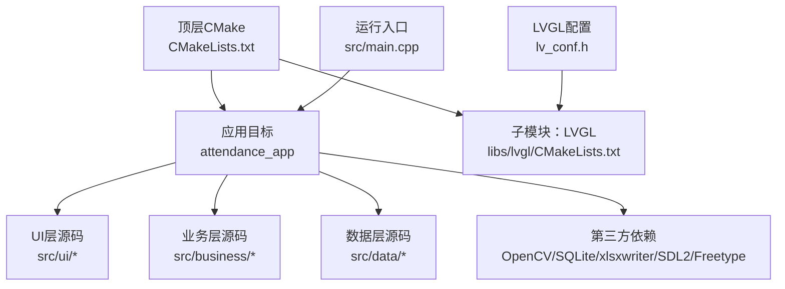
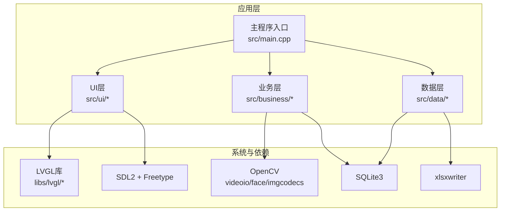
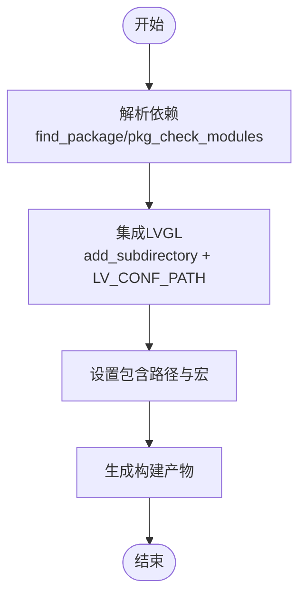
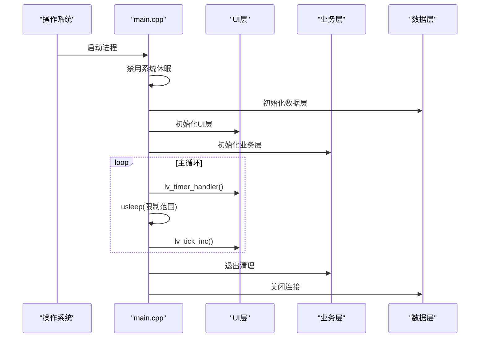
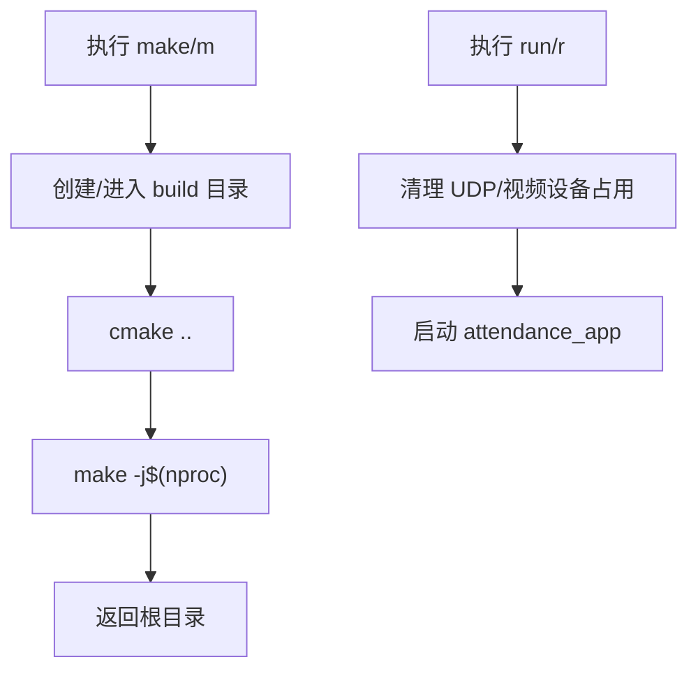
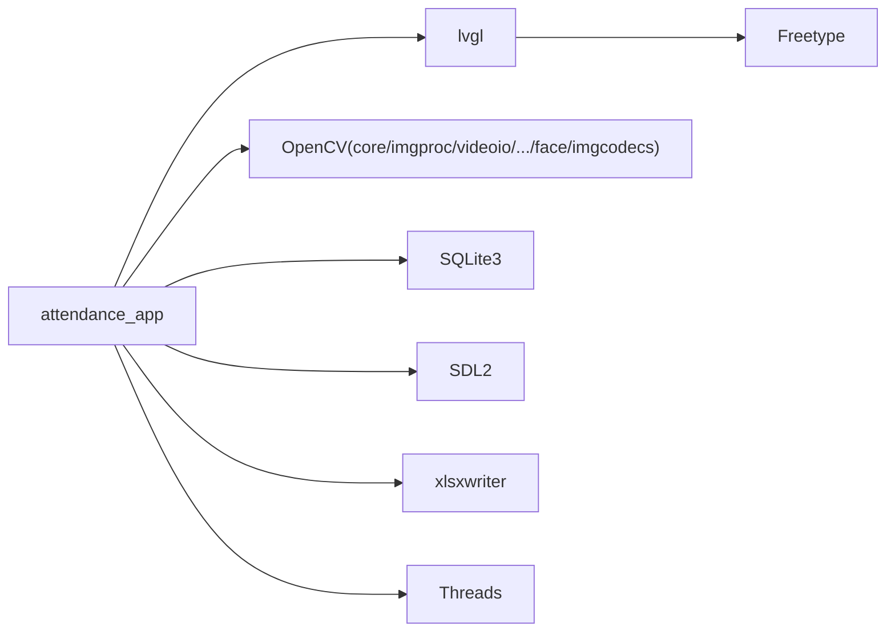

# 部署与运维

<cite>
**本文引用的文件**
- [CMakeLists.txt](file://CMakeLists.txt)
- [env.sh](file://env/env.sh)
- [main.cpp](file://src/main.cpp)
- [lv_conf.h](file://lv_conf.h)
- [Dockerfile](file://libs/lvgl/tests/Dockerfile)
- [lvgl CMakeLists.txt](file://libs/lvgl/CMakeLists.txt)
</cite>

## 目录
1. [简介](#简介)
2. [项目结构](#项目结构)
3. [核心组件](#核心组件)
4. [架构总览](#架构总览)
5. [详细组件分析](#详细组件分析)
6. [依赖关系分析](#依赖关系分析)
7. [性能考量](#性能考量)
8. [故障排查指南](#故障排查指南)
9. [结论](#结论)
10. [附录](#附录)

## 简介
本指南面向SmartAttendance项目的部署与运维团队，覆盖从本地编译到跨平台部署、容器化与自动化集成的全生命周期。内容包括：
- 编译与构建：编译选项、依赖解析、交叉编译与打包
- 部署脚本：一键构建、运行与清理
- 监控与健康检查：日志、性能与运行状态
- 故障排查：常见问题定位、日志分析与恢复
- 最佳实践：升级、备份、安全加固
- 容器化与CI：容器镜像构建、自动化部署与持续集成

## 项目结构
SmartAttendance采用CMake多模块工程组织，核心由UI层（LVGL）、业务层（人脸识别、规则引擎等）与数据层（SQLite）组成；顶层CMake负责依赖发现与链接，env脚本提供便捷的构建与运行。

**图示来源**
- [CMakeLists.txt:1-153](file://CMakeLists.txt#L1-L153)
- [lvgl CMakeLists.txt:1-45](file://libs/lvgl/CMakeLists.txt#L1-L45)
- [main.cpp:187-246](file://src/main.cpp#L187-L246)

**章节来源**
- [CMakeLists.txt:1-153](file://CMakeLists.txt#L1-L153)
- [lv_conf.h:1-LV_CONF_H:1-1476](file://lv_conf.h#L1-L1476)

## 核心组件
- 构建系统与编译选项
  - C++17标准、Debug构建类型、导出compile_commands.json便于IDE索引
  - 依赖发现：PkgConfig、Threads、OpenCV(含face模块)、SQLite3、xlsxwriter、SDL2、Freetype
  - LVGL集成：通过add_subdirectory引入，并设置LV_CONF_PATH宏与包含路径
- 运行入口与主循环
  - 信号处理捕获SIGINT，优雅退出
  - 初始化系统级休眠禁用、数据层、UI层、业务层
  - 主循环中驱动LVGL心跳，限制usleep范围以平衡性能与响应
- 环境脚本
  - 提供make/m、run/r、clean/cl等快捷命令，自动清理端口与设备占用，保障运行稳定性

**章节来源**
- [CMakeLists.txt:7-146](file://CMakeLists.txt#L7-L146)
- [main.cpp:40-246](file://src/main.cpp#L40-L246)
- [env.sh:16-102](file://env/env.sh#L16-L102)

## 架构总览
系统采用分层架构：UI层基于LVGL，业务层封装考勤规则与事件总线，数据层对接SQLite并支持Excel报表导出。顶层CMake统一管理依赖与链接，env脚本提供运维便利。

**图示来源**
- [CMakeLists.txt:112-146](file://CMakeLists.txt#L112-L146)
- [main.cpp:17-34](file://src/main.cpp#L17-L34)

## 详细组件分析

### 组件A：编译与依赖管理
- 依赖解析与链接
  - 通过find_package(pkg-config)与pkg_check_modules解析SDL2、xlsxwriter
  - OpenCV按需启用face、imgcodecs等组件
  - SQLite3与Threads作为必需库
  - LVGL通过add_subdirectory集成，设置LV_CONF_PATH宏与包含路径
- 编译选项
  - C++17/C11标准、Debug构建、导出compile_commands.json
- 复杂度与性能
  - 递归收集源文件，便于扩展但需注意构建时间；可通过显式列出源文件优化增量编译

**图示来源**
- [CMakeLists.txt:18-71](file://CMakeLists.txt#L18-L71)
- [CMakeLists.txt:112-146](file://CMakeLists.txt#L112-L146)

**章节来源**
- [CMakeLists.txt:18-71](file://CMakeLists.txt#L18-L71)
- [CMakeLists.txt:112-146](file://CMakeLists.txt#L112-L146)

### 组件B：运行入口与主循环
- 信号处理与优雅退出
  - 注册SIGINT处理器，设置全局退出标志
- 系统休眠禁用
  - 设置SDL环境变量、Linux控制台命令与Framebuffer参数，避免黑屏
- 初始化顺序
  - 数据层 → UI层 → 业务层，确保事件订阅与渲染前置
- 主循环
  - 驱动LVGL定时器与tick，限制usleep上下限，兼顾性能与响应

**图示来源**
- [main.cpp:187-246](file://src/main.cpp#L187-L246)

**章节来源**
- [main.cpp:40-246](file://src/main.cpp#L40-L246)

### 组件C：环境脚本与运维命令
- 构建命令
  - make/m：创建build目录、执行cmake、并行编译
- 运行命令
  - run/r：清理UDP端口与/dev/video0占用、终止僵尸进程、启动应用
- 清理命令
  - clean/cl：删除build目录
- 工作流
  - 通过别名简化日常操作，提升开发与运维效率

**图示来源**
- [env.sh:48-99](file://env/env.sh#L48-L99)

**章节来源**
- [env.sh:16-102](file://env/env.sh#L16-L102)

### 组件D：LVGL配置与渲染
- 配置要点
  - 颜色深度、默认刷新周期、DPI、内存分配策略
  - 软件渲染开关、图元缓冲与线程优先级
  - 日志与断言开关，便于生产与调试场景切换
- 性能影响
  - draw_buf大小、线程栈与优先级直接影响渲染吞吐
  - 文本与字体配置决定内存与绘制开销

**章节来源**
- [lv_conf.h:29-167](file://lv_conf.h#L29-L167)
- [lv_conf.h:412-451](file://lv_conf.h#L412-L451)

## 依赖关系分析
- 直接依赖
  - attendance_app链接lvgl、OpenCV、SQLite3、SDL2、xlsxwriter、Threads
- 间接依赖
  - LVGL依赖SDL2与Freetype；OpenCV依赖底层图像编解码库
- 外部集成点
  - xlsxwriter用于报表导出；SQLite3用于本地持久化

**图示来源**
- [CMakeLists.txt:139-146](file://CMakeLists.txt#L139-L146)

**章节来源**
- [CMakeLists.txt:139-146](file://CMakeLists.txt#L139-L146)

## 性能考量
- 渲染与定时
  - 限制主循环usleep范围，避免过快或过慢导致卡顿或CPU占用过高
  - 调整LVGL默认刷新周期与draw_buf大小，平衡流畅度与内存
- 线程与并发
  - 启用多draw_unit或调整线程栈/优先级，结合FreeType/ThorVG场景评估
- I/O与外部库
  - OpenCV人脸检测/识别耗时较高，建议在后台线程或异步任务中执行
  - SQLite写入批量提交，避免频繁fsync

[本节为通用指导，无需具体文件引用]

## 故障排查指南
- 黑屏/无画面
  - 确认系统休眠禁用逻辑已执行；检查/dev/video0是否被其他进程占用；必要时清理UDP端口
  - 参考运行脚本中的清理步骤
- 无法启动/崩溃
  - 检查依赖是否满足（OpenCV、SQLite3、SDL2、Freetype、xlsxwriter）
  - 查看编译日志与链接阶段输出
- 人脸检测异常
  - 确认摄像头权限与设备节点可用；核对OpenCV组件是否完整启用
- 升级与回滚
  - 建议保留旧版本二进制与数据库备份，按“先备份、后升级、失败即回滚”的原则执行

**章节来源**
- [env.sh:68-99](file://env/env.sh#L68-L99)
- [CMakeLists.txt:18-38](file://CMakeLists.txt#L18-L38)

## 结论
通过标准化的CMake工程、完善的依赖管理与运维脚本，SmartAttendance可在多种环境中稳定运行。建议在生产环境中开启适当的日志级别与监控，配合容器化与CI流水线实现自动化部署与快速回滚。

[本节为总结性内容，无需具体文件引用]

## 附录

### A. 编译与部署流程
- 本地编译
  - 使用env脚本的make/m命令完成配置与并行编译
- 运行
  - 使用env脚本的run/r命令启动，自动清理潜在冲突资源
- 清理
  - 使用clean/cl或make-distclean清理构建产物

**章节来源**
- [env.sh:48-99](file://env/env.sh#L48-L99)

### B. 容器化部署与跨平台支持
- 容器镜像基础
  - 可参考LVGL仓库提供的Dockerfile示例，安装apt与pip依赖，构建工作区
- 跨平台构建
  - LVGL提供了针对嵌入式与桌面环境的CMake集成模板，可作为参考进行交叉编译链配置
- 镜像构建建议
  - 分离build与deploy阶段，减少最终镜像体积；在容器内运行前确保显示与音频设备挂载

**章节来源**
- [Dockerfile:1-25](file://libs/lvgl/tests/Dockerfile#L1-L25)
- [lvgl CMakeLists.txt:21-27](file://libs/lvgl/CMakeLists.txt#L21-L27)

### C. 监控与健康检查
- 日志
  - 可在LVGL配置中启用日志模块与时间戳，便于追踪渲染与输入事件
- 性能
  - 通过限制主循环usleep范围与调整LVGL刷新周期，观察帧率与CPU占用
- 健康检查
  - 在业务层增加心跳事件与状态上报，结合UI层反馈形成可视化健康面板

**章节来源**
- [lv_conf.h:412-451](file://lv_conf.h#L412-L451)
- [main.cpp:229-238](file://src/main.cpp#L229-L238)

### D. 升级、备份与安全加固
- 升级
  - 采用灰度发布策略，先在小范围验证，再逐步扩大
- 备份
  - 对数据库文件与关键配置进行定期备份；变更前先打快照
- 安全
  - 限制摄像头访问权限；对敏感数据加密存储；启用最小权限原则

[本节为通用指导，无需具体文件引用]