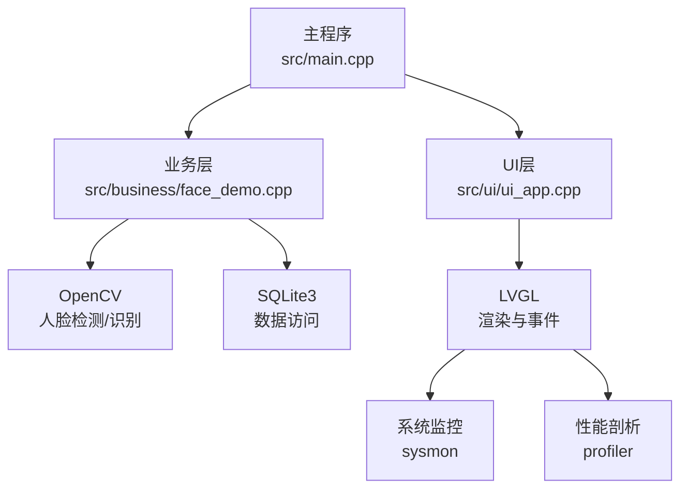
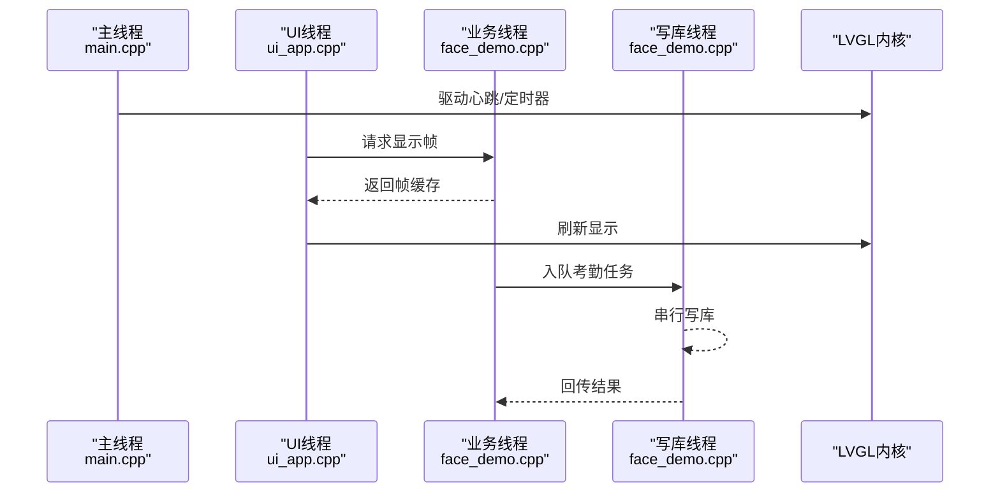
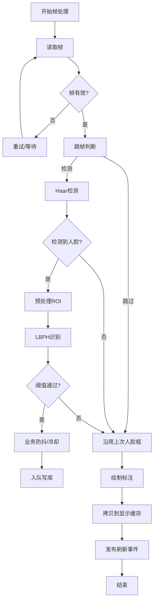
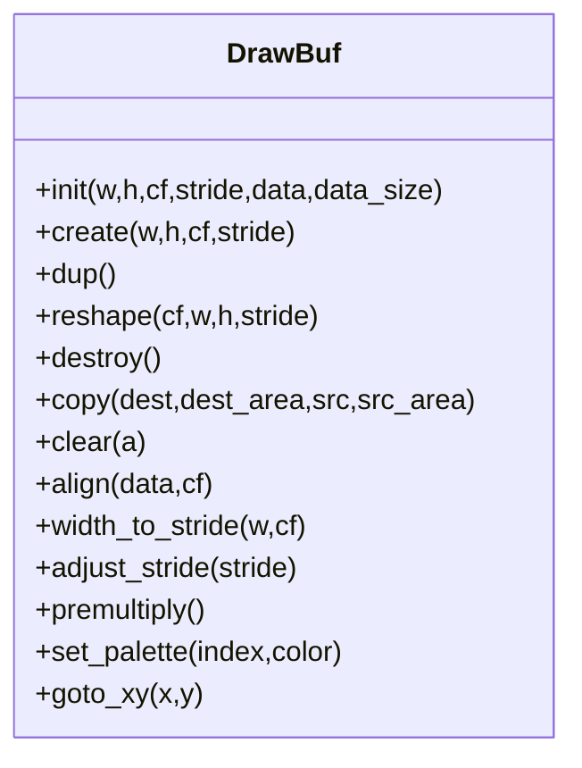
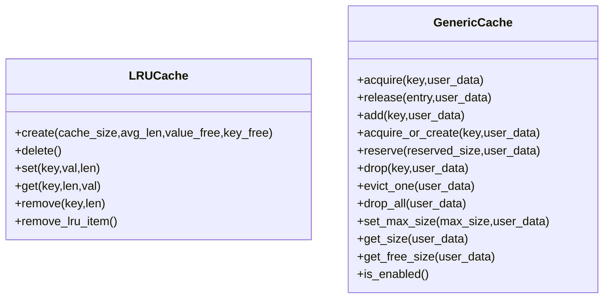
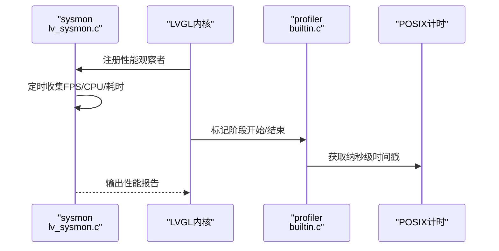
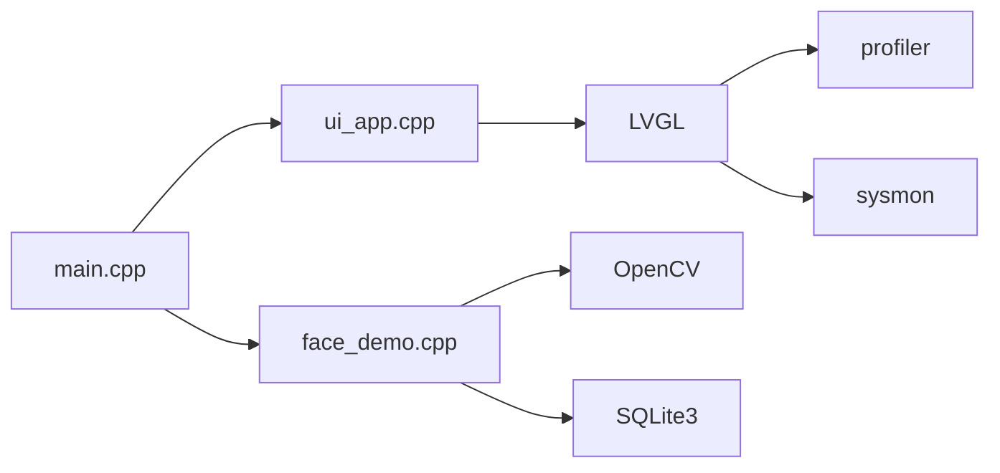

# 性能优化

<cite>
**本文引用的文件**
- [src/main.cpp](file://src/main.cpp)
- [src/business/face_demo.cpp](file://src/business/face_demo.cpp)
- [src/business/face_demo.h](file://src/business/face_demo.h)
- [src/ui/ui_app.cpp](file://src/ui/ui_app.cpp)
- [libs/lvgl/src/misc/lv_profiler_builtin.c](file://libs/lvgl/src/misc/lv_profiler_builtin.c)
- [libs/lvgl/src/misc/lv_profiler_builtin.h](file://libs/lvgl/src/misc/lv_profiler_builtin.h)
- [libs/lvgl/src/misc/lv_profiler.h](file://libs/lvgl/src/misc/lv_profiler.h)
- [libs/lvgl/src/misc/lv_profiler_builtin_posix.c](file://libs/lvgl/src/misc/lv_profiler_builtin_posix.c)
- [libs/lvgl/src/draw/lv_draw_buf.c](file://libs/lvgl/src/draw/lv_draw_buf.c)
- [libs/lvgl/src/misc/cache/lv_cache.c](file://libs/lvgl/src/misc/cache/lv_cache.c)
- [libs/lvgl/src/misc/lv_lru.c](file://libs/lvgl/src/misc/lv_lru.c)
- [libs/lvgl/src/others/sysmon/lv_sysmon.c](file://libs/lvgl/src/others/sysmon/lv_sysmon.c)
- [tools/stress_test.sh](file://tools/stress_test.sh)
</cite>

## 目录
1. [简介](#简介)
2. [项目结构](#项目结构)
3. [核心组件](#核心组件)
4. [架构总览](#架构总览)
5. [详细组件分析](#详细组件分析)
6. [依赖关系分析](#依赖关系分析)
7. [性能考量](#性能考量)
8. [故障排查指南](#故障排查指南)
9. [结论](#结论)
10. [附录](#附录)

## 简介
本文件面向智能考勤系统的性能优化，聚焦以下目标：
- 人脸识别模块的性能瓶颈与优化：OpenCV 处理速度、多线程并行策略、内存使用优化
- LVGL 图形渲染性能调优：缓冲区管理、绘制优化、动画性能改进
- 系统资源监控：CPU 使用率、内存占用、GPU 负载的监测与分析
- 缓存策略优化：图像缓存、数据库查询缓存、字体缓存
- 性能测试与基准测试：测试方法与工具使用
- 不同硬件配置的优化建议与低配设备适配
- 性能问题诊断流程与常见问题解决方案

## 项目结构
系统采用分层架构：UI 层（LVGL + SDL）、业务层（人脸识别与考勤规则）、数据层（SQLite）。主循环负责驱动 LVGL 心跳与定时器，业务层在后台线程中完成摄像头采集、人脸检测/识别与异步写库。

**图表来源**
- [src/main.cpp:187-246](file://src/main.cpp#L187-L246)
- [src/ui/ui_app.cpp:34-94](file://src/ui/ui_app.cpp#L34-L94)
- [src/business/face_demo.cpp:557-694](file://src/business/face_demo.cpp#L557-L694)

**章节来源**
- [src/main.cpp:187-246](file://src/main.cpp#L187-L246)
- [src/ui/ui_app.cpp:34-94](file://src/ui/ui_app.cpp#L34-L94)
- [src/business/face_demo.cpp:557-694](file://src/business/face_demo.cpp#L557-L694)

## 核心组件
- 主循环与心跳：主程序循环驱动 LVGL 心跳与定时器，限制最小/最大休眠时间，保障响应与节能平衡。
- UI 层：基于 LVGL + SDL 的仿真显示，绑定键盘输入，加载主页并启动后台服务。
- 业务层：后台采集线程负责摄像头/流读取、人脸检测与识别、绘制标注、异步写库；数据库写线程串行落库，避免并发竞争。
- 缓存与预处理：全局配置缓存、用户与记录缓存、显示帧缓存；预处理流水线包含裁剪、尺寸归一化、直方图均衡化、ROI 增强。
- LVGL 性能与缓存：内置剖析器、缓存框架（LRU/通用缓存）、绘制缓冲区管理。

**章节来源**
- [src/main.cpp:226-238](file://src/main.cpp#L226-L238)
- [src/ui/ui_app.cpp:34-94](file://src/ui/ui_app.cpp#L34-L94)
- [src/business/face_demo.cpp:291-549](file://src/business/face_demo.cpp#L291-L549)
- [src/business/face_demo.h:42-84](file://src/business/face_demo.h#L42-L84)

## 架构总览
系统采用“主循环 + 多线程后台”的模式：
- 主线程：LVGL 心跳、事件循环、定时器推进
- 采集线程：视频采集、人脸检测/识别、绘制标注、UI 帧缓存
- 写库线程：消费队列、串行写库、异常隔离
- UI 线程：渲染、事件处理、资源监控

**图表来源**
- [src/main.cpp:226-238](file://src/main.cpp#L226-L238)
- [src/ui/ui_app.cpp:34-94](file://src/ui/ui_app.cpp#L34-L94)
- [src/business/face_demo.cpp:246-285](file://src/business/face_demo.cpp#L246-L285)
- [src/business/face_demo.cpp:516-527](file://src/business/face_demo.cpp#L516-L527)

## 详细组件分析

### 人脸识别模块性能分析与优化
- 处理流水线
  - 预处理：裁剪边界、尺寸归一化、直方图均衡化（全局/CLAHE）、ROI 增强
  - 检测：Haar 级联分类器，选择最大人脸框
  - 识别：LBPH 模型预测，阈值过滤
  - 标注：绘制框与文本，冷却与防抖
  - 缓存：显示帧缓存、用户/记录缓存、全局配置缓存
- 多线程策略
  - 采集线程：读取帧、检测/识别、绘制、UI 帧缓存
  - 写库线程：队列消费、串行写库、异常隔离
  - 互斥与条件变量：保护共享数据，避免竞争
- 内存优化
  - 跳帧策略：每 N 帧检测一次，降低 CPU 占用
  - 限时刷新：UI 最小刷新间隔，避免过度渲染
  - 帧释放：及时释放临时帧，减少峰值内存
  - 队列长度控制：防止积压导致内存膨胀
- 可靠性
  - SDP 流重连机制：检测断流并自动恢复
  - 异常捕获：避免单点崩溃影响整体

**图表来源**
- [src/business/face_demo.cpp:291-549](file://src/business/face_demo.cpp#L291-L549)
- [src/business/face_demo.cpp:516-527](file://src/business/face_demo.cpp#L516-L527)

**章节来源**
- [src/business/face_demo.cpp:88-165](file://src/business/face_demo.cpp#L88-L165)
- [src/business/face_demo.cpp:193-202](file://src/business/face_demo.cpp#L193-L202)
- [src/business/face_demo.cpp:246-285](file://src/business/face_demo.cpp#L246-L285)
- [src/business/face_demo.cpp:291-549](file://src/business/face_demo.cpp#L291-L549)
- [src/business/face_demo.cpp:516-527](file://src/business/face_demo.cpp#L516-L527)

### LVGL 图形渲染性能调优
- 缓冲区管理
  - 绘制缓冲区创建/对齐/复制/销毁流程，支持 stride 对齐与跨格式复制
  - 颜色格式与 BPP 计算，避免未对齐导致的性能下降
- 绘制优化
  - 区域裁剪与清屏，仅对必要区域进行刷新
  - 缓存失效与刷新，减少不必要的写回
- 动画与刷新
  - 通过 LVGL 心跳与定时器推进动画与刷新
  - 限制最小/最大休眠时间，兼顾响应与能耗

**图表来源**
- [libs/lvgl/src/draw/lv_draw_buf.c:218-468](file://libs/lvgl/src/draw/lv_draw_buf.c#L218-L468)

**章节来源**
- [libs/lvgl/src/draw/lv_draw_buf.c:218-468](file://libs/lvgl/src/draw/lv_draw_buf.c#L218-L468)
- [src/main.cpp:226-238](file://src/main.cpp#L226-L238)

### 缓存策略优化
- LRU 缓存
  - 基于哈希表+链表的 LRU，支持插入、获取、淘汰最久未使用项
  - 适用于用户列表、记录列表等热点数据
- 通用缓存框架
  - 支持 acquire/create/release/drop/evict 等操作，配合互斥锁保证线程安全
  - 适用于字体、图像解码结果等资源缓存
- 全局配置与数据缓存
  - 考勤规则、班次、用户列表、记录列表等在业务层维护缓存，减少重复查询

**图表来源**
- [libs/lvgl/src/misc/lv_lru.c:74-134](file://libs/lvgl/src/misc/lv_lru.c#L74-L134)
- [libs/lvgl/src/misc/cache/lv_cache.c:47-80](file://libs/lvgl/src/misc/cache/lv_cache.c#L47-L80)

**章节来源**
- [libs/lvgl/src/misc/lv_lru.c:74-134](file://libs/lvgl/src/misc/lv_lru.c#L74-L134)
- [libs/lvgl/src/misc/cache/lv_cache.c:47-80](file://libs/lvgl/src/misc/cache/lv_cache.c#L47-L80)
- [src/business/face_demo.cpp:60-77](file://src/business/face_demo.cpp#L60-L77)

### 系统资源监控
- LVGL 性能监控
  - 提供 FPS、CPU 百分比、渲染/刷新耗时等指标
  - 支持暂停/恢复，便于定位性能瓶颈
- 内置剖析器
  - 支持布局、样式、绘制、解码、刷新、输入、字体、缓存、文件系统、定时器等模块的性能标记
  - POSIX 平台下提供纳秒级计时与线程/CPU ID 获取
- 压力测试脚本
  - 定时采样进程 RSS 与内存占比，持续一小时，检测崩溃

**图表来源**
- [libs/lvgl/src/others/sysmon/lv_sysmon.c:294-318](file://libs/lvgl/src/others/sysmon/lv_sysmon.c#L294-L318)
- [libs/lvgl/src/misc/lv_profiler_builtin.c:180-208](file://libs/lvgl/src/misc/lv_profiler_builtin.c#L180-L208)
- [libs/lvgl/src/misc/lv_profiler_builtin_posix.c:76-100](file://libs/lvgl/src/misc/lv_profiler_builtin_posix.c#L76-L100)

**章节来源**
- [libs/lvgl/src/others/sysmon/lv_sysmon.c:294-318](file://libs/lvgl/src/others/sysmon/lv_sysmon.c#L294-L318)
- [libs/lvgl/src/misc/lv_profiler_builtin.c:180-208](file://libs/lvgl/src/misc/lv_profiler_builtin.c#L180-L208)
- [libs/lvgl/src/misc/lv_profiler_builtin_posix.c:76-100](file://libs/lvgl/src/misc/lv_profiler_builtin_posix.c#L76-L100)
- [tools/stress_test.sh:1-20](file://tools/stress_test.sh#L1-L20)

## 依赖关系分析
- 主程序依赖 UI 与业务模块，UI 依赖 LVGL，业务模块依赖 OpenCV 与 SQLite
- 业务模块内部通过事件总线与 UI 交互，通过队列与写库线程解耦
- LVGL 提供性能剖析与系统监控能力，辅助定位瓶颈

**图表来源**
- [src/main.cpp:187-246](file://src/main.cpp#L187-L246)
- [src/ui/ui_app.cpp:34-94](file://src/ui/ui_app.cpp#L34-L94)
- [src/business/face_demo.cpp:557-694](file://src/business/face_demo.cpp#L557-L694)

**章节来源**
- [src/main.cpp:187-246](file://src/main.cpp#L187-L246)
- [src/ui/ui_app.cpp:34-94](file://src/ui/ui_app.cpp#L34-L94)
- [src/business/face_demo.cpp:557-694](file://src/business/face_demo.cpp#L557-L694)

## 性能考量
- OpenCV 处理速度
  - 跳帧与跟踪：通过 SKIP_FRAMES 与跟踪状态减少检测频率
  - 预处理优化：按需启用直方图均衡化与 ROI 增强，避免冗余计算
  - 模型复用：本地模型文件读写，避免重复训练
- 多线程并行
  - 采集线程专注 I/O 与推理，写库线程串行落库，避免数据库竞争
  - 队列长度与 UI 刷新节流，防止内存与带宽压力
- 内存使用
  - 帧释放、跳帧、缓存容量控制，降低峰值内存
  - 绘制缓冲区对齐与 stride 计算，提升缓存命中
- LVGL 渲染
  - 区域裁剪与清屏，减少无效绘制
  - 缓存失效/刷新策略，避免频繁写回
- 监控与测试
  - 使用 sysmon 输出 FPS/CPU/耗时，结合 profiler 标记定位热点
  - 压力测试脚本持续观测内存占用，发现泄漏或异常

[本节为通用指导，无需具体文件引用]

## 故障排查指南
- 人脸识别卡顿
  - 检查是否启用跳帧与跟踪，确认 SKIP_FRAMES 与冷却时间设置合理
  - 关注 SDP 流断连与重连逻辑，避免长时间阻塞
  - 降低分辨率或关闭不必要的预处理步骤
- UI 卡顿
  - 检查 UI 刷新节流（最小刷新间隔），避免过度刷新
  - 关注绘制区域裁剪与清屏，减少无效绘制
- 写库失败
  - 检查队列长度与写库线程状态，确保异常被捕获不致崩溃
  - 关注数据库锁与事务，避免阻塞
- 内存增长
  - 使用压力测试脚本持续观测 RSS，定位泄漏点
  - 检查帧释放与缓存容量，避免无限增长

**章节来源**
- [src/business/face_demo.cpp:291-549](file://src/business/face_demo.cpp#L291-L549)
- [src/business/face_demo.cpp:246-285](file://src/business/face_demo.cpp#L246-L285)
- [tools/stress_test.sh:1-20](file://tools/stress_test.sh#L1-L20)

## 结论
通过多线程解耦、缓存与预处理优化、LVGL 缓冲区与绘制策略、系统监控与剖析工具，智能考勤系统可在不同硬件配置下获得稳定流畅的体验。建议优先实施跳帧与跟踪、队列节流、绘制区域裁剪与缓存容量控制，并结合 sysmon/profiler 持续监控与迭代优化。

[本节为总结，无需具体文件引用]

## 附录
- 性能测试与基准
  - 使用 sysmon 输出的 FPS/CPU/耗时指标评估优化效果
  - 使用 profiler 标记关键路径，定位热点
  - 使用压力测试脚本进行长期稳定性验证
- 低配设备适配建议
  - 降低分辨率与帧率，启用跳帧与跟踪
  - 关闭或简化预处理步骤（如 CLAHE）
  - 限制缓存容量与 UI 刷新频率
  - 优先使用本地模型文件，减少 IO

[本节为通用指导，无需具体文件引用]