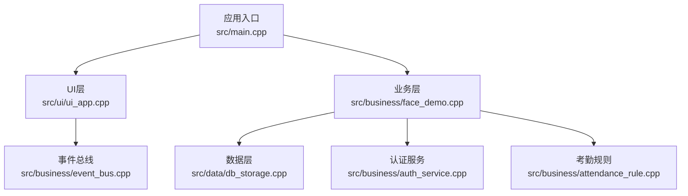
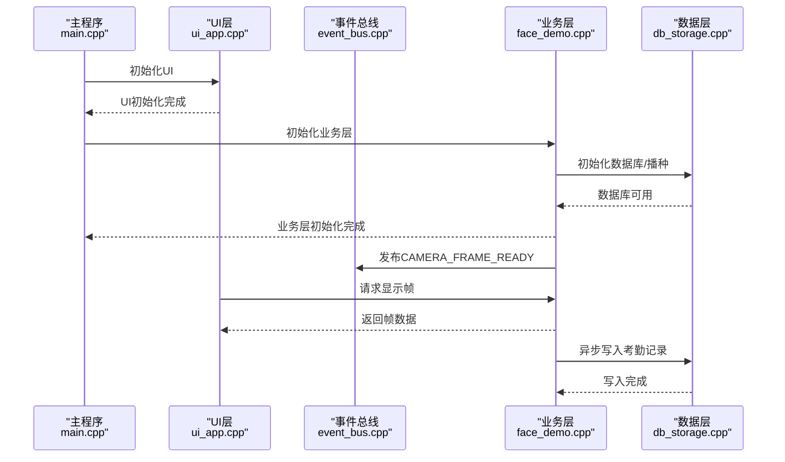
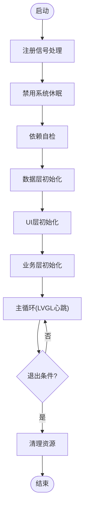
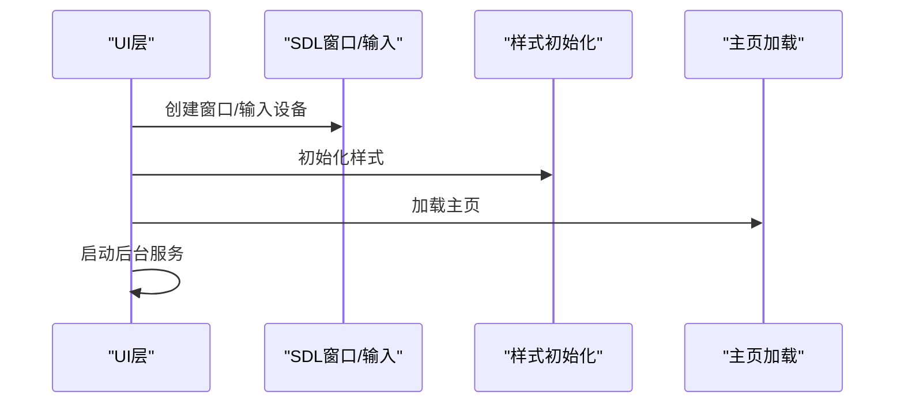
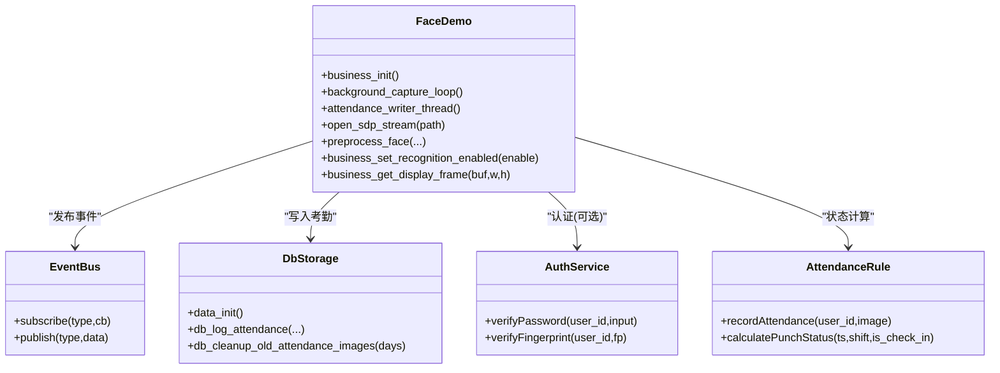
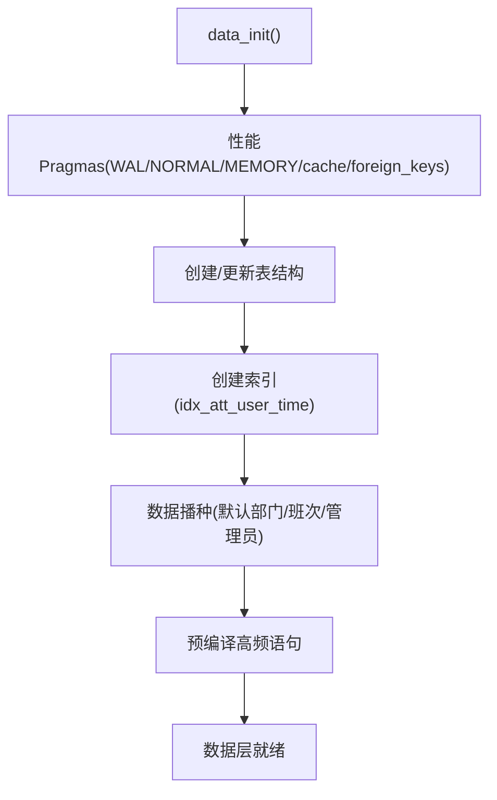
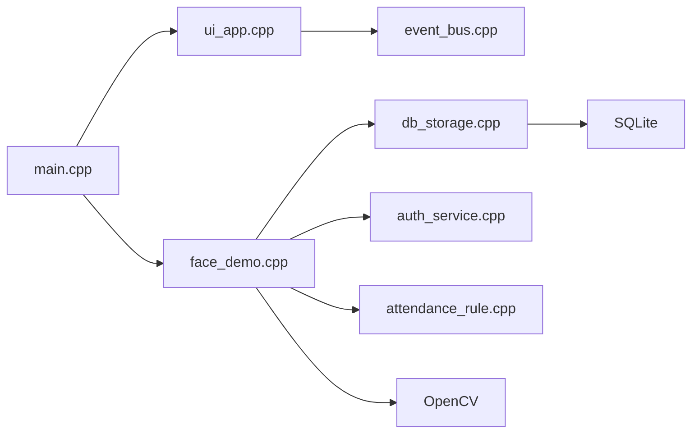

# 故障排除与维护

<cite>
**本文引用的文件**   
- [src/main.cpp](file://src/main.cpp)
- [src/ui/ui_app.cpp](file://src/ui/ui_app.cpp)
- [src/ui/ui_app.h](file://src/ui/ui_app.h)
- [src/ui/managers/ui_manager.cpp](file://src/ui/managers/ui_manager.cpp)
- [src/business/face_demo.cpp](file://src/business/face_demo.cpp)
- [src/business/face_demo.h](file://src/business/face_demo.h)
- [src/business/auth_service.cpp](file://src/business/auth_service.cpp)
- [src/business/auth_service.h](file://src/business/auth_service.h)
- [src/business/attendance_rule.cpp](file://src/business/attendance_rule.cpp)
- [src/business/event_bus.cpp](file://src/business/event_bus.cpp)
- [src/business/event_bus.h](file://src/business/event_bus.h)
- [src/data/db_storage.cpp](file://src/data/db_storage.cpp)
- [src/data/db_storage.h](file://src/data/db_storage.h)
</cite>

## 目录
1. [简介](#简介)
2. [项目结构](#项目结构)
3. [核心组件](#核心组件)
4. [架构总览](#架构总览)
5. [详细组件分析](#详细组件分析)
6. [依赖关系分析](#依赖关系分析)
7. [性能考虑](#性能考虑)
8. [故障排除指南](#故障排除指南)
9. [结论](#结论)
10. [附录](#附录)

## 简介
本文件面向智能考勤系统的运维与技术支持人员，提供一套完整的故障诊断与维护流程，涵盖系统启动失败、人脸识别异常、数据库连接问题、UI界面崩溃等常见问题的排查方法；给出日志分析指南（系统日志、应用日志、OpenCV错误日志）；说明数据备份与恢复策略（SQLite数据库备份、用户数据导出、系统配置保存）；介绍系统健康检查方法（硬件状态监控、软件运行状态检测、网络连接验证）；提供定期维护任务清单（数据库清理、日志轮转、缓存清理、系统更新）；包含紧急故障处理预案与数据恢复流程；并建立问题反馈与跟踪机制，帮助用户报告与解决使用中遇到的问题。

## 项目结构
系统采用分层架构：
- 应用入口层：负责系统初始化、信号处理、主循环驱动
- UI层：基于LVGL与SDL，负责显示与交互
- 业务层：负责人脸识别、考勤规则计算、事件总线与多线程协调
- 数据层：基于SQLite，负责表结构、CRUD、事务与性能优化

**图表来源**
- [src/main.cpp:187-246](file://src/main.cpp#L187-L246)
- [src/ui/ui_app.cpp:34-94](file://src/ui/ui_app.cpp#L34-L94)
- [src/business/face_demo.cpp:557-694](file://src/business/face_demo.cpp#L557-L694)
- [src/data/db_storage.cpp:133-310](file://src/data/db_storage.cpp#L133-L310)
- [src/business/auth_service.cpp:9-37](file://src/business/auth_service.cpp#L9-L37)
- [src/business/attendance_rule.cpp:263-342](file://src/business/attendance_rule.cpp#L263-L342)
- [src/business/event_bus.cpp:1-28](file://src/business/event_bus.cpp#L1-L28)

**章节来源**
- [src/main.cpp:187-246](file://src/main.cpp#L187-L246)
- [src/ui/ui_app.cpp:34-94](file://src/ui/ui_app.cpp#L34-L94)
- [src/business/face_demo.cpp:557-694](file://src/business/face_demo.cpp#L557-L694)
- [src/data/db_storage.cpp:133-310](file://src/data/db_storage.cpp#L133-L310)

## 核心组件
- 应用入口与主循环：负责系统初始化、信号处理、LVGL心跳与退出清理
- UI层：负责SDL窗口创建、输入设备绑定、样式初始化与主页加载
- 业务层：负责摄像头/视频流接入、人脸检测与识别、识别线程与数据库写入线程、事件发布
- 数据层：负责SQLite连接、表结构创建与播种、事务、预编译语句、BLOB存储与索引
- 认证服务：负责密码与指纹验证
- 考勤规则：负责班次归属判断、状态计算与记录入库
- 事件总线：负责跨模块解耦通信

**章节来源**
- [src/main.cpp:41-246](file://src/main.cpp#L41-L246)
- [src/ui/ui_app.cpp:34-94](file://src/ui/ui_app.cpp#L34-L94)
- [src/business/face_demo.cpp:557-694](file://src/business/face_demo.cpp#L557-L694)
- [src/data/db_storage.cpp:133-310](file://src/data/db_storage.cpp#L133-L310)
- [src/business/auth_service.cpp:9-37](file://src/business/auth_service.cpp#L9-L37)
- [src/business/attendance_rule.cpp:263-342](file://src/business/attendance_rule.cpp#L263-L342)
- [src/business/event_bus.cpp:1-28](file://src/business/event_bus.cpp#L1-L28)

## 架构总览
系统采用“入口-UI-业务-数据”的分层结构，业务层通过事件总线与UI层解耦，通过数据层与数据库交互。业务层内部采用双线程模型：采集线程负责视频帧采集、人脸检测与识别、状态计算与队列推送；数据库写入线程负责从队列消费并串行写库，避免SQLite多线程竞争。

**图表来源**
- [src/main.cpp:213-225](file://src/main.cpp#L213-L225)
- [src/ui/ui_app.cpp:86-93](file://src/ui/ui_app.cpp#L86-L93)
- [src/business/face_demo.cpp:246-285](file://src/business/face_demo.cpp#L246-L285)
- [src/business/face_demo.cpp:523](file://src/business/face_demo.cpp#L523)
- [src/business/face_demo.cpp:268-281](file://src/business/face_demo.cpp#L268-L281)
- [src/data/db_storage.cpp:133-310](file://src/data/db_storage.cpp#L133-L310)

## 详细组件分析

### 组件A：系统启动与主循环
- 职责：系统初始化、依赖自检、数据层初始化、UI初始化、业务层初始化、主循环与退出清理
- 关键点：
  - 信号处理：捕获中断信号，设置退出标志
  - 屏幕保护禁用：通过环境变量与系统命令禁用休眠
  - LVGL心跳：定时器驱动与tick增量
  - 业务层初始化失败时回滚数据层资源

**图表来源**
- [src/main.cpp:41-246](file://src/main.cpp#L41-L246)

**章节来源**
- [src/main.cpp:41-246](file://src/main.cpp#L41-L246)

### 组件B：UI层（LVGL + SDL）
- 职责：SDL窗口创建、输入设备绑定、样式初始化、主页加载、后台服务启动
- 关键点：
  - SDL窗口创建失败时输出致命错误提示
  - 键盘绑定到UI组，支持键盘导航
  - 与业务层后台服务协作

**图表来源**
- [src/ui/ui_app.cpp:34-94](file://src/ui/ui_app.cpp#L34-L94)

**章节来源**
- [src/ui/ui_app.cpp:34-94](file://src/ui/ui_app.cpp#L34-L94)
- [src/ui/ui_app.h:8-12](file://src/ui/ui_app.h#L8-L12)

### 组件C：业务层（人脸识别与考勤）
- 职责：摄像头/视频流接入、人脸检测与识别、识别线程、数据库写入线程、事件发布、配置缓存
- 关键点：
  - 双线程模型：采集线程与数据库写入线程分离
  - SDP流重连与强制重启机制
  - 识别冷却与防重复打卡
  - 预处理配置与直方图均衡化
  - 模型加载与全量训练回退
  - 磁盘清理与过期图片回收

**图表来源**
- [src/business/face_demo.cpp:557-694](file://src/business/face_demo.cpp#L557-L694)
- [src/business/event_bus.cpp:1-28](file://src/business/event_bus.cpp#L1-L28)
- [src/data/db_storage.cpp:133-310](file://src/data/db_storage.cpp#L133-L310)
- [src/business/auth_service.cpp:9-37](file://src/business/auth_service.cpp#L9-L37)
- [src/business/attendance_rule.cpp:263-342](file://src/business/attendance_rule.cpp#L263-L342)

**章节来源**
- [src/business/face_demo.cpp:557-694](file://src/business/face_demo.cpp#L557-L694)
- [src/business/face_demo.h:34-212](file://src/business/face_demo.h#L34-L212)

### 组件D：数据层（SQLite）
- 职责：数据库连接、表结构创建与播种、事务、预编译语句、BLOB存储、索引、系统配置
- 关键点：
  - WAL模式、同步级别、临时存储、缓存大小、外键约束
  - 预编译高频语句，降低开销
  - BLOB存储人脸与抓拍图，目录隔离
  - 磁盘清理与过期图片回收

**图表来源**
- [src/data/db_storage.cpp:133-310](file://src/data/db_storage.cpp#L133-L310)

**章节来源**
- [src/data/db_storage.cpp:133-310](file://src/data/db_storage.cpp#L133-L310)
- [src/data/db_storage.h:215-683](file://src/data/db_storage.h#L215-L683)

### 组件E：认证服务与考勤规则
- 职责：密码与指纹验证；班次归属判断与状态计算
- 关键点：
  - 认证结果枚举与分支处理
  - 时间字符串清洗与容错
  - 跨天与折中原则
  - 防重复打卡与状态映射

**章节来源**
- [src/business/auth_service.cpp:9-37](file://src/business/auth_service.cpp#L9-L37)
- [src/business/auth_service.h:8-46](file://src/business/auth_service.h#L8-L46)
- [src/business/attendance_rule.cpp:24-139](file://src/business/attendance_rule.cpp#L24-L139)
- [src/business/attendance_rule.cpp:192-256](file://src/business/attendance_rule.cpp#L192-L256)
- [src/business/attendance_rule.cpp:263-342](file://src/business/attendance_rule.cpp#L263-L342)

## 依赖关系分析
- 入口依赖UI与业务层；UI依赖事件总线；业务层依赖数据层与认证服务；UI层与业务层通过事件总线解耦
- 数据层依赖SQLite与OpenCV（图像编码/解码）

**图表来源**
- [src/main.cpp:31-33](file://src/main.cpp#L31-L33)
- [src/ui/ui_app.cpp:12-15](file://src/ui/ui_app.cpp#L12-L15)
- [src/business/face_demo.cpp:20-25](file://src/business/face_demo.cpp#L20-L25)
- [src/data/db_storage.cpp:7-19](file://src/data/db_storage.cpp#L7-L19)

**章节来源**
- [src/main.cpp:31-33](file://src/main.cpp#L31-L33)
- [src/ui/ui_app.cpp:12-15](file://src/ui/ui_app.cpp#L12-L15)
- [src/business/face_demo.cpp:20-25](file://src/business/face_demo.cpp#L20-L25)
- [src/data/db_storage.cpp:7-19](file://src/data/db_storage.cpp#L7-L19)

## 性能考虑
- 数据层：
  - WAL模式提升并发读写性能
  - NORMAL同步兼顾安全与速度
  - 临时表与索引内存化
  - 缓存大小与外键约束
  - 预编译语句降低开销
- 业务层：
  - 采集线程与写入线程分离，避免竞争
  - 跳帧检测与跟踪，降低CPU占用
  - UI刷新限流，保证流畅性
  - 模型文件本地缓存，避免重复训练
- UI层：
  - 键盘绑定到UI组，提高交互效率

[本节为通用性能讨论，不直接分析具体文件]

## 故障排除指南

### 系统启动失败
- 现象：程序启动即退出或UI无法创建
- 排查步骤：
  - 检查依赖版本：OpenCV、SQLite3、LVGL
  - 检查SDL环境：窗口创建失败时输出致命错误
  - 检查休眠禁用：确认环境变量与系统命令执行
  - 检查数据层初始化：数据库打开失败与SQL错误
- 日志定位：
  - 系统日志：依赖版本输出
  - 应用日志：UI致命错误、数据库打开错误
- 处理建议：
  - 安装缺失依赖，修正SDL配置
  - 确认环境变量SDL_VIDEO_ALLOW_SCREENSAVER=0
  - 修复数据库权限与路径

**章节来源**
- [src/main.cpp:49-59](file://src/main.cpp#L49-L59)
- [src/main.cpp:156-182](file://src/main.cpp#L156-L182)
- [src/main.cpp:143-146](file://src/main.cpp#L143-L146)
- [src/ui/ui_app.cpp:50-53](file://src/ui/ui_app.cpp#L50-L53)

### UI界面崩溃
- 现象：界面无响应、黑屏、键盘无反应
- 排查步骤：
  - 检查SDL窗口创建与输入设备绑定
  - 检查键盘是否绑定到UI组
  - 检查屏幕切换事件是否影响识别状态
  - 检查内存管理：屏幕销毁与定时器清理
- 日志定位：
  - UI层错误输出、键盘绑定失败
  - 事件总线订阅/发布
- 处理建议：
  - 重新配置SDL与输入设备
  - 确保键盘类型设置为KEYPAD并绑定组
  - 使用异步清理定时器避免竞态

**章节来源**
- [src/ui/ui_app.cpp:68-81](file://src/ui/ui_app.cpp#L68-L81)
- [src/ui/managers/ui_manager.cpp:16-32](file://src/ui/managers/ui_manager.cpp#L16-L32)
- [src/ui/managers/ui_manager.cpp:118-125](file://src/ui/managers/ui_manager.cpp#L118-L125)
- [src/business/event_bus.cpp:8-28](file://src/business/event_bus.cpp#L8-L28)

### 人脸识别异常
- 现象：无法检测/识别、识别频繁失败、摄像头无画面
- 排查步骤：
  - 检查Haar级联分类器加载
  - 检查SDP流连接与重连逻辑
  - 检查识别线程异常捕获与日志
  - 检查预处理配置与直方图均衡化
  - 检查模型文件加载与训练回退
- 日志定位：
  - OpenCV异常日志、识别线程错误
  - 模型加载失败与全量训练回退
- 处理建议：
  - 确认模型文件存在与可读
  - 调整预处理参数，改善光照与对比度
  - 修复流中断强制重启逻辑

**章节来源**
- [src/business/face_demo.cpp:570-576](file://src/business/face_demo.cpp#L570-L576)
- [src/business/face_demo.cpp:314-344](file://src/business/face_demo.cpp#L314-L344)
- [src/business/face_demo.cpp:537-548](file://src/business/face_demo.cpp#L537-L548)
- [src/business/face_demo.cpp:606-630](file://src/business/face_demo.cpp#L606-L630)
- [src/business/face_demo.cpp:633-677](file://src/business/face_demo.cpp#L633-L677)

### 数据库连接问题
- 现象：数据库打开失败、SQL执行错误、写入失败
- 排查步骤：
  - 检查数据库文件权限与路径
  - 检查性能Pragmas设置
  - 检查预编译语句与锁机制
  - 检查事务与回滚
- 日志定位：
  - 数据库打开错误、SQL错误消息
  - 预编译语句失败警告
- 处理建议：
  - 修复文件权限与路径
  - 确认WAL与foreign_keys启用
  - 使用RAII封装与共享锁保护

**章节来源**
- [src/data/db_storage.cpp:143-146](file://src/data/db_storage.cpp#L143-L146)
- [src/data/db_storage.cpp:121-129](file://src/data/db_storage.cpp#L121-L129)
- [src/data/db_storage.cpp:300-307](file://src/data/db_storage.cpp#L300-L307)

### 认证异常（密码/指纹）
- 现象：密码错误、指纹不匹配、未录入特征
- 排查步骤：
  - 检查用户是否存在与特征数据
  - 检查密码哈希与指纹模板比对
- 日志定位：
  - 认证结果枚举与分支
- 处理建议：
  - 确认用户已录入密码/指纹
  - 替换为真实指纹SDK算法

**章节来源**
- [src/business/auth_service.cpp:9-37](file://src/business/auth_service.cpp#L9-L37)
- [src/business/auth_service.cpp:74-90](file://src/business/auth_service.cpp#L74-L90)

### 考勤记录异常
- 现象：重复打卡、状态计算错误、记录未入库
- 排查步骤：
  - 检查防重复打卡与冷却时间
  - 检查班次归属与跨天逻辑
  - 检查状态映射与写库
- 日志定位：
  - 防重复打卡日志、状态计算日志
- 处理建议：
  - 调整重复打卡阈值
  - 校正班次时间与跨天逻辑

**章节来源**
- [src/business/face_demo.cpp:437-442](file://src/business/face_demo.cpp#L437-L442)
- [src/business/attendance_rule.cpp:192-256](file://src/business/attendance_rule.cpp#L192-L256)
- [src/business/attendance_rule.cpp:329-332](file://src/business/attendance_rule.cpp#L329-L332)

### 日志分析指南
- 系统日志：
  - 依赖版本输出（OpenCV、SQLite3、LVGL）
  - SDL窗口创建失败
- 应用日志：
  - 数据库打开/SQL错误
  - 业务层异常（OpenCV异常、未知崩溃）
  - 识别线程错误与模型加载失败
- OpenCV错误日志：
  - 捕获cv::Exception并降噪输出
  - 避免刷屏与崩溃

**章节来源**
- [src/main.cpp:49-59](file://src/main.cpp#L49-L59)
- [src/ui/ui_app.cpp:50-53](file://src/ui/ui_app.cpp#L50-L53)
- [src/data/db_storage.cpp:121-129](file://src/data/db_storage.cpp#L121-L129)
- [src/business/face_demo.cpp:537-548](file://src/business/face_demo.cpp#L537-L548)

### 数据备份与恢复策略
- SQLite数据库备份：
  - 直接复制attendance.db文件
  - 使用SQLite在线备份API（扩展）
- 用户数据导出：
  - 导出users表与相关BLOB路径
  - 导出头像目录与抓拍目录
- 系统配置保存：
  - 导出system_config表
  - 导出attendance_rules与bell配置
- 恢复流程：
  - 停止服务，备份现有数据库
  - 恢复数据库与目录
  - 启动服务，验证播种与模型

**章节来源**
- [src/data/db_storage.cpp:133-310](file://src/data/db_storage.cpp#L133-L310)
- [src/data/db_storage.h:551-556](file://src/data/db_storage.h#L551-L556)

### 系统健康检查方法
- 硬件状态监控：
  - 摄像头/视频流可用性
  - SDP流重连与强制重启
- 软件运行状态检测：
  - 业务线程存活与队列长度
  - 数据库连接与事务状态
- 网络连接验证：
  - SDP管道参数与GStreamer可用性

**章节来源**
- [src/business/face_demo.cpp:314-344](file://src/business/face_demo.cpp#L314-L344)
- [src/business/face_demo.cpp:246-285](file://src/business/face_demo.cpp#L246-L285)
- [src/data/db_storage.cpp:133-310](file://src/data/db_storage.cpp#L133-L310)

### 定期维护任务清单
- 数据库清理：
  - 定期清理过期抓拍图（默认30天）
  - 事务批量导入与索引维护
- 日志轮转：
  - 应用日志按大小/时间轮转
- 缓存清理：
  - 识别缓存与用户列表缓存
- 系统更新：
  - 依赖版本升级与兼容性验证

**章节来源**
- [src/business/face_demo.cpp:588-595](file://src/business/face_demo.cpp#L588-L595)
- [src/data/db_storage.cpp:486](file://src/data/db_storage.cpp#L486)

### 紧急故障处理预案与数据恢复流程
- 预案：
  - 业务线程异常：捕获异常并降噪，避免崩溃
  - 数据库写入失败：队列降级与错误日志
  - UI崩溃：异步清理与定时器保障
- 恢复流程：
  - 停机—备份—恢复—验证—重启

**章节来源**
- [src/business/face_demo.cpp:276-281](file://src/business/face_demo.cpp#L276-L281)
- [src/ui/managers/ui_manager.cpp:118-125](file://src/ui/managers/ui_manager.cpp#L118-L125)

### 问题反馈与跟踪机制
- 事件总线：
  - 订阅/发布机制，模块间解耦
- 日志与告警：
  - 磁盘状态告警事件（DISK_FULL/DISK_NORMAL）
- 用户反馈：
  - 建议收集与问题分类，结合日志定位

**章节来源**
- [src/business/event_bus.cpp:10-28](file://src/business/event_bus.cpp#L10-L28)

## 结论
本故障排除与维护文档基于系统实际代码实现，提供了从启动、UI、业务、数据到日志与维护的全流程指导。通过事件总线解耦、双线程模型、SQLite性能优化与完善的日志体系，系统具备良好的可维护性与稳定性。建议在生产环境中严格执行备份与轮转策略，定期进行健康检查与维护，确保系统长期稳定运行。

## 附录
- 术语说明：
  - WAL：Write-Ahead Logging，提升并发性能
  - BLOB：二进制大对象，存储图像数据
  - Pragmas：SQLite配置参数
- 参考路径：
  - [src/main.cpp](file://src/main.cpp)
  - [src/ui/ui_app.cpp](file://src/ui/ui_app.cpp)
  - [src/business/face_demo.cpp](file://src/business/face_demo.cpp)
  - [src/data/db_storage.cpp](file://src/data/db_storage.cpp)
  - [src/business/auth_service.cpp](file://src/business/auth_service.cpp)
  - [src/business/attendance_rule.cpp](file://src/business/attendance_rule.cpp)
  - [src/business/event_bus.cpp](file://src/business/event_bus.cpp)