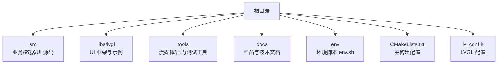
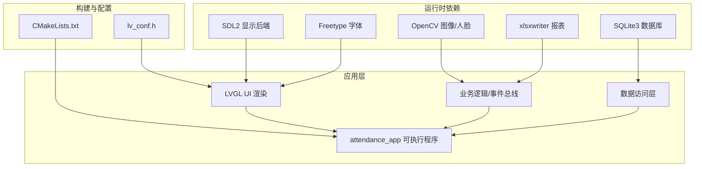
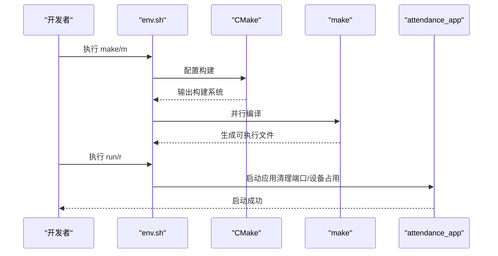
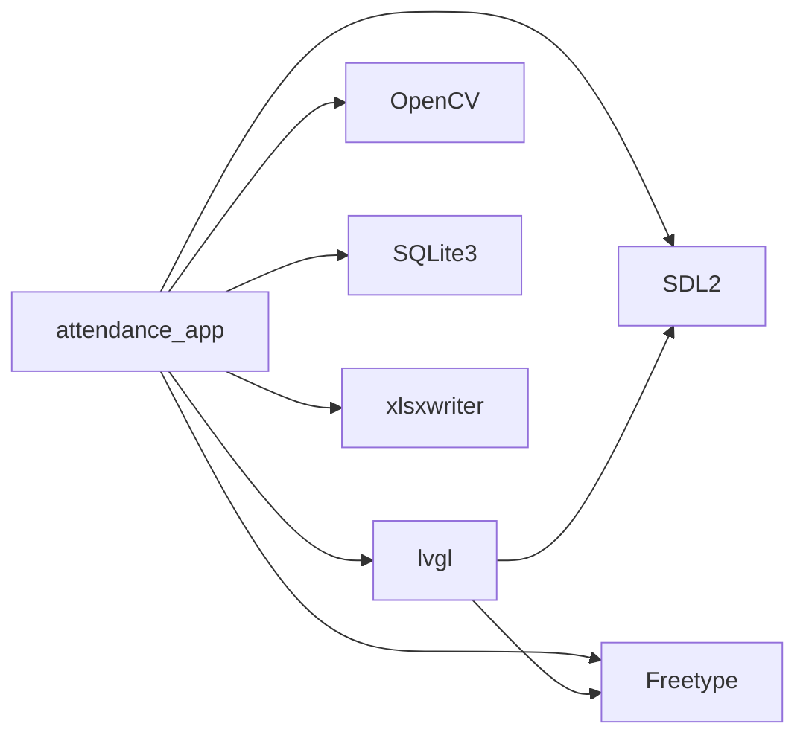

# 系统部署

<cite>
**本文引用的文件**
- [CMakeLists.txt](file://CMakeLists.txt)
- [lv_conf.h](file://lv_conf.h)
- [env.sh](file://env/env.sh)
- [install-prerequisites.sh](file://libs/lvgl/scripts/install-prerequisites.sh)
- [install-prerequisites.bat](file://libs/lvgl/scripts/install-prerequisites.bat)
- [prerequisites-apt.txt](file://libs/lvgl/scripts/prerequisites-apt.txt)
- [prerequisites-pip.txt](file://libs/lvgl/scripts/prerequisites-pip.txt)
- [Dockerfile（LVGL测试）](file://libs/lvgl/tests/Dockerfile)
- [run.bat](file://tools/stream/run.bat)
- [stream.ps1](file://tools/stream/stream.ps1)
- [CMakePresets.json](file://libs/lvgl/CMakePresets.json)
</cite>

## 目录
1. [简介](#简介)
2. [项目结构](#项目结构)
3. [核心组件](#核心组件)
4. [架构总览](#架构总览)
5. [详细组件分析](#详细组件分析)
6. [依赖分析](#依赖分析)
7. [性能考虑](#性能考虑)
8. [故障排查指南](#故障排查指南)
9. [结论](#结论)
10. [附录](#附录)

## 简介
本部署文档面向智能考勤系统，覆盖 Windows、Linux、macOS 三大平台的环境准备、依赖安装、构建与运行、配置文件管理、环境变量与路径设置、服务启动脚本与自动化部署、部署验证以及容器化与云平台部署建议。系统基于 CMake 构建，UI 使用 LVGL，图像与人脸识别依赖 OpenCV，数据库采用 SQLite3，报表导出使用 xlsxwriter；同时提供针对桌面端 SDL2/Freetype 的渲染链路。

## 项目结构
- 根目录包含主工程入口、业务与数据层、UI 层、第三方库子模块（libs/lvgl）、构建脚本与环境脚本、工具集等。
- 关键构建与运行脚本集中在根目录的 CMakeLists.txt 与 env/env.sh 中。
- LVGL 提供了跨平台的依赖安装脚本与预置配置，便于快速搭建开发环境。

图表来源
- [CMakeLists.txt:1-155](file://CMakeLists.txt#L1-L155)
- [env.sh:1-102](file://env/env.sh#L1-L102)

章节来源
- [CMakeLists.txt:1-155](file://CMakeLists.txt#L1-L155)
- [env.sh:1-102](file://env/env.sh#L1-L102)

## 核心组件
- 构建系统与依赖发现
  - 使用 CMake 查找并链接 OpenCV、SQLite3、SDL2、Freetype、xlsxwriter，并引入 LVGL 子目录。
  - 通过 pkg-config 与 find_package 组合定位系统库，必要时回退至 pkg_check_modules。
- UI 与渲染
  - LVGL 通过 SDL2 作为显示后端，配合 Freetype 字体渲染；可通过 lv_conf.h 调整渲染策略与内存参数。
- 数据与报表
  - SQLite3 用于本地存储；xlsxwriter 用于生成 Excel 报表。
- 工具链与自动化
  - env.sh 提供一键构建、运行、清理；Windows 提供 PowerShell 推流脚本与批处理启动脚本，便于摄像头输入对接。

章节来源
- [CMakeLists.txt:15-78](file://CMakeLists.txt#L15-L78)
- [CMakeLists.txt:114-148](file://CMakeLists.txt#L114-L148)
- [lv_conf.h:100-122](file://lv_conf.h#L100-L122)

## 架构总览
系统采用“构建配置 → 依赖发现 → UI 渲染 → 业务处理 → 数据持久化/报表”的分层架构。CMake 作为统一入口，负责依赖解析与目标链接；LVGL 负责 UI 渲染与事件；OpenCV 负责图像处理与人脸识别；SQLite3 负责数据存储；xlsxwriter 负责报表导出。

图表来源
- [CMakeLists.txt:15-78](file://CMakeLists.txt#L15-L78)
- [CMakeLists.txt:114-148](file://CMakeLists.txt#L114-L148)
- [lv_conf.h:100-122](file://lv_conf.h#L100-L122)

## 详细组件分析

### 依赖库安装指南（按平台）
- Linux（Ubuntu/WSL）
  - 使用 LVGL 提供的安装脚本与包清单，自动安装构建工具、SDL2、Freetype、OpenGL/GLFW、FFmpeg 等依赖。
  - 参考文件：
    - [install-prerequisites.sh:1-16](file://libs/lvgl/scripts/install-prerequisites.sh#L1-L16)
    - [prerequisites-apt.txt:1-39](file://libs/lvgl/scripts/prerequisites-apt.txt#L1-L39)
    - [prerequisites-pip.txt:1-4](file://libs/lvgl/scripts/prerequisites-pip.txt#L1-L4)
- Windows
  - 使用 vcpkg 安装 SDL2、Freetype、OpenGL/GLFW/GLEW 等依赖；pip 安装 PNG、压缩与配置工具。
  - 参考文件：
    - [install-prerequisites.bat:1-5](file://libs/lvgl/scripts/install-prerequisites.bat#L1-L5)
- macOS
  - 使用 Homebrew 或 MacPorts 安装 SDL2、Freetype、OpenCV、SQLite3、pkg-config 等依赖；pip 安装 Python 依赖。
  - 说明：本仓库未提供 macOS 专用安装脚本，可参考 Linux/Windows 的依赖清单自行安装。

章节来源
- [install-prerequisites.sh:1-16](file://libs/lvgl/scripts/install-prerequisites.sh#L1-L16)
- [install-prerequisites.bat:1-5](file://libs/lvgl/scripts/install-prerequisites.bat#L1-L5)
- [prerequisites-apt.txt:1-39](file://libs/lvgl/scripts/prerequisites-apt.txt#L1-L39)
- [prerequisites-pip.txt:1-4](file://libs/lvgl/scripts/prerequisites-pip.txt#L1-L4)

### 环境变量与路径配置
- OpenCV
  - CMake 通过 find_package(OpenCV ...) 自动定位 OpenCV4 头文件与库；若默认路径不匹配，可在构建前设置 OpenCV_DIR 或确保系统已安装在标准路径。
  - 参考位置：[CMakeLists.txt:28-30](file://CMakeLists.txt#L28-L30)
- SDL2
  - 通过 pkg_check_modules(sdl2 ...) 发现 SDL2_INCLUDE_DIRS 与 SDL2_LIBRARIES；确保系统已安装 SDL2 开发包。
  - 参考位置：[CMakeLists.txt:24-26](file://CMakeLists.txt#L24-L26)
- Freetype
  - 通过 find_package(Freetype ...) 定位头文件与库；与 SDL2 一起作为 LVGL 的渲染依赖。
  - 参考位置：[CMakeLists.txt:25-26](file://CMakeLists.txt#L25-L26)
- SQLite3
  - 通过 find_package(SQLite3 ...) 定位库；若失败可回退至 pkg_check_modules(SQLITE3 ...)。
  - 参考位置：[CMakeLists.txt:32-34](file://CMakeLists.txt#L32-L34)
- xlsxwriter
  - 通过 pkg_check_modules(XLSXWRITER ...) 定位头文件与库。
  - 参考位置：[CMakeLists.txt:36-37](file://CMakeLists.txt#L36-L37)
- LVGL 配置文件路径
  - 通过 LV_CONF_PATH 与宏定义 LV_CONF_PATH 指向根目录的 lv_conf.h。
  - 参考位置：[CMakeLists.txt:54-61](file://CMakeLists.txt#L54-L61)

章节来源
- [CMakeLists.txt:24-37](file://CMakeLists.txt#L24-L37)
- [CMakeLists.txt:54-61](file://CMakeLists.txt#L54-L61)

### 服务启动脚本与自动化部署
- Linux/macOS
  - 使用 env.sh 提供的 make/m 与 run/r 快捷命令完成构建与运行；内部自动清理占用端口与摄像头设备，降低黑屏风险。
  - 参考位置：
    - [env.sh:47-65](file://env/env.sh#L47-L65)
    - [env.sh:67-99](file://env/env.sh#L67-L99)
- Windows
  - run.bat 调用 stream.ps1 启动 FFmpeg 推流到 WSL，配合 attendance_app 从 RTP 源读取视频帧。
  - 参考位置：
    - [run.bat:1-5](file://tools/stream/run.bat#L1-L5)
    - [stream.ps1:1-47](file://tools/stream/stream.ps1#L1-L47)

图表来源
- [env.sh:47-99](file://env/env.sh#L47-L99)

章节来源
- [env.sh:47-99](file://env/env.sh#L47-L99)
- [run.bat:1-5](file://tools/stream/run.bat#L1-L5)
- [stream.ps1:1-47](file://tools/stream/stream.ps1#L1-L47)

### 配置文件管理（lv_conf.h）
- LVGL 配置要点
  - 颜色深度、默认刷新周期、DPI、操作系统抽象层、渲染器选择、字体与文本编码、日志与断言等。
  - 示例关键项（路径参考）：
    - 颜色深度与默认刷新周期：[lv_conf.h:29-95](file://lv_conf.h#L29-L95)
    - 操作系统抽象层（默认关闭）：[lv_conf.h:100-122](file://lv_conf.h#L100-L122)
    - 软件渲染开关与复杂度：[lv_conf.h:168-230](file://lv_conf.h#L168-L230)
    - 默认字体与文本编码：[lv_conf.h:602-708](file://lv_conf.h#L602-L708)
- 运行时参数调整
  - 可通过修改 lv_conf.h 中相应宏控制渲染质量、内存缓冲、日志级别等；修改后需重新构建。

章节来源
- [lv_conf.h:29-95](file://lv_conf.h#L29-L95)
- [lv_conf.h:100-122](file://lv_conf.h#L100-L122)
- [lv_conf.h:168-230](file://lv_conf.h#L168-L230)
- [lv_conf.h:602-708](file://lv_conf.h#L602-L708)

### 部署验证方法
- 构建阶段
  - 确认 CMake 输出中包含 OpenCV、SQLite3、SDL2、Freetype、xlsxwriter 的路径信息。
  - 参考位置：[CMakeLists.txt:150-155](file://CMakeLists.txt#L150-L155)
- 运行阶段
  - Linux/macOS：通过 env.sh 的 run/r 启动，自动清理 5004/udp 端口与 /dev/video0 占用，减少黑屏问题。
  - Windows：通过 run.bat 启动 stream.ps1 推流，再启动 attendance_app。
  - 参考位置：
    - [env.sh:67-99](file://env/env.sh#L67-L99)
    - [run.bat:1-5](file://tools/stream/run.bat#L1-L5)
    - [stream.ps1:1-47](file://tools/stream/stream.ps1#L1-L47)

章节来源
- [CMakeLists.txt:150-155](file://CMakeLists.txt#L150-L155)
- [env.sh:67-99](file://env/env.sh#L67-L99)
- [run.bat:1-5](file://tools/stream/run.bat#L1-L5)
- [stream.ps1:1-47](file://tools/stream/stream.ps1#L1-L47)

### Docker 容器化部署方案
- 方案一：基于 LVGL 测试镜像
  - 使用 libs/lvgl/tests/Dockerfile 构建基础镜像，安装 apt 与 pip 依赖，适合在容器内进行构建与测试。
  - 参考位置：[Dockerfile（LVGL测试）:1-25](file://libs/lvgl/tests/Dockerfile#L1-L25)
- 方案二：自定义生产镜像
  - 基于 Ubuntu/Debian，安装 OpenCV、SDL2、Freetype、SQLite3、xlsxwriter、构建工具链与 Python 依赖，复制源码后执行 CMake + make 构建。
  - 参考位置：
    - [prerequisites-apt.txt:1-39](file://libs/lvgl/scripts/prerequisites-apt.txt#L1-L39)
    - [prerequisites-pip.txt:1-4](file://libs/lvgl/scripts/prerequisites-pip.txt#L1-L4)
- 方案三：WSL2 + Docker
  - 在 Windows 上使用 WSL2 运行 Docker，结合 stream.ps1 将摄像头视频推送到容器内的应用。

章节来源
- [Dockerfile（LVGL测试）:1-25](file://libs/lvgl/tests/Dockerfile#L1-L25)
- [prerequisites-apt.txt:1-39](file://libs/lvgl/scripts/prerequisites-apt.txt#L1-L39)
- [prerequisites-pip.txt:1-4](file://libs/lvgl/scripts/prerequisites-pip.txt#L1-L4)

### 云平台部署指南
- 通用步骤
  - 选择支持 Docker 的云平台（如阿里云、腾讯云、AWS、Azure），准备 Ubuntu/Debian 基础镜像。
  - 在镜像中安装依赖（参考 prerequisites-apt.txt 与 prerequisites-pip.txt），拉取源码，执行 CMake + make 构建。
  - 将 attendance_app 作为无头服务运行，或通过反向代理暴露 Web 管理界面（如需）。
- 注意事项
  - 云上摄像头接入需通过网络推流（RTP/RTSP）或 USB 设备直连（需支持宿主机直通）。
  - 若使用 xlsxwriter 导出报表，确保磁盘空间充足且具备写权限。

章节来源
- [prerequisites-apt.txt:1-39](file://libs/lvgl/scripts/prerequisites-apt.txt#L1-L39)
- [prerequisites-pip.txt:1-4](file://libs/lvgl/scripts/prerequisites-pip.txt#L1-L4)

## 依赖分析
- 组件耦合与链接关系
  - attendance_app 链接 lvgl、OpenCV、SQLite3、SDL2、xlsxwriter、线程库。
  - LVGL 依赖 SDL2 与 Freetype；CMake 通过 pkg-config 与 find_package 统一解析。
- 外部依赖与集成点
  - OpenCV：图像采集、人脸检测与识别。
  - SQLite3：本地数据持久化。
  - SDL2/Freetype：桌面端 UI 渲染。
  - xlsxwriter：Excel 报表导出。
  - FFmpeg（Windows 推流）：RTP 视频输入。

图表来源
- [CMakeLists.txt:140-148](file://CMakeLists.txt#L140-L148)

章节来源
- [CMakeLists.txt:140-148](file://CMakeLists.txt#L140-L148)

## 性能考虑
- 渲染与内存
  - 通过 lv_conf.h 调整颜色深度、默认刷新周期、绘制缓冲大小与线程优先级，平衡流畅度与资源占用。
  - 参考位置：[lv_conf.h:29-95](file://lv_conf.h#L29-L95)、[lv_conf.h:145-167](file://lv_conf.h#L145-L167)
- 构建优化
  - 使用 Ninja/多核并行编译提升构建速度；在 CMake 中开启编译命令导出以改善 IDE 头文件索引。
  - 参考位置：[CMakeLists.txt:7-13](file://CMakeLists.txt#L7-L13)
- 运行时优化
  - Linux 运行前清理摄像头与端口占用，避免黑屏与资源争用。
  - 参考位置：[env.sh:67-99](file://env/env.sh#L67-L99)

章节来源
- [lv_conf.h:29-95](file://lv_conf.h#L29-L95)
- [lv_conf.h:145-167](file://lv_conf.h#L145-L167)
- [CMakeLists.txt:7-13](file://CMakeLists.txt#L7-L13)
- [env.sh:67-99](file://env/env.sh#L67-L99)

## 故障排查指南
- 构建失败（找不到依赖）
  - 确认已安装对应开发包（SDL2、Freetype、OpenCV、SQLite3、xlsxwriter），并确保 pkg-config 与 find_package 能找到它们。
  - 参考位置：[CMakeLists.txt:24-37](file://CMakeLists.txt#L24-L37)
- 运行黑屏或摄像头占用
  - Linux/macOS：使用 env.sh 的 run/r，脚本会清理 5004/udp 与 /dev/video0 占用。
  - Windows：使用 run.bat 启动 stream.ps1 推流，确保 WSL IP 正确。
  - 参考位置：
    - [env.sh:67-99](file://env/env.sh#L67-L99)
    - [run.bat:1-5](file://tools/stream/run.bat#L1-L5)
    - [stream.ps1:19-24](file://tools/stream/stream.ps1#L19-L24)
- 字体与文本显示异常
  - 检查 lv_conf.h 中字体与文本编码配置是否符合预期。
  - 参考位置：[lv_conf.h:602-708](file://lv_conf.h#L602-L708)
- 日志与断言
  - 可根据需要启用 LV_USE_LOG 与断言，便于定位问题。
  - 参考位置：[lv_conf.h:412-451](file://lv_conf.h#L412-L451)

章节来源
- [CMakeLists.txt:24-37](file://CMakeLists.txt#L24-L37)
- [env.sh:67-99](file://env/env.sh#L67-L99)
- [run.bat:1-5](file://tools/stream/run.bat#L1-L5)
- [stream.ps1:19-24](file://tools/stream/stream.ps1#L19-L24)
- [lv_conf.h:412-451](file://lv_conf.h#L412-L451)
- [lv_conf.h:602-708](file://lv_conf.h#L602-L708)

## 结论
本部署文档提供了从环境准备、依赖安装、构建运行到容器化与云平台部署的完整方案。通过 CMake 统一依赖发现与链接，结合 env.sh 与 Windows 推流脚本，可快速在多平台部署智能考勤系统。建议在生产环境中进一步完善日志与监控、容器健康检查与资源限制，并对摄像头与网络输入进行冗余设计。

## 附录
- 平台差异与建议
  - Linux/WSL：推荐使用 Ninja 与多核并行构建；确保摄像头与网络权限。
  - Windows：使用 vcpkg 管理依赖；通过 stream.ps1 将摄像头视频推送到 WSL。
  - macOS：参考 Linux 依赖清单，结合 Homebrew/MacPorts 安装。
- CMake 预设与跨平台
  - 可参考 LVGL 的 CMakePresets.json，为 Windows/WSL/Linux 准备不同生成器与缓存变量。
  - 参考位置：[CMakePresets.json:1-53](file://libs/lvgl/CMakePresets.json#L1-L53)

章节来源
- [CMakePresets.json:1-53](file://libs/lvgl/CMakePresets.json#L1-L53)