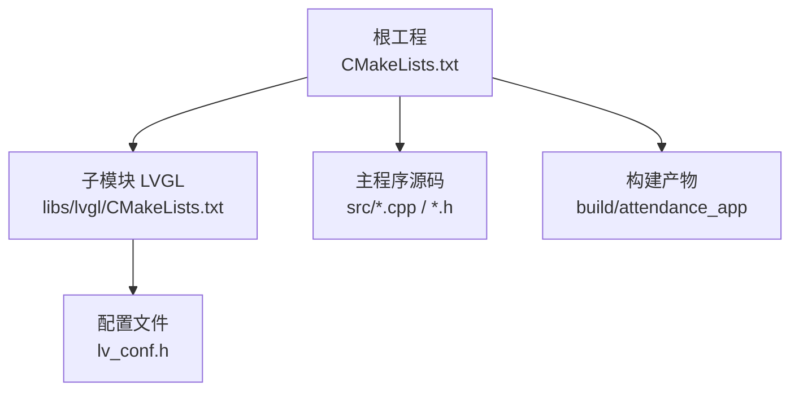
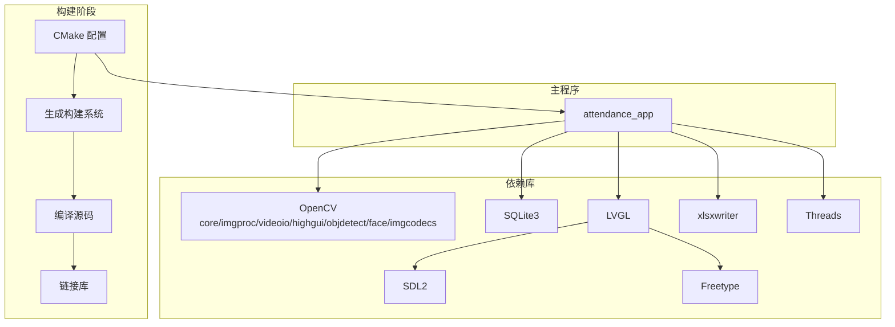
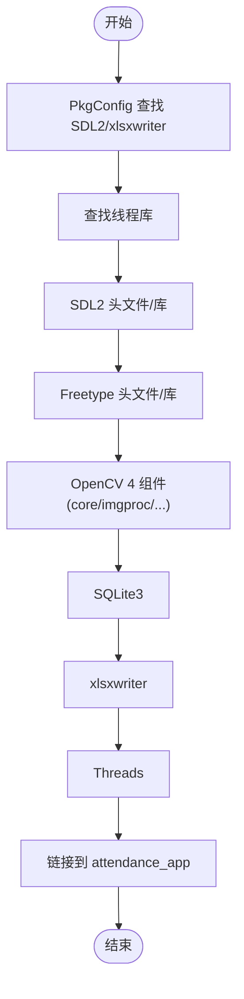
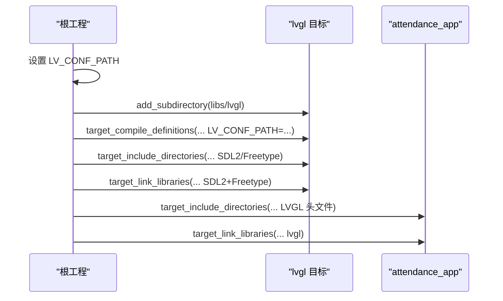
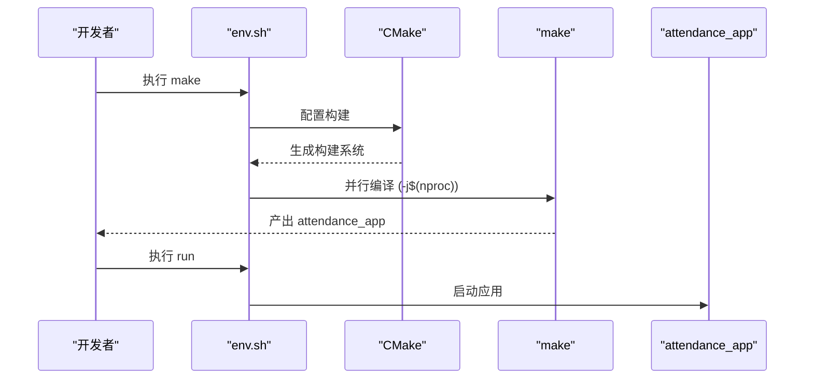
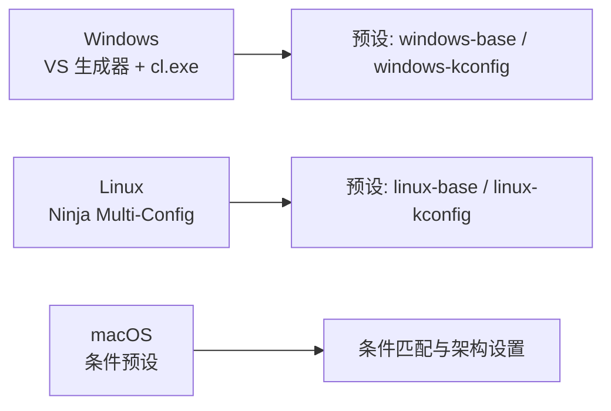
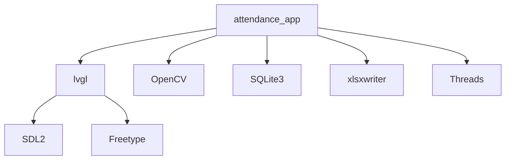

# 编译打包

<cite>
**本文引用的文件**
- [CMakeLists.txt](file://CMakeLists.txt)
- [env.sh](file://env/env.sh)
- [lv_conf.h](file://lv_conf.h)
- [CMakeLists.txt（LVGL）](file://libs/lvgl/CMakeLists.txt)
- [CMakePresets.json（LVGL）](file://libs/lvgl/CMakePresets.json)
- [gen_json.py（LVGL）](file://libs/lvgl/scripts/gen_json/gen_json.py)
- [main.cpp](file://src/main.cpp)
</cite>

## 目录
1. [简介](#简介)
2. [项目结构](#项目结构)
3. [核心组件](#核心组件)
4. [架构总览](#架构总览)
5. [详细组件分析](#详细组件分析)
6. [依赖关系分析](#依赖关系分析)
7. [性能考虑](#性能考虑)
8. [故障排查指南](#故障排查指南)
9. [结论](#结论)
10. [附录](#附录)

## 简介
本文件面向智能考勤系统的编译与打包，围绕 CMake 构建配置进行系统化说明，覆盖以下主题：
- 编译选项与构建类型设置
- 关键依赖库的查找与配置（OpenCV、SQLite3、SDL2、xlsxwriter、Freetype）
- 主程序与 LVGL 子模块的集成方式
- 从环境准备到可执行文件生成的完整流程
- 平台差异化配置（Windows、Linux、macOS）
- 静态/动态链接策略与编译优化建议
- 常见编译错误与解决方案
- 编译产物分析与验证方法

## 项目结构
本项目采用 CMake 多级工程组织：
- 根工程负责主程序构建与依赖整合
- 子模块 libs/lvgl 作为 UI 库引入，通过 add_subdirectory 方式集成
- 顶层 CMakeLists.txt 统一管理编译选项、依赖查找、头文件路径与链接库

图示来源
- [CMakeLists.txt:1-155](file://CMakeLists.txt#L1-L155)
- [CMakeLists.txt（LVGL）:1-45](file://libs/lvgl/CMakeLists.txt#L1-L45)
- [lv_conf.h:1-120](file://lv_conf.h#L1-L120)

章节来源
- [CMakeLists.txt:1-155](file://CMakeLists.txt#L1-L155)
- [CMakeLists.txt（LVGL）:1-45](file://libs/lvgl/CMakeLists.txt#L1-L45)

## 核心组件
- 构建系统与编译选项
  - C++17 标准、C11 标准、Debug 构建类型、导出 compile_commands.json 便于编辑器索引
- 依赖库查找
  - PkgConfig、线程库、SDL2、Freetype、OpenCV（含 face 模块）、SQLite3、xlsxwriter
- LVGL 集成
  - 通过 LV_CONF_PATH 指定配置文件；在 add_subdirectory 前后分别设置宏与头文件/链接库
- 主程序目标
  - attendance_app，聚合 UI、业务、数据三层源文件，链接 LVGL、OpenCV、SQLite3、SDL2、xlsxwriter、Threads

章节来源
- [CMakeLists.txt:5-155](file://CMakeLists.txt#L5-L155)
- [lv_conf.h:1-120](file://lv_conf.h#L1-L120)

## 架构总览
下图展示从源码到可执行文件的构建链路，以及关键依赖的连接关系。

图示来源
- [CMakeLists.txt:24-148](file://CMakeLists.txt#L24-L148)
- [CMakeLists.txt（LVGL）:1-45](file://libs/lvgl/CMakeLists.txt#L1-L45)

## 详细组件分析

### 1) 依赖库查找与链接
- PkgConfig：用于发现系统库（如 SDL2、xlsxwriter）
- 线程库：find_package(Threads REQUIRED)，链接 Threads::Threads
- SDL2：pkg_check_modules(SDL2 REQUIRED sdl2)，包含目录与库由 ${SDL2_INCLUDE_DIRS}/${SDL2_LIBRARIES} 提供
- Freetype：find_package(Freetype REQUIRED)，通过 Freetype::Freetype 链接
- OpenCV：find_package(OpenCV 4 REQUIRED ...)，启用 core/imgproc/videoio/highgui/objdetect/face/imgcodecs 组件，链接 ${OpenCV_LIBS}
- SQLite3：find_package(SQLite3 REQUIRED)，通过 SQLite::SQLite3 链接
- xlsxwriter：pkg_check_modules(XLSXWRITER REQUIRED xlsxwriter)，链接 ${XLSXWRITER_LIBRARIES}

图示来源
- [CMakeLists.txt:18-37](file://CMakeLists.txt#L18-L37)
- [CMakeLists.txt:140-148](file://CMakeLists.txt#L140-L148)

章节来源
- [CMakeLists.txt:18-37](file://CMakeLists.txt#L18-L37)
- [CMakeLists.txt:140-148](file://CMakeLists.txt#L140-L148)

### 2) LVGL 集成与配置
- LVGL 通过 add_subdirectory 引入，并在构建前设置 LV_CONF_PATH 指向项目根目录的 lv_conf.h
- 在 target_compile_definitions 中为 lvgl 宏定义 LV_CONF_PATH
- 为 lvgl 目标设置包含目录（SDL2、Freetype），并链接 SDL2 与 Freetype::Freetype
- 顶层主程序目标包含 LVGL 头文件路径，并链接 lvgl

图示来源
- [CMakeLists.txt:52-71](file://CMakeLists.txt#L52-L71)
- [CMakeLists.txt:116-148](file://CMakeLists.txt#L116-L148)
- [CMakeLists.txt（LVGL）:1-45](file://libs/lvgl/CMakeLists.txt#L1-L45)

章节来源
- [CMakeLists.txt:52-71](file://CMakeLists.txt#L52-L71)
- [CMakeLists.txt:116-148](file://CMakeLists.txt#L116-L148)
- [lv_conf.h:1-120](file://lv_conf.h#L1-L120)

### 3) 主程序构建与运行
- attendance_app 目标聚合 UI、业务、数据三层源文件，包含必要的头文件路径
- 链接顺序：lvgl → OpenCV → SQLite3 → SDL2 → xlsxwriter → Threads
- 运行时通过 env.sh 提供 make/run/clean 等便捷命令

图示来源
- [env.sh:48-99](file://env/env.sh#L48-L99)
- [CMakeLists.txt:114-148](file://CMakeLists.txt#L114-L148)

章节来源
- [env.sh:48-99](file://env/env.sh#L48-L99)
- [CMakeLists.txt:114-148](file://CMakeLists.txt#L114-L148)

### 4) 平台差异化配置
- Windows
  - 使用 Visual Studio 生成器，C/C++ 编译器为 cl.exe，默认启用 BUILD_SHARED_LIBS=ON（可通过预设切换）
- Linux
  - 使用 Ninja Multi-Config 生成器，支持多配置构建，BUILD_SHARED_LIBS=ON
- macOS
  - 通过 CMakePresets.json 的条件判断与 generator/architecture 设置，适配不同工具链

图示来源
- [CMakePresets.json（LVGL）:1-160](file://libs/lvgl/CMakePresets.json#L1-L160)

章节来源
- [CMakePresets.json（LVGL）:1-160](file://libs/lvgl/CMakePresets.json#L1-L160)

### 5) 交叉编译与目标平台
- LVGL 文档中提供了基于 yocto 与 buildroot 的交叉编译示例，展示了如何设置 CMAKE_C/CXX 编译器、CMAKE_SYSROOT 与 --sysroot 参数
- 可据此在本项目中扩展交叉编译参数，结合 CMakePresets 或命令行参数实现跨平台构建

章节来源
- [CMakeLists.txt（LVGL）:1-45](file://libs/lvgl/CMakeLists.txt#L1-L45)

## 依赖关系分析
- 耦合与内聚
  - 主程序对 LVGL、OpenCV、SQLite3、SDL2、xlsxwriter、Threads 的依赖清晰，通过 CMake 目标属性集中管理
  - LVGL 与 SDL2、Freetype 的耦合通过 target_include_directories 与 target_link_libraries 解耦
- 外部依赖集成点
  - PkgConfig 与 find_package 的组合用于发现系统库
  - LV_CONF_PATH 作为配置注入点，确保 UI 层行为可控

图示来源
- [CMakeLists.txt:140-148](file://CMakeLists.txt#L140-L148)

章节来源
- [CMakeLists.txt:140-148](file://CMakeLists.txt#L140-L148)

## 性能考虑
- 构建类型
  - 当前默认 Debug，便于调试；Release 可通过构建类型切换获得更高优化级别
- 编译器优化
  - 可根据目标平台选择合适的编译器标志（例如 -O3/-DNDEBUG 对应 Release）
- 链接策略
  - 动态链接可减小体积、提升复用性；静态链接便于分发但增大体积
  - BUILD_SHARED_LIBS 的设置影响 LVGL 与部分依赖的链接方式

[本节为通用指导，无需特定文件引用]

## 故障排查指南
- 依赖未找到
  - 若 find_package 无法定位 OpenCV/SQLite3，请确认系统已安装对应开发包，并确保 pkg-config 能解析 SDL2/xlsxwriter
- 头文件路径问题
  - 确认主程序目标包含 ${OpenCV_INCLUDE_DIRS} 与 "/usr/include/opencv4"（Linux/WSL 标准路径）
  - 确认 LVGL 目标的包含目录包含 SDL2 与 Freetype 的头文件路径
- 运行时黑屏/摄像头占用
  - env.sh 提供运行前清理 UDP 端口与 /dev/video0 占用的逻辑，可在运行前执行
- 版本兼容性
  - OpenCV 4 的头文件位于 /usr/include/opencv4，需确保系统安装路径一致

章节来源
- [CMakeLists.txt:134-138](file://CMakeLists.txt#L134-L138)
- [env.sh:67-99](file://env/env.sh#L67-L99)

## 结论
本项目的 CMake 构建体系以模块化与可移植为核心设计原则：通过 PkgConfig 与 find_package 统一依赖发现，借助 add_subdirectory 集成 LVGL，主程序目标集中链接各依赖。配合 env.sh 的一键构建与运行脚本，可快速完成从环境准备到可执行文件生成的全流程。针对不同平台，可通过 CMakePresets 或命令行参数灵活调整生成器与链接策略，满足静态/动态链接与交叉编译需求。

[本节为总结性内容，无需特定文件引用]

## 附录

### A. 完整编译流程（从零到可执行）
- 准备环境
  - 安装依赖：SDL2、Freetype、OpenCV 4（含 face 组件）、SQLite3、xlsxwriter、pkg-config、线程库
- 配置与构建
  - 使用 env.sh 的 make 命令完成 CMake 配置与并行编译
- 运行
  - 使用 env.sh 的 run 命令启动 attendance_app，并自动清理潜在资源占用

章节来源
- [env.sh:48-99](file://env/env.sh#L48-L99)
- [CMakeLists.txt:114-148](file://CMakeLists.txt#L114-L148)

### B. 交叉编译参考
- 可参考 LVGL 文档中的 yocto/buildroot 交叉编译示例，设置 CMAKE_C/CXX 编译器、CMAKE_SYSROOT 与 --sysroot 参数，结合本项目 CMakeLists.txt 的依赖查找逻辑进行扩展

章节来源
- [CMakeLists.txt（LVGL）:1-45](file://libs/lvgl/CMakeLists.txt#L1-L45)

### C. 编译产物分析与验证
- 可执行文件
  - 位置：build/attendance_app
  - 验证：运行前可查看依赖库是否正确链接（如通过 ldd/ldd-like 工具检查共享库依赖）
- 配置注入
  - LV_CONF_PATH 已通过宏注入 LVGL，可通过运行期日志或版本信息确认配置生效

章节来源
- [CMakeLists.txt:52-71](file://CMakeLists.txt#L52-L71)
- [main.cpp:49-59](file://src/main.cpp#L49-L59)