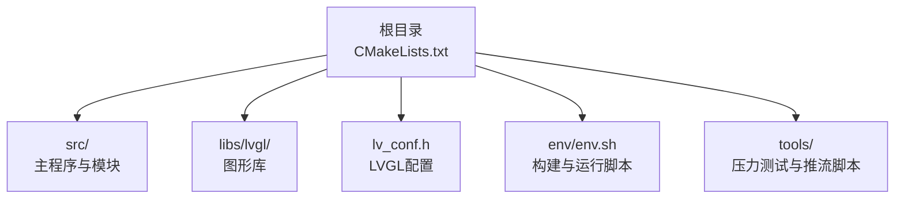
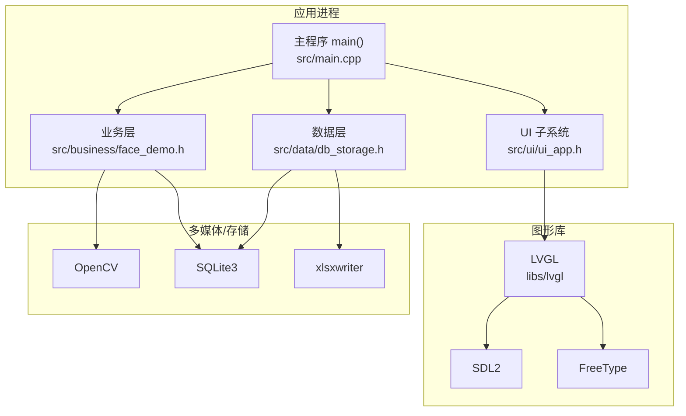
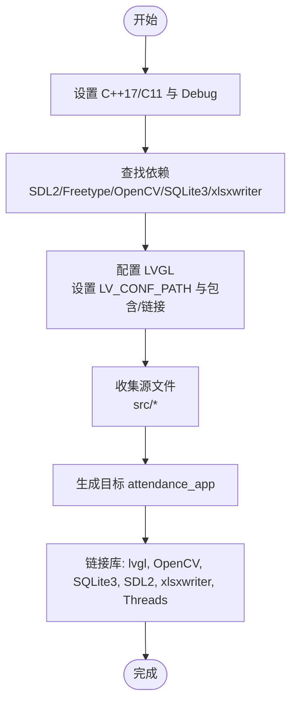
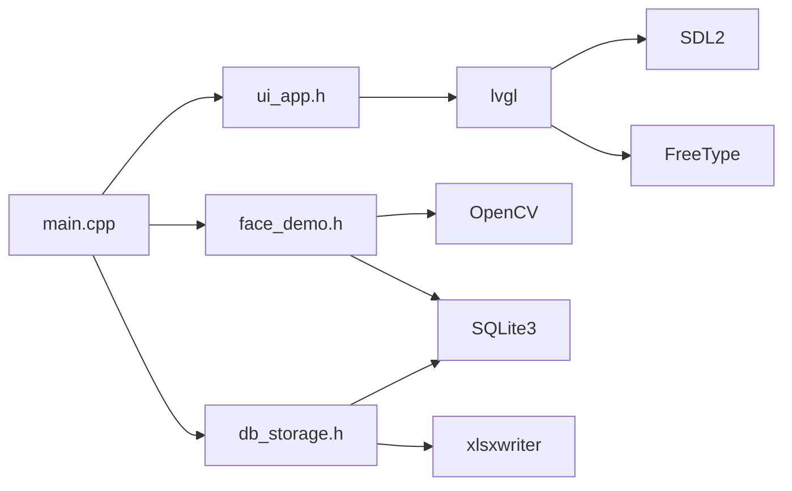

# 部署运维

<cite>
**本文引用的文件**   
- [CMakeLists.txt](file://CMakeLists.txt)
- [lv_conf.h](file://lv_conf.h)
- [main.cpp](file://src/main.cpp)
- [env.sh](file://env/env.sh)
- [face_demo.h](file://src/business/face_demo.h)
- [db_storage.h](file://src/data/db_storage.h)
- [ui_app.h](file://src/ui/ui_app.h)
- [Dockerfile](file://libs/lvgl/tests/Dockerfile)
- [stream.ps1](file://tools/stream/stream.ps1)
- [stress_test.sh](file://tools/stress_test.sh)
</cite>

## 目录
1. [简介](#简介)
2. [项目结构](#项目结构)
3. [核心组件](#核心组件)
4. [架构总览](#架构总览)
5. [详细组件分析](#详细组件分析)
6. [依赖关系分析](#依赖关系分析)
7. [性能考虑](#性能考虑)
8. [故障排除指南](#故障排除指南)
9. [结论](#结论)
10. [附录](#附录)

## 简介
本文件面向智能考勤系统的部署与运维，围绕编译与打包、系统部署、性能优化、故障排除、监控与维护以及多平台差异展开，帮助工程团队在不同环境中稳定交付与长期维护系统。

## 项目结构
项目采用 CMake 构建，主程序入口位于 src/main.cpp，业务层封装在 src/business，数据层封装在 src/data，UI 层封装在 src/ui。LVGL 作为图形界面库通过子目录方式集成，配置文件为根目录 lv_conf.h。构建脚本与环境变量配置位于 env/env.sh，工具脚本位于 tools/。

**图表来源**
- [CMakeLists.txt:1-155](file://CMakeLists.txt#L1-L155)
- [lv_conf.h:1-120](file://lv_conf.h#L1-L120)
- [env.sh:1-102](file://env/env.sh#L1-L102)

**章节来源**
- [CMakeLists.txt:1-155](file://CMakeLists.txt#L1-L155)
- [lv_conf.h:1-120](file://lv_conf.h#L1-L120)
- [env.sh:1-102](file://env/env.sh#L1-L102)

## 核心组件
- 主程序入口与生命周期控制：负责系统初始化、信号处理、主循环驱动 LVGL 心跳。
- UI 子系统：负责 HAL 初始化、输入设备配置、管理器启动与主页加载。
- 业务层：封装人脸检测、识别、训练、视频流获取、预处理配置与考勤记录查询等接口。
- 数据层：封装 SQLite3 访问，提供部门、班次、用户、考勤记录、全局配置等 DAO 接口。
- LVGL 集成：通过 CMake 引入并配置 SDL2、FreeType、xlsxwriter 等依赖，设置 LVGL 配置路径与宏。

**章节来源**
- [main.cpp:187-246](file://src/main.cpp#L187-L246)
- [ui_app.h:8-12](file://src/ui/ui_app.h#L8-L12)
- [face_demo.h:34-212](file://src/business/face_demo.h#L34-L212)
- [db_storage.h:214-683](file://src/data/db_storage.h#L214-L683)
- [CMakeLists.txt:56-71](file://CMakeLists.txt#L56-L71)

## 架构总览
系统采用三层架构：UI 层（LVGL）、业务层（OpenCV + SQLite3）、数据层（SQLite3）。主程序负责初始化顺序与主循环，业务层负责摄像头与识别逻辑，数据层负责持久化与查询。

**图表来源**
- [main.cpp:187-246](file://src/main.cpp#L187-L246)
- [ui_app.h:8-12](file://src/ui/ui_app.h#L8-L12)
- [face_demo.h:34-212](file://src/business/face_demo.h#L34-L212)
- [db_storage.h:214-683](file://src/data/db_storage.h#L214-L683)
- [CMakeLists.txt:24-37](file://CMakeLists.txt#L24-L37)
- [lv_conf.h:120-200](file://lv_conf.h#L120-L200)

## 详细组件分析

### 编译与打包流程
- C++/C 标准与构建类型：C++17、C11、Debug 构建，开启编译命令导出以便 IDE 自动识别头文件路径。
- 依赖发现：通过 pkg-config 与 find_package 检测 SDL2、FreeType、OpenCV、SQLite3、xlsxwriter。
- LVGL 集成：设置 LV_CONF_PATH 宏与包含路径，链接 SDL2 与 FreeType。
- 目标与链接：add_executable 生成 attendance_app，链接 lvgl、OpenCV、SQLite3、SDL2、xlsxwriter、Threads。
- 构建脚本：env/env.sh 提供 make/m 与 run/r 快捷，自动并行编译与运行。

**图表来源**
- [CMakeLists.txt:7-14](file://CMakeLists.txt#L7-L14)
- [CMakeLists.txt:24-37](file://CMakeLists.txt#L24-L37)
- [CMakeLists.txt:56-71](file://CMakeLists.txt#L56-L71)
- [CMakeLists.txt:84-112](file://CMakeLists.txt#L84-L112)
- [CMakeLists.txt:141-148](file://CMakeLists.txt#L141-L148)

**章节来源**
- [CMakeLists.txt:7-14](file://CMakeLists.txt#L7-L14)
- [CMakeLists.txt:24-37](file://CMakeLists.txt#L24-L37)
- [CMakeLists.txt:56-71](file://CMakeLists.txt#L56-L71)
- [CMakeLists.txt:84-112](file://CMakeLists.txt#L84-L112)
- [CMakeLists.txt:141-148](file://CMakeLists.txt#L141-L148)
- [env.sh:48-63](file://env/env.sh#L48-L63)

### 交叉编译与静态链接
- 交叉编译：仓库未提供交叉编译工具链配置，建议在 CMake 中通过 TOOLCHAIN_FILE 或 CMAKE_TOOLCHAIN_FILE 指定目标平台工具链。
- 静态链接：当前链接策略为动态库链接（find_package/pkg_check_modules），如需静态链接，可在目标上设置链接器标志并确保第三方库提供静态版本。
- Docker 环境：可参考 libs/lvgl/tests/Dockerfile 在容器内安装依赖，便于在 CI/CD 中进行一致化构建。

**章节来源**
- [Dockerfile:1-25](file://libs/lvgl/tests/Dockerfile#L1-L25)

### 系统部署指南
- 依赖安装：确保系统具备 SDL2、FreeType、OpenCV、SQLite3、xlsxwriter 等库的开发包。
- 环境变量：主程序在启动时会设置 SDL_VIDEO_ALLOW_SCREENSAVER=0 并通过系统命令禁用黑屏与电源管理，避免运行时休眠导致黑屏。
- 服务启动脚本：env/env.sh 提供 run/r 命令，自动清理端口占用与摄像头占用，再启动 attendance_app。
- 端口与设备：Windows 推流脚本 tools/stream/stream.ps1 使用 5004 端口推送 RTP，Linux/WSL 环境下需确保端口未被占用。

**章节来源**
- [main.cpp:156-182](file://src/main.cpp#L156-L182)
- [env.sh:68-99](file://env/env.sh#L68-L99)
- [stream.ps1:1-47](file://tools/stream/stream.ps1#L1-L47)

### 性能优化建议
- 内存管理：LVGL 内存池大小与对齐参数可按平台调整；软件渲染线程栈大小与优先级可优化渲染吞吐。
- CPU 使用率：主循环中根据 LVGL 返回的下次触发时间限制 usleep 范围，避免过快轮询；业务层预处理参数（直方图均衡化、裁剪、ROI 增强）应按场景权衡。
- 图形渲染：LVGL 配置中 DRAW_BUF_STRIDE_ALIGN、DRAW_BUF_ALIGN、DRAW_LAYER_* 参数影响缓冲与分块渲染；DRAW_SW_DRAW_UNIT_CNT 可根据任务数并行渲染。

**章节来源**
- [lv_conf.h:70-84](file://lv_conf.h#L70-L84)
- [lv_conf.h:128-166](file://lv_conf.h#L128-L166)
- [lv_conf.h:192-230](file://lv_conf.h#L192-L230)
- [main.cpp:229-238](file://src/main.cpp#L229-L238)

### 故障排除手册
- 黑屏/摄像头占用：run/r 会在启动前尝试释放 5004 UDP 端口与 /dev/video0 设备占用，必要时可手动 killall -9 attendance_app。
- Windows 推流冲突：stream.ps1 推送 RTP 到 WSL，若出现端口冲突或设备占用，先停止 ffmpeg 推流或更换端口。
- 依赖缺失：CMake 会在 find_package/pkg_check_modules 失败时报错，需确认各库的开发包已安装且 pkg-config 能找到。
- 日志与断言：LVGL 配置中可启用日志与断言，便于定位渲染与内存问题。

**章节来源**
- [env.sh:80-96](file://env/env.sh#L80-L96)
- [stream.ps1:26-34](file://tools/stream/stream.ps1#L26-L34)
- [CMakeLists.txt:24-37](file://CMakeLists.txt#L24-L37)
- [lv_conf.h:412-451](file://lv_conf.h#L412-L451)

### 监控与维护方案
- 健康检查：主循环中定期调用 lv_timer_handler 与 lv_tick_inc，可通过外部脚本监控进程存活与内存占用。
- 压力测试：tools/stress_test.sh 每 5 秒记录 RSS 与内存占比，持续 1 小时，检测长时间运行稳定性。
- 数据备份：SQLite3 数据库文件与抓拍图片目录需定期备份；可结合业务层提供的清理接口与工厂重置接口进行维护。
- 升级维护：通过 env/env.sh 的 make/m 重新构建，run/r 重启服务；Dockerfile 可用于标准化构建环境。

**章节来源**
- [main.cpp:229-238](file://src/main.cpp#L229-L238)
- [stress_test.sh:1-20](file://tools/stress_test.sh#L1-L20)
- [db_storage.h:537-555](file://src/data/db_storage.h#L537-L555)
- [env.sh:48-63](file://env/env.sh#L48-L63)
- [Dockerfile:1-25](file://libs/lvgl/tests/Dockerfile#L1-L25)

### 不同平台的部署差异与注意事项
- Linux/WSL：依赖 SDL2 与 FreeType，注意 OpenCV4 头文件路径 /usr/include/opencv4；禁用黑屏与电源管理。
- Windows：使用 tools/stream/stream.ps1 推送摄像头流至 WSL；运行前释放 5004 端口与摄像头占用。
- 容器化：libs/lvgl/tests/Dockerfile 提供 Ubuntu 基础镜像与依赖安装流程，适合 CI/CD 场景。

**章节来源**
- [CMakeLists.txt:136-137](file://CMakeLists.txt#L136-L137)
- [main.cpp:156-182](file://src/main.cpp#L156-L182)
- [stream.ps1:19-24](file://tools/stream/stream.ps1#L19-L24)
- [Dockerfile:1-25](file://libs/lvgl/tests/Dockerfile#L1-L25)

## 依赖关系分析
- 主程序依赖 UI、业务、数据三层模块；UI 依赖 LVGL 与 SDL2/FreeType；业务依赖 OpenCV 与 SQLite3；数据层依赖 SQLite3 与 xlsxwriter。
- CMake 通过 add_subdirectory 引入 LVGL，并设置 LV_CONF_PATH 宏，确保 UI 层使用正确的配置。

**图表来源**
- [main.cpp:30-33](file://src/main.cpp#L30-L33)
- [ui_app.h:8-12](file://src/ui/ui_app.h#L8-L12)
- [face_demo.h:34-212](file://src/business/face_demo.h#L34-L212)
- [db_storage.h:214-683](file://src/data/db_storage.h#L214-L683)
- [CMakeLists.txt:56-71](file://CMakeLists.txt#L56-L71)

**章节来源**
- [CMakeLists.txt:56-71](file://CMakeLists.txt#L56-L71)
- [main.cpp:30-33](file://src/main.cpp#L30-L33)

## 性能考虑
- 渲染与缓冲：合理设置 DRAW_BUF_STRIDE_ALIGN、DRAW_BUF_ALIGN、DRAW_LAYER_*，避免过大缓冲造成内存压力。
- 线程与优先级：DRAW_THREAD_STACK_SIZE 与优先级需与系统调度能力匹配，避免抢占其他任务。
- 主循环节流：根据 LVGL 返回的下次触发时间限制 usleep，兼顾响应性与能耗。
- 业务侧优化：预处理参数（裁剪、尺寸归一化、直方图均衡化、ROI 增强）按硬件能力与场景需求调节。

**章节来源**
- [lv_conf.h:128-166](file://lv_conf.h#L128-L166)
- [lv_conf.h:192-230](file://lv_conf.h#L192-L230)
- [main.cpp:229-238](file://src/main.cpp#L229-L238)

## 故障排除指南
- 启动失败：检查 CMake 依赖发现与 find_package/pkg_check_modules 输出；确认 db_storage.h 存在。
- 黑屏/摄像头占用：使用 env/env.sh 的 run/r 自动清理；必要时手动释放端口与设备。
- Windows 推流异常：确认 stream.ps1 中设备名、分辨率、端口与 WSL IP；避免端口冲突。
- 日志与断言：启用 LVGL 日志与断言，定位渲染与内存问题。

**章节来源**
- [CMakeLists.txt:74-78](file://CMakeLists.txt#L74-L78)
- [env.sh:80-96](file://env/env.sh#L80-L96)
- [stream.ps1:26-34](file://tools/stream/stream.ps1#L26-L34)
- [lv_conf.h:412-451](file://lv_conf.h#L412-L451)

## 结论
本部署运维文档基于现有仓库配置与脚本，给出了从编译、部署到性能优化与故障排除的完整实践路径。建议在生产环境进一步完善交叉编译与静态链接策略、容器化构建流程，并建立自动化监控与备份机制，以提升系统的稳定性与可维护性。

## 附录
- 构建与运行快捷命令：env/env.sh 提供 make/m 与 run/r，一键完成构建与启动。
- 压力测试：tools/stress_test.sh 提供长时间运行监控脚本。
- Docker 构建：libs/lvgl/tests/Dockerfile 提供依赖安装模板。

**章节来源**
- [env.sh:48-63](file://env/env.sh#L48-L63)
- [env.sh:68-99](file://env/env.sh#L68-L99)
- [stress_test.sh:1-20](file://tools/stress_test.sh#L1-L20)
- [Dockerfile:1-25](file://libs/lvgl/tests/Dockerfile#L1-L25)