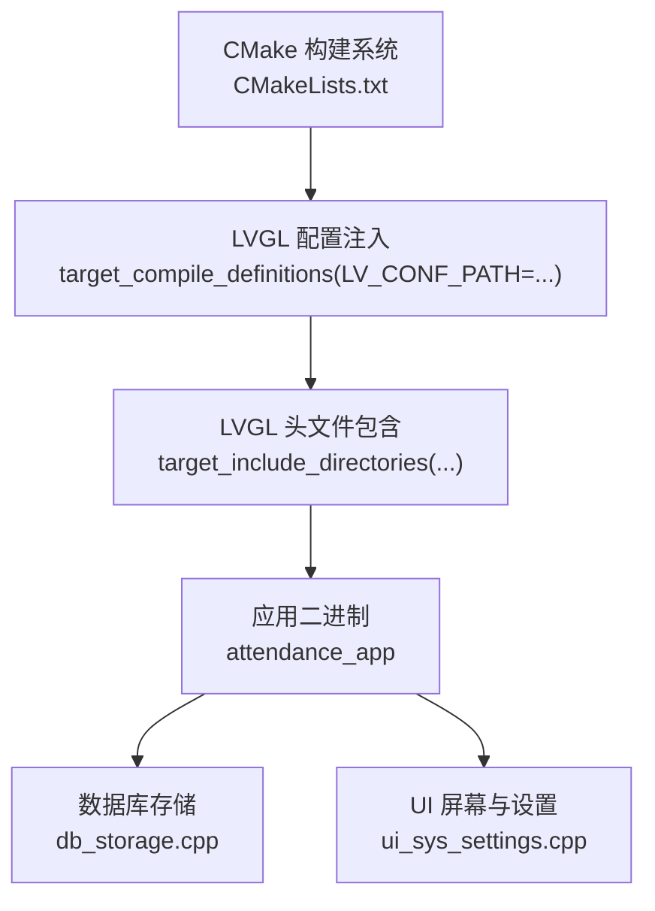
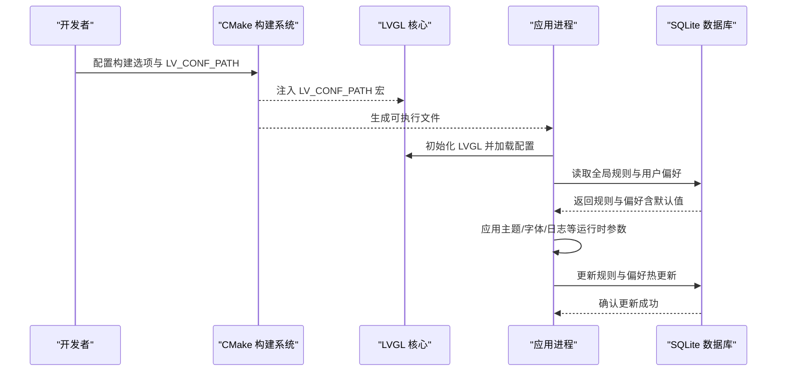
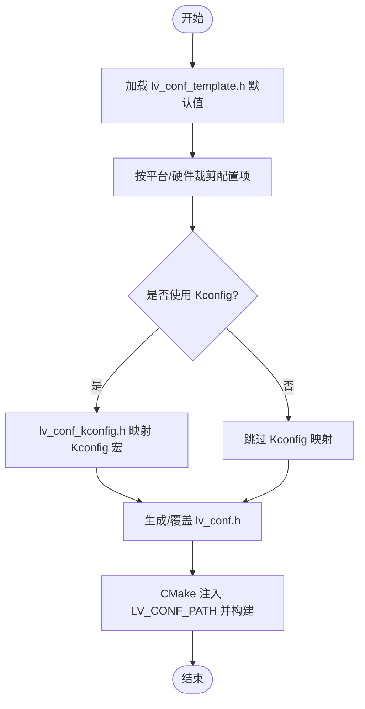
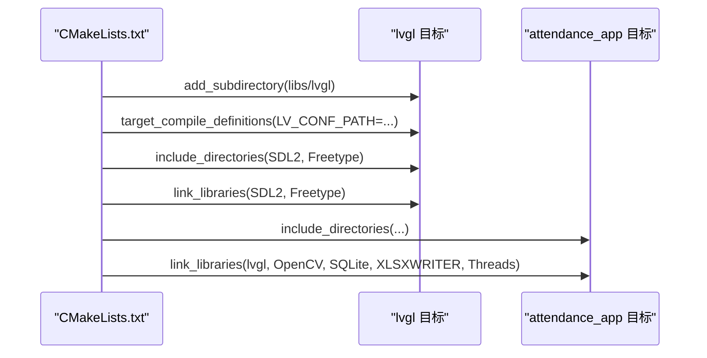
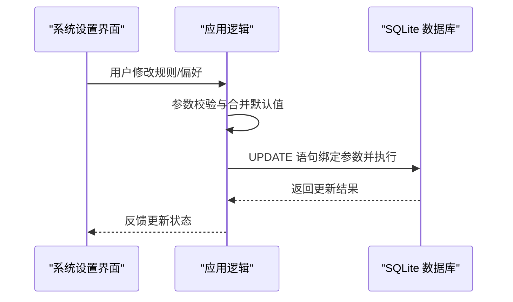
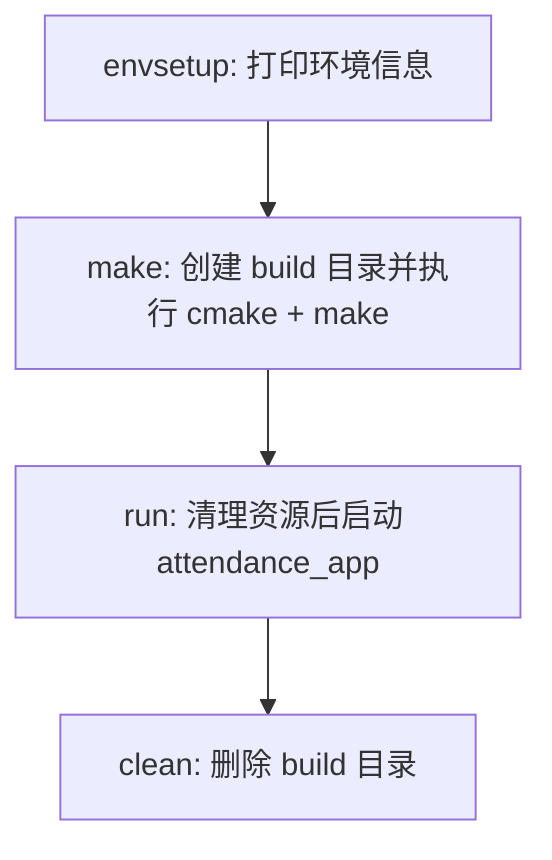
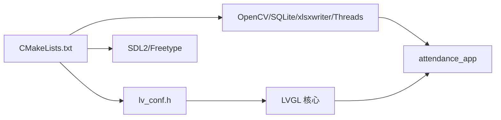

# 配置管理

<cite>
**本文引用的文件**
- [lv_conf.h](file://lv_conf.h)
- [lv_conf_template.h](file://libs/lvgl/lv_conf_template.h)
- [default.defconfig](file://libs/lvgl/configs/defconfigs/default.defconfig)
- [lv_conf_kconfig.h](file://libs/lvgl/src/lv_conf_kconfig.h)
- [CMakeLists.txt](file://CMakeLists.txt)
- [env.sh](file://env/env.sh)
- [db_storage.cpp](file://src/data/db_storage.cpp)
- [ui_sys_settings.cpp](file://src/ui/screens/system/ui_sys_settings.cpp)
</cite>

## 目录
1. [简介](#简介)
2. [项目结构](#项目结构)
3. [核心组件](#核心组件)
4. [架构总览](#架构总览)
5. [详细组件分析](#详细组件分析)
6. [依赖关系分析](#依赖关系分析)
7. [性能考量](#性能考量)
8. [故障排查指南](#故障排查指南)
9. [结论](#结论)
10. [附录](#附录)

## 简介
本指南聚焦于 SmartAttendance 的“配置管理”，覆盖以下方面：
- 系统配置文件管理机制：LVGL 配置、编译选项与运行时参数
- 用户偏好设置：个性化配置、界面主题与功能开关
- 配置验证机制、默认值处理与配置热更新策略
- 配置示例、参数说明与最佳实践
- 版本管理、迁移策略与备份恢复
- 不同环境下的配置差异、环境变量使用与部署配置

## 项目结构
SmartAttendance 的配置体系由三层构成：
- 构建期配置：通过 CMake 将 LVGL 配置文件路径注入编译定义
- 运行期配置：通过 SQLite 数据库存储业务规则与用户偏好
- LVGL 运行期渲染与主题：通过 lv_conf.h 控制渲染、字体、日志等行为

图表来源
- [CMakeLists.txt:54-61](file://CMakeLists.txt#L54-L61)
- [CMakeLists.txt:64-71](file://CMakeLists.txt#L64-L71)
- [CMakeLists.txt:114-146](file://CMakeLists.txt#L114-L146)

章节来源
- [CMakeLists.txt:1-153](file://CMakeLists.txt#L1-L153)

## 核心组件
- LVGL 配置文件：lv_conf.h 决定颜色深度、内存、渲染器、字体、日志、小部件启用等
- Kconfig 映射：lv_conf_kconfig.h 将 Kconfig 选项映射为 LVGL 宏，便于在不同平台统一配置
- 构建系统：CMake 将 LV_CONF_PATH 注入目标，确保 LVGL 使用项目自定义配置
- 运行时配置：db_storage.cpp 提供规则与偏好读写，默认值兜底，支持热更新
- 环境脚本：env.sh 提供一键构建、运行与资源清理，减少环境差异带来的问题

章节来源
- [lv_conf.h:1-800](file://lv_conf.h#L1-L800)
- [lv_conf_kconfig.h:1-312](file://libs/lvgl/src/lv_conf_kconfig.h#L1-L312)
- [CMakeLists.txt:54-61](file://CMakeLists.txt#L54-L61)
- [db_storage.cpp:574-738](file://src/data/db_storage.cpp#L574-L738)
- [env.sh:16-102](file://env/env.sh#L16-L102)

## 架构总览
下图展示从构建到运行的配置链路，以及运行期配置的读写路径。

图表来源
- [CMakeLists.txt:54-61](file://CMakeLists.txt#L54-L61)
- [db_storage.cpp:574-738](file://src/data/db_storage.cpp#L574-L738)

## 详细组件分析

### LVGL 配置管理（lv_conf.h 与模板）
- 作用域与关键宏
  - 颜色深度、内存大小与分配器选择
  - 默认刷新周期、DPI、操作系统抽象层
  - 渲染缓冲对齐、图层缓存大小、绘制线程栈与优先级
  - 软件渲染支持的颜色格式、阴影与圆缓存、复杂渐变
  - 日志级别、断言与调试开关
  - 字体启用与默认字体、文本编码与换行策略
  - 小部件启用列表（按钮、标签、日历、菜单等）
- 模板与默认值
  - lv_conf_template.h 提供完整注释与默认值模板，便于按需裁剪
  - default.defconfig 为空，表示采用默认参数展开
- Kconfig 映射
  - lv_conf_kconfig.h 将 Kconfig 选项映射为 LVGL 宏，统一跨平台配置

图表来源
- [lv_conf_template.h:1-800](file://libs/lvgl/lv_conf_template.h#L1-L800)
- [default.defconfig:1-2](file://libs/lvgl/configs/defconfigs/default.defconfig#L1-L2)
- [lv_conf_kconfig.h:1-312](file://libs/lvgl/src/lv_conf_kconfig.h#L1-L312)
- [CMakeLists.txt:54-61](file://CMakeLists.txt#L54-L61)

章节来源
- [lv_conf.h:1-800](file://lv_conf.h#L1-L800)
- [lv_conf_template.h:1-800](file://libs/lvgl/lv_conf_template.h#L1-L800)
- [default.defconfig:1-2](file://libs/lvgl/configs/defconfigs/default.defconfig#L1-L2)
- [lv_conf_kconfig.h:1-312](file://libs/lvgl/src/lv_conf_kconfig.h#L1-L312)
- [CMakeLists.txt:54-61](file://CMakeLists.txt#L54-L61)

### 构建期配置注入（CMake）
- 关键点
  - 通过 set(LV_CONF_PATH ...) 与 target_compile_definitions 将配置文件路径注入 LVGL
  - include 与 link LVGL 所需的 SDL2、FreeType 等依赖
  - 输出构建信息，便于定位配置路径与依赖状态

图表来源
- [CMakeLists.txt:52-71](file://CMakeLists.txt#L52-L71)
- [CMakeLists.txt:114-146](file://CMakeLists.txt#L114-L146)

章节来源
- [CMakeLists.txt:52-71](file://CMakeLists.txt#L52-L71)
- [CMakeLists.txt:114-146](file://CMakeLists.txt#L114-L146)

### 运行时配置与用户偏好（数据库）
- 规则与偏好读取
  - db_storage.cpp 中提供 db_get_global_rules()，在查询失败或字段为 NULL 时使用默认值兜底
  - 支持公司名称、迟到阈值、音量、屏保时间、管理员上限、继电器延时、Wiegand 格式、重复打卡限制、语言、日期格式、回家延迟、警告记录数等
- 更新与热更新
  - 提供更新接口，绑定参数后执行 SQL，返回更新结果
  - UI 层通过系统设置界面进行交互，变更后调用更新接口持久化

图表来源
- [db_storage.cpp:574-738](file://src/data/db_storage.cpp#L574-L738)
- [ui_sys_settings.cpp:2764-2789](file://src/ui/screens/system/ui_sys_settings.cpp#L2764-L2789)

章节来源
- [db_storage.cpp:574-738](file://src/data/db_storage.cpp#L574-L738)
- [ui_sys_settings.cpp:2764-2789](file://src/ui/screens/system/ui_sys_settings.cpp#L2764-L2789)

### 环境变量与部署配置（env.sh）
- 功能
  - 一键构建（m/make）、运行（r/run）、清理（cl/clean）
  - 启动前清理端口与摄像头资源，降低黑屏与资源占用导致的问题
  - 输出构建信息，便于定位依赖与配置路径

图表来源
- [env.sh:16-102](file://env/env.sh#L16-L102)

章节来源
- [env.sh:16-102](file://env/env.sh#L16-L102)

## 依赖关系分析
- 构建期依赖
  - LVGL 配置文件路径通过 CMake 注入
  - LVGL 依赖 SDL2 与 FreeType；应用依赖 OpenCV、SQLite、xlsxwriter、线程库
- 运行期依赖
  - LVGL 行为受 lv_conf.h 控制
  - UI 主题与样式受 LVGL 配置影响
  - 业务规则与用户偏好来自 SQLite

图表来源
- [CMakeLists.txt:52-71](file://CMakeLists.txt#L52-L71)
- [CMakeLists.txt:114-146](file://CMakeLists.txt#L114-L146)

章节来源
- [CMakeLists.txt:52-71](file://CMakeLists.txt#L52-L71)
- [CMakeLists.txt:114-146](file://CMakeLists.txt#L114-L146)

## 性能考量
- 渲染与内存
  - 合理设置内存池大小与绘制线程栈，避免频繁分配与上下文切换
  - 根据屏幕分辨率与颜色深度调整渲染缓冲对齐与图层缓存
- 日志与调试
  - 生产环境建议关闭 LV_USE_LOG 或降低日志级别，减少 I/O 影响
  - 调试阶段开启断言与调试覆盖，有助于定位问题但会影响性能
- 字体与文本
  - 按需启用字体，避免加载过多字形导致内存与解码开销上升
  - 文本换行策略与长文本提示可减少重绘压力

## 故障排查指南
- 构建期
  - 若找不到 db_storage.h，检查路径与文件是否存在
  - 确认 LV_CONF_PATH 已正确注入，避免 LVGL 使用默认配置
- 运行期
  - 若出现黑屏或资源占用异常，使用 env.sh 的 run 流程清理端口与摄像头资源
  - 若 UI 主题或字体异常，检查 lv_conf.h 对应宏是否被正确编译进入
- 配置更新
  - 更新失败时查看 SQL 返回值与错误信息
  - 确保默认值兜底逻辑生效，避免 NULL 导致的异常行为

章节来源
- [CMakeLists.txt:73-78](file://CMakeLists.txt#L73-L78)
- [CMakeLists.txt:54-61](file://CMakeLists.txt#L54-L61)
- [env.sh:67-99](file://env/env.sh#L67-L99)
- [db_storage.cpp:712-738](file://src/data/db_storage.cpp#L712-L738)

## 结论
SmartAttendance 的配置管理以“构建期注入 + 运行期数据库”为核心，结合 LVGL 的灵活配置能力，实现了跨平台、可裁剪、可扩展的配置体系。通过默认值兜底与热更新机制，既保证了稳定性，也提升了用户体验。建议在不同环境中遵循统一的配置注入流程与默认值策略，并建立完善的备份与迁移方案。

## 附录

### 配置参数速查与最佳实践
- LVGL 配置要点
  - 颜色深度与内存：根据设备内存与分辨率选择合适深度与内存池大小
  - 渲染器：软件渲染按需启用颜色格式，复杂渐变与阴影按需开启
  - 日志与断言：开发阶段开启，生产关闭或降级
  - 字体：仅启用所需字体，避免过大字体文件
- 运行时参数
  - 公司名称、语言、日期格式、音量、屏保时间、管理员上限、继电器延时、Wiegand 格式、重复打卡限制、回家延迟、警告记录数等
  - 建议在 UI 中提供校验与范围限制，更新失败时回滚并提示
- 环境与部署
  - 使用 env.sh 的 run 流程启动，自动清理潜在冲突资源
  - 构建前确认依赖与路径，构建后核对 LV_CONF_PATH 输出

章节来源
- [lv_conf.h:1-800](file://lv_conf.h#L1-L800)
- [db_storage.cpp:574-738](file://src/data/db_storage.cpp#L574-L738)
- [env.sh:67-99](file://env/env.sh#L67-L99)