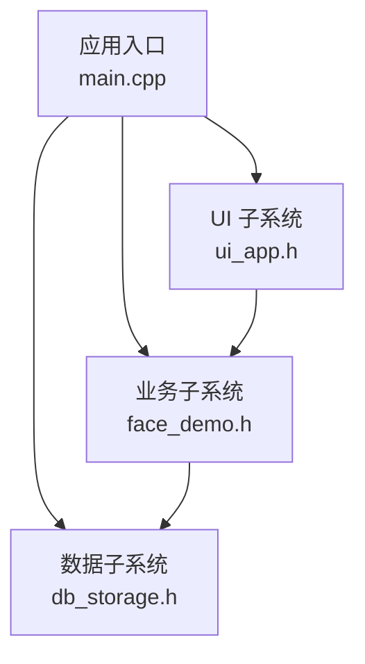
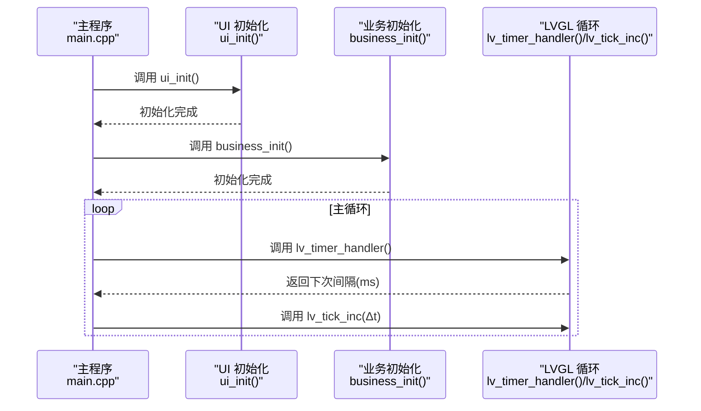
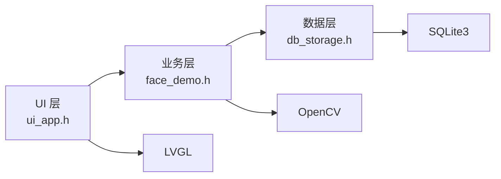

# 附录

<cite>
**本文引用的文件**
- [lv_conf.h](file://lv_conf.h)
- [lv_conf_template.h](file://libs/lvgl/lv_conf_template.h)
- [main.cpp](file://src/main.cpp)
- [face_demo.h](file://src/business/face_demo.h)
- [db_storage.h](file://src/data/db_storage.h)
- [ui_app.h](file://src/ui/ui_app.h)
- [CHANGELOG.rst](file://libs/lvgl/docs/src/CHANGELOG.rst)
- [README.md](file://libs/lvgl/README.md)
- [COPYRIGHTS.md](file://libs/lvgl/COPYRIGHTS.md)
</cite>

## 目录
1. [简介](#简介)
2. [项目结构](#项目结构)
3. [核心组件](#核心组件)
4. [架构总览](#架构总览)
5. [详细组件分析](#详细组件分析)
6. [依赖关系分析](#依赖关系分析)
7. [性能考虑](#性能考虑)
8. [故障排查指南](#故障排查指南)
9. [结论](#结论)
10. [附录](#附录)

## 简介
本附录面向智能考勤系统的维护者与开发者，提供以下内容：
- 完整的 API 参考手册（业务层、数据层、UI 层）
- LVGL 配置参数说明（编译宏、运行时参数）
- 版本更新日志（LVGL v9.4.0 变更要点）
- 贡献指南与资源链接
- 许可证与法律声明

## 项目结构
系统采用三层架构：
- UI 层：基于 LVGL 的图形界面，负责展示与交互
- 业务层：封装人脸识别、视频流、预处理与考勤逻辑
- 数据层：SQLite 数据访问与种子数据初始化

图表来源
- [main.cpp:187-246](file://src/main.cpp#L187-L246)
- [ui_app.h:8-12](file://src/ui/ui_app.h#L8-L12)
- [face_demo.h:34-212](file://src/business/face_demo.h#L34-L212)
- [db_storage.h:215-683](file://src/data/db_storage.h#L215-L683)

章节来源
- [main.cpp:187-246](file://src/main.cpp#L187-L246)
- [ui_app.h:8-12](file://src/ui/ui_app.h#L8-L12)
- [face_demo.h:34-212](file://src/business/face_demo.h#L34-L212)
- [db_storage.h:215-683](file://src/data/db_storage.h#L215-L683)

## 核心组件
- UI 子系统
  - 初始化入口：ui_init()
  - 作用：初始化 LVGL、显示驱动与输入设备，加载主页
- 业务子系统
  - 初始化：business_init()
  - 预处理配置：PreprocessConfig、Histogram Equalization、ROI 增强
  - 用户管理：注册、更新人脸、查询用户列表
  - 考勤记录：加载缓存、查询格式化文本、记录考勤
  - 识别控制：启用/禁用人脸识别
- 数据子系统
  - 初始化与播种：data_init()、data_seed()
  - 部门/班次/用户/考勤记录的 CRUD
  - 排班与规则：部门周排班、个人特殊排班、全局规则
  - 系统配置：全局键值配置、节假日管理、报表批量查询

章节来源
- [ui_app.h:8-12](file://src/ui/ui_app.h#L8-L12)
- [face_demo.h:34-212](file://src/business/face_demo.h#L34-L212)
- [db_storage.h:215-683](file://src/data/db_storage.h#L215-L683)

## 架构总览
系统主循环负责驱动 LVGL 心跳与定时器，业务层在后台进行摄像头采集、人脸识别与考勤记录落库。

图表来源
- [main.cpp:226-238](file://src/main.cpp#L226-L238)

章节来源
- [main.cpp:226-238](file://src/main.cpp#L226-L238)

## 详细组件分析

### UI 子系统 API
- 函数
  - ui_init(): 初始化 UI 子系统（显示、输入、管理器、主页）

章节来源
- [ui_app.h:8-12](file://src/ui/ui_app.h#L8-L12)

### 业务子系统 API
- 初始化与退出
  - business_init(): 初始化模型、打开摄像头、启动识别线程
  - business_quit(): 释放资源、停止采集
- 预处理配置
  - business_set_preprocess_config()/business_get_preprocess_config()
  - business_set_histogram_equalization()
  - business_set_crop_settings()
  - business_set_clahe_parameters()
  - business_set_roi_enhance()
  - business_reload_config(): 强制刷新配置
- 视频帧与 UI 显示
  - business_get_display_frame(buffer, w, h): 获取当前帧用于 UI 显示
- 用户管理
  - business_get_user_count()/business_get_user_at()
  - business_register_user(name, dept_id): 注册新用户并入库
  - business_update_user_face(user_id): 更新人脸特征
- 考勤记录
  - business_load_records(): 刷新缓存
  - business_get_record_count()/business_get_record_at(index, buf, len)
- 识别控制
  - business_set_recognition_enabled()/business_get_recognition_enabled()

章节来源
- [face_demo.h:34-212](file://src/business/face_demo.h#L34-L212)

### 数据子系统 API
- 初始化与关闭
  - data_init(): 连接数据库并建表、播种
  - data_seed(): 默认数据播种
  - data_close(): 关闭数据库
- 部门管理
  - db_add_department()/db_get_departments()/db_delete_department()
- 班次管理
  - db_update_shift()/db_get_shifts()/db_get_shift_info()/db_add_shift()/db_delete_shift()
- 用户管理
  - db_add_user()/db_batch_add_users()/db_delete_user()
  - db_get_user_info()/db_get_all_users()/db_get_all_users_info()
  - db_assign_user_shift()/db_get_user_shift()
  - db_update_user_basic()/db_update_user_face()/db_update_user_password()/db_update_user_fingerprint()
  - db_get_all_users_light()
- 考勤记录
  - db_log_attendance(): 记录考勤并保存图片
  - db_get_records()/db_get_records_by_user()
  - db_getLastPunchTime()/db_cleanup_old_attendance_images()
- 排班与规则
  - db_set_dept_schedule()/db_set_user_special_schedule()
  - db_get_user_shift_smart(): 智能获取班次（优先级：个人特殊 > 部门周排班 > 默认）
- 事务与清理
  - db_begin_transaction()/db_commit_transaction()
  - db_clear_attendance()/db_clear_users()/db_factory_reset()
- 系统配置与报表
  - db_get_system_config()/db_set_system_config()
  - db_set_holiday()/db_delete_holiday()/db_get_holiday()
  - db_get_all_records_by_time()/db_get_users_by_dept()
  - db_get_system_stats()

章节来源
- [db_storage.h:215-683](file://src/data/db_storage.h#L215-L683)

### LVGL 配置参数说明
- 颜色深度与内存
  - LV_COLOR_DEPTH：颜色深度（1/8/16/24/32）
  - LV_MEM_SIZE、LV_MEM_POOL_EXPAND_SIZE、LV_MEM_ADR：内存池大小与地址
- 操作系统与线程
  - LV_USE_OS：操作系统选择（None/Pthreads/FreeRTOS/Windows/SDL2 等）
  - LV_USE_FREERTOS_TASK_NOTIFY：FreeRTOS 任务通知
  - LV_DRAW_THREAD_STACK_SIZE、LV_DRAW_THREAD_PRIO：绘制线程栈与优先级
- 渲染与 GPU
  - LV_USE_DRAW_SW、LV_DRAW_SW_SUPPORT_*：软件渲染支持的颜色格式
  - LV_USE_DRAW_VG_LITE、LV_USE_DRAW_DMA2D、LV_USE_DRAW_EVE 等：硬件加速开关
  - LV_VG_LITE_*、LV_DRAW_EVE_*：VG-Lite 与 EVE 相关参数
- 日志与断言
  - LV_USE_LOG、LV_LOG_LEVEL、LV_LOG_PRINTF、LV_LOG_USE_TIMESTAMP、LV_LOG_USE_FILE_LINE
  - LV_USE_ASSERT_NULL、LV_USE_ASSERT_MALLOC、LV_USE_ASSERT_STYLE
- 文本与字体
  - LV_TXT_ENC、LV_TXT_BREAK_CHARS、LV_TXT_LINE_BREAK_LONG_LEN 等
  - LV_FONT_DEFAULT、LV_USE_FONT_COMPRESSED、LV_USE_FONT_PLACEHOLDER
- 小工具与特性
  - LV_WIDGETS_HAS_DEFAULT_VALUE、各类 Widget 开关
  - LV_USE_GESTURE_RECOGNITION、LV_USE_OBJ_ID、LV_USE_OBJ_NAME、LV_USE_OBJ_PROPERTY

章节来源
- [lv_conf.h:29-800](file://lv_conf.h#L29-L800)
- [lv_conf_template.h:29-800](file://libs/lvgl/lv_conf_template.h#L29-L800)

### 版本更新日志（LVGL v9.4.0）
- 主要特性
  - glTF 与 3D 支持
  - XML 支持（LVGL Pro）
  - GPU 加速：EVE、ESP PPA、NemaGFX、统一 VGLite、Dave2D 优化
  - MPU 功能：GStreamer、DRM+EGL、ARM NEON 优化
  - GIF 库性能提升、FrogFS 支持
- 性能改进
  - GIF、VGLite、文本渲染等多处性能优化
- 修复
  - 多平台与驱动相关的大量修复
- 文档与示例
  - 文档全面重构与补充

章节来源
- [CHANGELOG.rst:6-480](file://libs/lvgl/docs/src/CHANGELOG.rst#L6-L480)

### 贡献指南与资源
- 贡献方式
  - 提交 Issue、编写示例、改进文档、修复 Bug、托管项目
- 官方资源
  - 官网、Pro 编辑器、文档、论坛、演示、服务
- 第三方库许可
  - LVGL 使用的第三方库清单与许可证位置

章节来源
- [README.md:372-384](file://libs/lvgl/README.md#L372-L384)
- [COPYRIGHTS.md:1-68](file://libs/lvgl/COPYRIGHTS.md#L1-L68)

## 依赖关系分析
- 运行时依赖
  - LVGL：图形库
  - OpenCV：图像处理与人脸识别
  - SQLite3：本地数据库
- 编译期依赖
  - CMake、SDL2（根据配置）
- 组件耦合
  - 业务层依赖数据层（DAO），UI 层依赖业务层
  - 预处理配置通过 C 接口暴露，便于 UI 与业务层共享

图表来源
- [face_demo.h:34-212](file://src/business/face_demo.h#L34-L212)
- [db_storage.h:215-683](file://src/data/db_storage.h#L215-L683)
- [ui_app.h:8-12](file://src/ui/ui_app.h#L8-L12)

章节来源
- [face_demo.h:34-212](file://src/business/face_demo.h#L34-L212)
- [db_storage.h:215-683](file://src/data/db_storage.h#L215-L683)
- [ui_app.h:8-12](file://src/ui/ui_app.h#L8-L12)

## 性能考虑
- LVGL
  - 合理设置刷新周期（LV_DEF_REFR_PERIOD）、绘制线程优先级与栈大小
  - 在启用 FreeType/ThorVG 时增大绘制线程栈
  - 选择合适的颜色格式与对齐参数，减少带宽占用
- 业务层
  - 预处理配置（裁剪、尺寸归一化、CLAHE）影响识别准确率与性能，建议按需启用
  - 批量导入用户时使用事务（db_begin_transaction/db_commit_transaction）提升吞吐
- 数据层
  - 定期清理过期图片（db_cleanup_old_attendance_images）
  - 使用 JOIN 查询减少 N+1 查询，提高报表生成效率

## 故障排查指南
- UI 无响应或卡顿
  - 检查主循环是否正确调用 lv_timer_handler() 与 lv_tick_inc()
  - 调整 LV_DEF_REFR_PERIOD 与绘制线程优先级
- 人脸识别失败
  - 确认摄像头可用且分辨率匹配
  - 检查预处理配置（裁剪、CLAHE 参数）是否合理
- 数据库异常
  - data_init() 返回失败时检查数据库文件权限与 SQL 语法
  - 使用 data_seed() 确保默认数据存在
- 耳机/音量/继电器等硬件参数
  - 通过 RuleConfig 与系统配置接口设置设备 ID、音量、继电器延时等

章节来源
- [main.cpp:226-238](file://src/main.cpp#L226-L238)
- [face_demo.h:76-84](file://src/business/face_demo.h#L76-L84)
- [db_storage.h:215-239](file://src/data/db_storage.h#L215-L239)

## 结论
本附录提供了智能考勤系统在 API、配置、版本与资源方面的完整参考。建议在开发与部署过程中：
- 严格遵循 API 使用规范，确保 UI、业务、数据三层职责清晰
- 根据目标平台调整 LVGL 配置，平衡性能与资源占用
- 借助版本日志与贡献指南持续迭代与优化

## 附录

### A. API 参考手册（按模块）

- UI 子系统
  - ui_init(): 初始化 UI 子系统
- 业务子系统
  - 初始化/退出：business_init(), business_quit()
  - 预处理：business_set_preprocess_config(), business_get_preprocess_config(), business_reload_config()
  - 直方图均衡化/裁剪/ROI：business_set_histogram_equalization(), business_set_crop_settings(), business_set_roi_enhance()
  - CLAHE 参数：business_set_clahe_parameters()
  - 视频帧：business_get_display_frame()
  - 用户管理：business_get_user_count(), business_get_user_at(), business_register_user(), business_update_user_face()
  - 考勤记录：business_load_records(), business_get_record_count(), business_get_record_at()
  - 识别控制：business_set_recognition_enabled(), business_get_recognition_enabled()
- 数据子系统
  - 初始化/播种/关闭：data_init(), data_seed(), data_close()
  - 部门：db_add_department(), db_get_departments(), db_delete_department()
  - 班次：db_update_shift(), db_get_shifts(), db_get_shift_info(), db_add_shift(), db_delete_shift()
  - 用户：db_add_user(), db_batch_add_users(), db_delete_user(), db_get_user_info(), db_get_all_users(), db_get_all_users_info(), db_assign_user_shift(), db_get_user_shift(), db_update_user_basic(), db_update_user_face(), db_update_user_password(), db_update_user_fingerprint(), db_get_all_users_light()
  - 考勤：db_log_attendance(), db_get_records(), db_get_records_by_user(), db_getLastPunchTime(), db_cleanup_old_attendance_images()
  - 排班与规则：db_set_dept_schedule(), db_set_user_special_schedule(), db_get_user_shift_smart(), db_get_global_rules(), db_update_global_rules(), db_get_all_bells(), db_update_bell()
  - 事务与清理：db_begin_transaction(), db_commit_transaction(), db_clear_attendance(), db_clear_users(), db_factory_reset()
  - 系统配置与报表：db_get_system_config(), db_set_system_config(), db_set_holiday(), db_delete_holiday(), db_get_holiday(), db_get_all_records_by_time(), db_get_users_by_dept(), db_get_system_stats()

章节来源
- [ui_app.h:8-12](file://src/ui/ui_app.h#L8-L12)
- [face_demo.h:34-212](file://src/business/face_demo.h#L34-L212)
- [db_storage.h:215-683](file://src/data/db_storage.h#L215-L683)

### B. LVGL 配置参数清单（节选）
- 颜色与内存
  - LV_COLOR_DEPTH、LV_MEM_SIZE、LV_MEM_POOL_EXPAND_SIZE、LV_MEM_ADR
- 操作系统与线程
  - LV_USE_OS、LV_USE_FREERTOS_TASK_NOTIFY、LV_DRAW_THREAD_STACK_SIZE、LV_DRAW_THREAD_PRIO
- 渲染与 GPU
  - LV_USE_DRAW_SW、LV_DRAW_SW_SUPPORT_*、LV_USE_DRAW_VG_LITE、LV_USE_DRAW_DMA2D、LV_USE_DRAW_EVE、LV_VG_LITE_*、LV_DRAW_EVE_*
- 日志与断言
  - LV_USE_LOG、LV_LOG_LEVEL、LV_LOG_PRINTF、LV_LOG_USE_TIMESTAMP、LV_LOG_USE_FILE_LINE、LV_USE_ASSERT_NULL、LV_USE_ASSERT_MALLOC、LV_USE_ASSERT_STYLE
- 文本与字体
  - LV_TXT_ENC、LV_TXT_BREAK_CHARS、LV_TXT_LINE_BREAK_LONG_LEN、LV_FONT_DEFAULT、LV_USE_FONT_COMPRESSED、LV_USE_FONT_PLACEHOLDER
- 小部件与特性
  - LV_WIDGETS_HAS_DEFAULT_VALUE、各类 Widget 开关、LV_USE_GESTURE_RECOGNITION、LV_USE_OBJ_ID、LV_USE_OBJ_NAME、LV_USE_OBJ_PROPERTY

章节来源
- [lv_conf.h:29-800](file://lv_conf.h#L29-L800)
- [lv_conf_template.h:29-800](file://libs/lvgl/lv_conf_template.h#L29-L800)

### C. 版本更新日志摘要（LVGL v9.4.0）
- 新特性：glTF/3D、XML 支持、EVE/GPU 加速、NXP/VGLite、Dave2D 优化、ARM NEON、GStreamer、DRM+EGL、FrogFS、GIF 性能提升
- 性能：GIF、VGLite、文本渲染等优化
- 修复：多平台与驱动修复
- 文档：文档体系重构与补充

章节来源
- [CHANGELOG.rst:6-480](file://libs/lvgl/docs/src/CHANGELOG.rst#L6-L480)

### D. 贡献指南与资源
- 贡献：Issue、示例、文档、Bug 修复、项目托管
- 官方：官网、Pro 编辑器、文档、论坛、演示、服务
- 第三方库：许可证与来源清单

章节来源
- [README.md:372-384](file://libs/lvgl/README.md#L372-L384)
- [COPYRIGHTS.md:1-68](file://libs/lvgl/COPYRIGHTS.md#L1-L68)

### E. 许可证与法律声明
- LVGL 采用 MIT 许可证，可在商业项目中使用
- 第三方库许可证位于各自目录下的 LICENSE.txt 文件

章节来源
- [COPYRIGHTS.md:1-68](file://libs/lvgl/COPYRIGHTS.md#L1-L68)