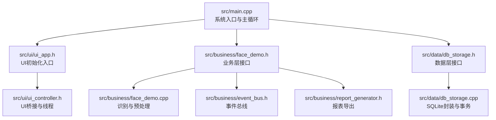
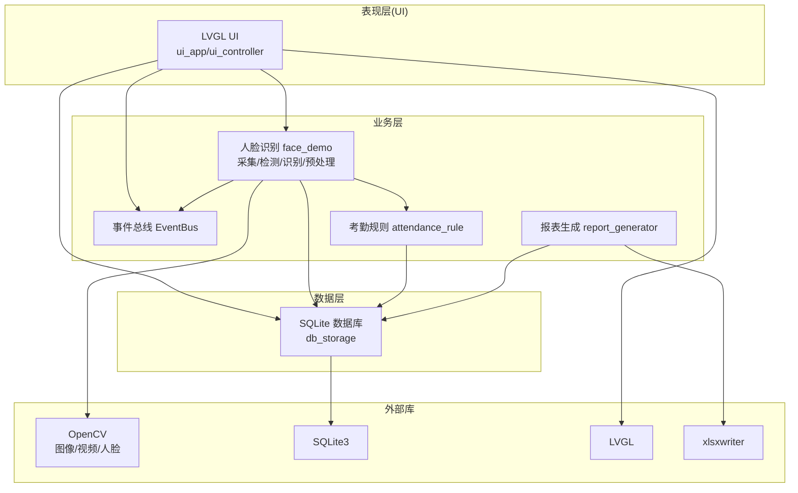
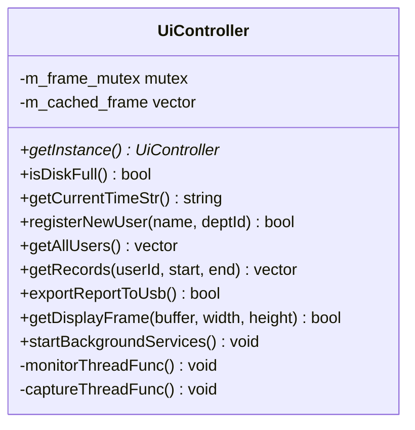
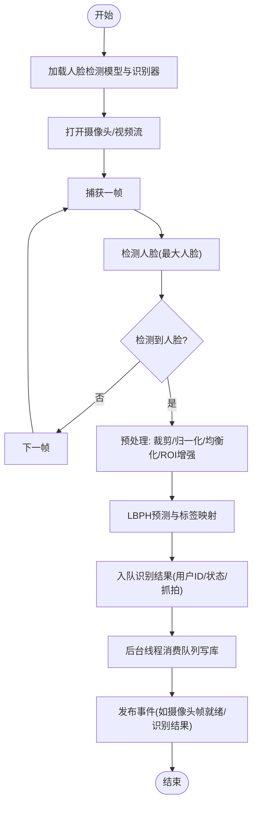
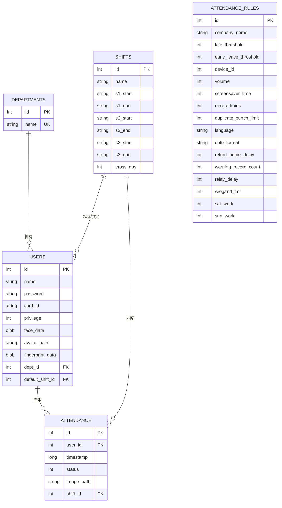
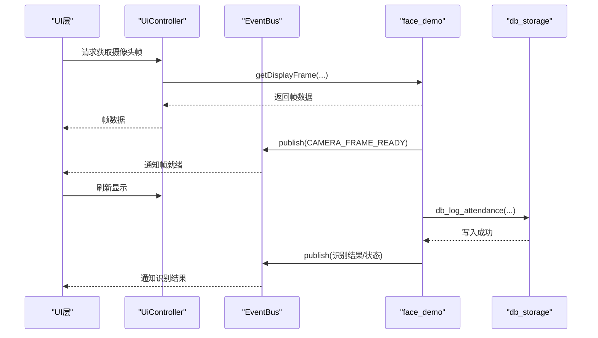
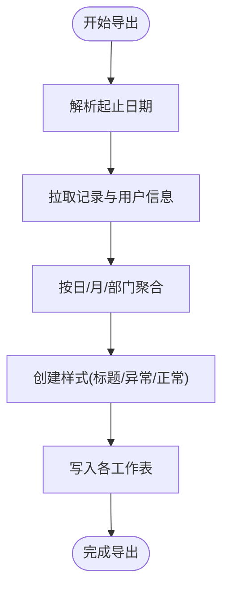
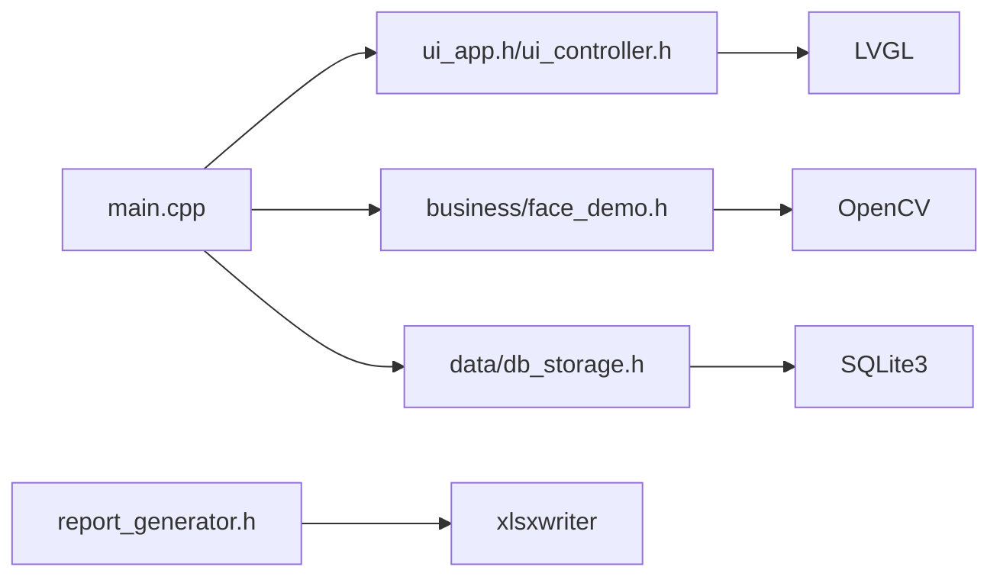

# 项目概述

<cite>
**本文引用的文件**
- [main.cpp](file://src/main.cpp)
- [CMakeLists.txt](file://CMakeLists.txt)
- [lv_conf.h](file://lv_conf.h)
- [ui_app.h](file://src/ui/ui_app.h)
- [face_demo.h](file://src/business/face_demo.h)
- [db_storage.h](file://src/data/db_storage.h)
- [face_demo.cpp](file://src/business/face_demo.cpp)
- [ui_controller.h](file://src/ui/ui_controller.h)
- [db_storage.cpp](file://src/data/db_storage.cpp)
- [event_bus.h](file://src/business/event_bus.h)
- [report_generator.h](file://src/business/report_generator.h)
- [SmartAttendance框架结构.txt](file://docs/SmartAttendance框架结构.txt)
</cite>

## 目录
1. [简介](#简介)
2. [项目结构](#项目结构)
3. [核心组件](#核心组件)
4. [架构总览](#架构总览)
5. [详细组件分析](#详细组件分析)
6. [依赖关系分析](#依赖关系分析)
7. [性能考量](#性能考量)
8. [故障排查指南](#故障排查指南)
9. [结论](#结论)
10. [附录](#附录)

## 简介
SmartAttendance是一个基于桌面Linux平台的智能考勤系统，采用三层架构（UI层、业务层、数据层），结合LVGL图形界面、OpenCV人脸识别技术和SQLite数据库，提供从人脸采集、识别、考勤记录到报表导出的完整闭环。系统通过事件总线解耦组件，通过线程池与队列异步处理识别与数据库写入，确保UI流畅与识别实时性。

本项目旨在为中小型企业提供低成本、易部署、可扩展的本地化考勤解决方案，支持多模块业务场景（员工管理、排班设计、异常统计、报表导出等），并具备良好的可维护性与可移植性。

## 项目结构
项目采用模块化分层组织，核心目录与职责如下：
- src/main.cpp：系统入口，负责初始化顺序、主循环与资源回收
- src/ui/：UI层，包含通用组件、页面与控制器，负责与LVGL交互
- src/business/：业务层，包含人脸识别、考勤规则、事件总线、报表生成等
- src/data/：数据层，封装SQLite数据库操作，提供DAO接口
- libs/lvgl/：LVGL图形库（子目录）
- docs/：项目文档与产品资料
- tools/：辅助工具脚本（压力测试、视频推流）

图表来源
- [main.cpp:187-246](file://src/main.cpp#L187-L246)
- [ui_app.h:8-12](file://src/ui/ui_app.h#L8-L12)
- [face_demo.h:34-196](file://src/business/face_demo.h#L34-L196)
- [db_storage.h:189-596](file://src/data/db_storage.h#L189-L596)
- [ui_controller.h:21-106](file://src/ui/ui_controller.h#L21-L106)
- [face_demo.cpp:1-200](file://src/business/face_demo.cpp#L1-L200)
- [db_storage.cpp:1-200](file://src/data/db_storage.cpp#L1-L200)
- [event_bus.h:10-41](file://src/business/event_bus.h#L10-L41)
- [report_generator.h:33-221](file://src/business/report_generator.h#L33-L221)

章节来源
- [SmartAttendance框架结构.txt:1-68](file://docs/SmartAttendance框架结构.txt#L1-L68)

## 核心组件
- UI层（LVGL）
  - 负责图形渲染、事件处理、页面跳转与输入设备驱动（SDL）
  - 通过ui_app与ui_controller桥接业务层能力
- 业务层（人脸识别与规则）
  - 人脸识别：采集、检测、预处理、训练、识别与队列落库
  - 考勤规则：基于班次与全局规则计算迟到/早退/异常
  - 事件总线：组件间解耦通信
  - 报表生成：基于xlsxwriter导出多类型报表
- 数据层（SQLite）
  - 提供DAO接口：部门、班次、用户、考勤记录、系统配置
  - 事务与并发：读写锁、预编译语句、WAL模式优化
- 构建与配置
  - CMake：依赖发现（OpenCV、SQLite3、SDL2、Freetype、xlsxwriter）、目标链接
  - LVGL：通过lv_conf.h配置渲染与特性

章节来源
- [ui_app.h:8-12](file://src/ui/ui_app.h#L8-L12)
- [face_demo.h:34-196](file://src/business/face_demo.h#L34-L196)
- [db_storage.h:189-596](file://src/data/db_storage.h#L189-L596)
- [CMakeLists.txt:1-153](file://CMakeLists.txt#L1-L153)
- [lv_conf.h:1-800](file://lv_conf.h#L1-L800)

## 架构总览
系统采用经典的三层架构，配合事件总线实现松耦合：
- UI层：负责展示与交互，通过ui_controller调用业务层接口
- 业务层：人脸识别与规则计算，异步写库，事件发布
- 数据层：SQLite持久化，提供事务与并发控制
- 外部依赖：OpenCV（图像处理与人脸识别）、SQLite3（数据库）、LVGL（图形界面）、xlsxwriter（报表导出）

图表来源
- [main.cpp:187-246](file://src/main.cpp#L187-L246)
- [face_demo.h:34-196](file://src/business/face_demo.h#L34-L196)
- [db_storage.h:189-596](file://src/data/db_storage.h#L189-L596)
- [event_bus.h:10-41](file://src/business/event_bus.h#L10-L41)
- [report_generator.h:33-221](file://src/business/report_generator.h#L33-L221)
- [CMakeLists.txt:24-38](file://CMakeLists.txt#L24-L38)

## 详细组件分析

### UI层与控制器
- ui_app：负责UI初始化（SDL/FB、输入设备、管理器启动、主页加载）
- ui_controller：提供UI侧所需的业务接口（用户列表、记录查询、摄像头帧获取、报表导出等），并管理后台线程
- 设计要点
  - 单例模式提供全局访问点
  - 线程安全：图像缓存与互斥锁保护
  - 与业务层解耦：通过接口封装降低UI复杂度

图表来源
- [ui_controller.h:21-106](file://src/ui/ui_controller.h#L21-L106)

章节来源
- [ui_app.h:8-12](file://src/ui/ui_app.h#L8-L12)
- [ui_controller.h:21-106](file://src/ui/ui_controller.h#L21-L106)

### 业务层：人脸识别与预处理
- 初始化：加载Haar级联模型、LBPH识别器、打开摄像头或视频流
- 预处理：裁剪边界、尺寸归一化、直方图均衡化（全局/CLAHE）、ROI增强
- 识别：检测最大人脸、灰度化、预处理、预测与标签映射
- 异步落库：识别结果入队，后台线程消费队列写库，避免阻塞UI
- 配置缓存：全局规则与班次列表缓存，减少频繁查询

图表来源
- [face_demo.cpp:35-200](file://src/business/face_demo.cpp#L35-L200)
- [face_demo.h:34-196](file://src/business/face_demo.h#L34-L196)

章节来源
- [face_demo.cpp:1-200](file://src/business/face_demo.cpp#L1-L200)
- [face_demo.h:34-196](file://src/business/face_demo.h#L34-L196)

### 数据层：SQLite封装与事务
- 生命周期：初始化时创建目录、连接数据库、应用性能优化（WAL、foreign_keys、cache_size等）
- 表结构：departments、shifts、users、attendance、attendance_rules、系统配置表
- DAO接口：部门/班次/用户/考勤记录的增删改查、批量导入、排班管理、节假日管理
- 并发控制：读写锁分离、预编译语句、事务封装，保障高并发下的数据一致性
- 图像存储：抓拍图与头像分别存于独立目录，BLOB字段存储人脸特征

图表来源
- [db_storage.cpp:139-200](file://src/data/db_storage.cpp#L139-L200)
- [db_storage.h:18-176](file://src/data/db_storage.h#L18-L176)

章节来源
- [db_storage.cpp:108-200](file://src/data/db_storage.cpp#L108-L200)
- [db_storage.h:189-596](file://src/data/db_storage.h#L189-L596)

### 事件总线与UI桥接
- EventBus：单例，支持订阅/发布，线程安全
- UI桥接：UiController封装业务接口，提供UI侧调用的统一入口
- 事件类型：时间更新、磁盘状态、摄像头帧就绪等

图表来源
- [event_bus.h:10-41](file://src/business/event_bus.h#L10-L41)
- [ui_controller.h:60-85](file://src/ui/ui_controller.h#L60-L85)
- [face_demo.h:91-100](file://src/business/face_demo.h#L91-L100)
- [db_storage.h:423-441](file://src/data/db_storage.h#L423-L441)

章节来源
- [event_bus.h:10-41](file://src/business/event_bus.h#L10-L41)
- [ui_controller.h:60-85](file://src/ui/ui_controller.h#L60-L85)

### 报表导出（xlsxwriter）
- 支持汇总表、异常表、员工信息表、周报、部门报表
- 核心流程：解析时间范围、拉取记录与用户信息、聚合计算、样式化写入Excel
- 依赖：xlsxwriter库，提供Workbook/Worksheet/Format管理

图表来源
- [report_generator.h:92-219](file://src/business/report_generator.h#L92-L219)

章节来源
- [report_generator.h:33-221](file://src/business/report_generator.h#L33-L221)

## 依赖关系分析
- 构建依赖
  - OpenCV：core/imgproc/videoio/highgui/objdetect/face
  - SQLite3：数据库引擎
  - SDL2 + Freetype：LVGL渲染与字体
  - xlsxwriter：报表导出
- 运行时依赖
  - OpenCV模型文件（haar cascade）与LBPH模型
  - SQLite数据库文件与图像目录
  - LVGL配置文件lv_conf.h

图表来源
- [CMakeLists.txt:24-38](file://CMakeLists.txt#L24-L38)
- [main.cpp:17-34](file://src/main.cpp#L17-L34)

章节来源
- [CMakeLists.txt:1-153](file://CMakeLists.txt#L1-L153)
- [main.cpp:17-34](file://src/main.cpp#L17-L34)

## 性能考量
- 渲染与UI
  - LVGL通过配置文件控制颜色深度、刷新周期、绘制缓冲策略，适配桌面环境
- 人脸识别
  - 预处理优化：裁剪、归一化、CLAHE均衡化、ROI增强，提升识别鲁棒性
  - 异步落库：识别结果入队，后台线程写库，避免阻塞UI
- 数据库
  - WAL模式、foreign_keys、cache_size等优化，提升并发与可靠性
  - 预编译语句与读写锁分离，降低锁竞争
- 线程与并发
  - 采集线程、监控线程、数据库写线程分离，互斥锁保护共享数据

章节来源
- [lv_conf.h:88-167](file://lv_conf.h#L88-L167)
- [face_demo.cpp:55-80](file://src/business/face_demo.cpp#L55-L80)
- [db_storage.cpp:123-135](file://src/data/db_storage.cpp#L123-L135)

## 故障排查指南
- 依赖缺失
  - OpenCV未找到：确认OpenCV4安装路径与find_package配置
  - SQLite3未找到：确认SQLite3库可用
  - SDL2/Freetype/xlsxwriter：确认pkg-config可用
- 模型文件
  - 人脸检测模型路径：确保haar cascade文件存在或在标准路径
  - LBPH模型：确保face_model.xml存在
- 数据库
  - 权限问题：确认当前用户对数据库文件与图像目录有读写权限
  - WAL模式：确认数据库文件可被WAL写入
- UI显示
  - 屏保/休眠：系统禁用屏保与自动休眠，确保显示持续
  - LVGL配置：确认lv_conf.h路径与宏定义正确

章节来源
- [CMakeLists.txt:24-38](file://CMakeLists.txt#L24-L38)
- [face_demo.cpp:175-184](file://src/business/face_demo.cpp#L175-L184)
- [db_storage.cpp:117-135](file://src/data/db_storage.cpp#L117-L135)
- [main.cpp:156-182](file://src/main.cpp#L156-L182)

## 结论
SmartAttendance通过清晰的三层架构与事件总线，将LVGL图形界面、OpenCV人脸识别与SQLite数据库有机结合，形成一套可扩展、可维护的本地化考勤系统。系统在性能与稳定性方面做了多项优化，适合中小企业的日常考勤与管理需求。未来可在移动端移植、云端同步、多机协同等方面进一步演进。

## 附录
- 实际使用场景
  - 日常考勤：刷脸打卡、识别结果即时反馈
  - 员工管理：注册/更新人脸、部门与班次绑定
  - 排班设计：部门周排班、个人特殊日期排班
  - 报表导出：月度汇总、异常统计、部门报表
- 价值主张
  - 低成本：纯桌面部署，无需云服务
  - 易维护：模块化设计，接口清晰
  - 可扩展：事件总线与DAO接口便于功能扩展