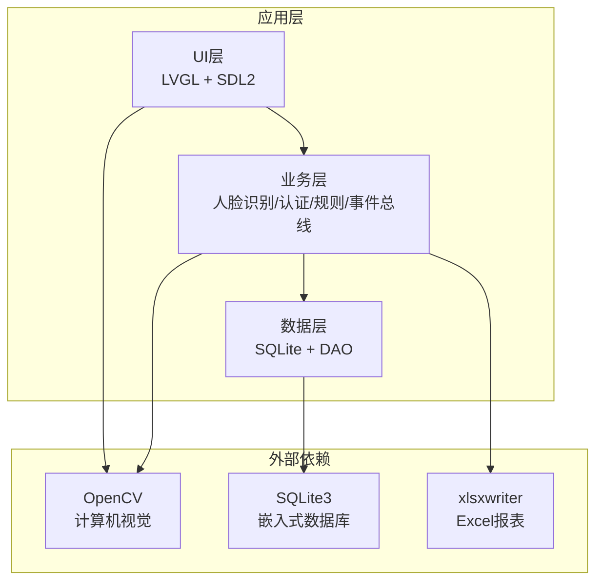
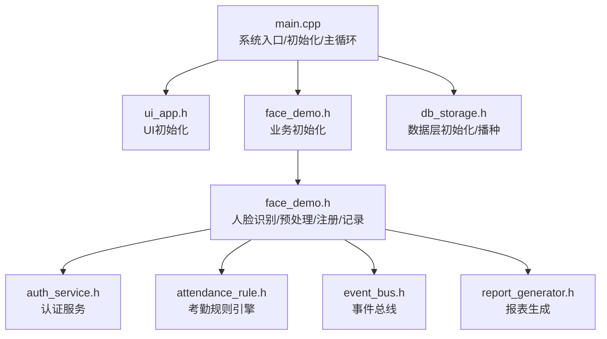
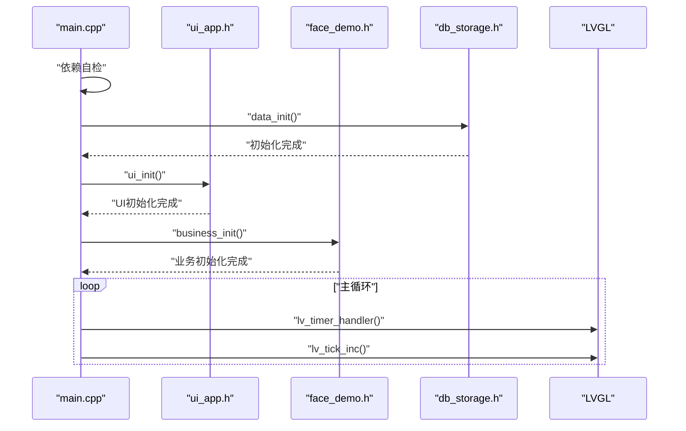
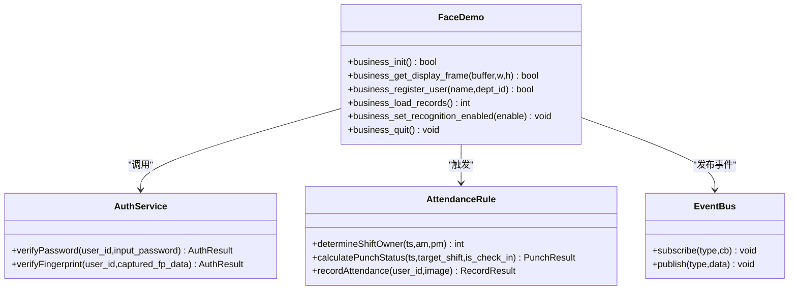
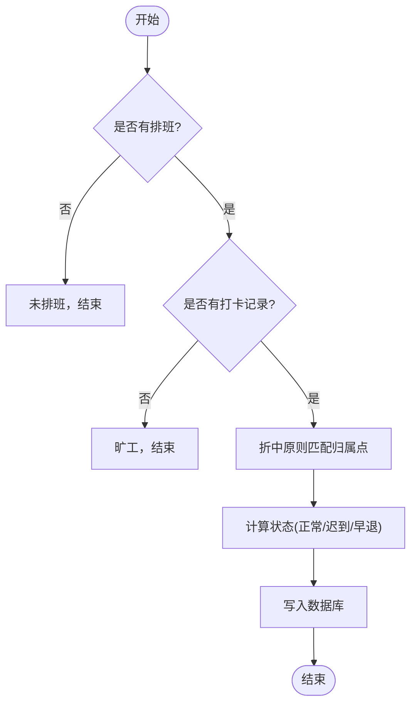
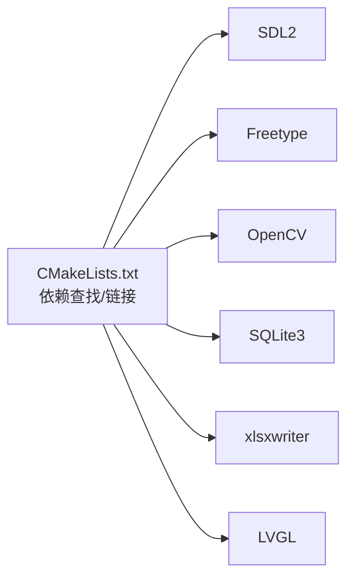

# 项目概述

<cite>
**本文引用的文件**
- [main.cpp](file://src/main.cpp)
- [CMakeLists.txt](file://CMakeLists.txt)
- [lv_conf.h](file://lv_conf.h)
- [face_demo.h](file://src/business/face_demo.h)
- [auth_service.h](file://src/business/auth_service.h)
- [attendance_rule.h](file://src/business/attendance_rule.h)
- [db_storage.h](file://src/data/db_storage.h)
- [event_bus.h](file://src/business/event_bus.h)
- [ui_app.h](file://src/ui/ui_app.h)
- [ui_controller.h](file://src/ui/ui_controller.h)
- [SmartAttendance框架结构.txt](file://docs/SmartAttendance框架结构.txt)
- [FA03H_rules.md](file://docs/markdowm/FA03H_rules.md)
</cite>

## 目录
1. [简介](#简介)
2. [项目结构](#项目结构)
3. [核心组件](#核心组件)
4. [架构总览](#架构总览)
5. [详细组件分析](#详细组件分析)
6. [依赖分析](#依赖分析)
7. [性能考虑](#性能考虑)
8. [故障排查指南](#故障排查指南)
9. [结论](#结论)
10. [附录](#附录)

## 简介
本项目是一个基于桌面端的智能考勤系统，目标是提供一体化的考勤解决方案，涵盖人脸识别考勤、多模态认证（密码/指纹）、实时监控与人脸预处理、考勤规则引擎、数据持久化与报表导出等能力。系统采用分层架构设计（UI层、业务层、数据层），结合LVGL图形库、OpenCV计算机视觉、SQLite数据库等关键技术栈，满足中小型组织的本地部署与离线运行需求。

## 项目结构
项目采用清晰的分层组织方式，便于维护与扩展：
- UI层：负责图形界面、交互与显示，基于LVGL实现，支持SDL2驱动与字体渲染。
- 业务层：封装核心业务逻辑，包括人脸识别流程、多模态认证、考勤规则引擎、事件总线与报表生成。
- 数据层：封装SQLite数据库访问，提供DAO接口，支持用户、部门、班次、排班、考勤记录等数据模型。
- 文档与工具：包含框架结构说明、硬件产品资料、T9键盘集成指南、压力测试脚本等。



图表来源
- [CMakeLists.txt:140-148](file://CMakeLists.txt#L140-L148)
- [lv_conf.h:1-120](file://lv_conf.h#L1-L120)
- [db_storage.h:1-60](file://src/data/db_storage.h#L1-L60)

章节来源
- [SmartAttendance框架结构.txt:1-79](file://docs/SmartAttendance框架结构.txt#L1-L79)

## 核心组件
- 主程序入口与生命周期管理：负责系统初始化、依赖自检、UI与业务模块初始化、主循环与资源清理。
- UI子系统：负责图形界面初始化、事件循环与显示刷新。
- 业务子系统：人脸识别与预处理、多模态认证、考勤规则引擎、事件总线、报表生成。
- 数据子系统：数据库初始化与播种、用户/部门/班次/排班/考勤记录的增删改查接口。
- 关键技术栈：LVGL（图形库）、OpenCV（计算机视觉）、SQLite（数据库）、xlsxwriter（报表导出）。

章节来源
- [main.cpp:187-246](file://src/main.cpp#L187-L246)
- [ui_app.h:8-12](file://src/ui/ui_app.h#L8-L12)
- [face_demo.h:34-84](file://src/business/face_demo.h#L34-L84)
- [auth_service.h:18-44](file://src/business/auth_service.h#L18-L44)
- [attendance_rule.h:28-88](file://src/business/attendance_rule.h#L28-L88)
- [db_storage.h:214-239](file://src/data/db_storage.h#L214-L239)

## 架构总览
系统采用三层架构，职责清晰、耦合度低：
- UI层：负责显示与交互，通过回调与业务层解耦。
- 业务层：封装人脸识别、认证、规则计算、事件发布与订阅，提供稳定的接口。
- 数据层：封装数据库访问，提供DAO接口，支持事务与批量导入。



图表来源
- [main.cpp:213-225](file://src/main.cpp#L213-L225)
- [face_demo.h:34-84](file://src/business/face_demo.h#L34-L84)
- [auth_service.h:18-44](file://src/business/auth_service.h#L18-L44)
- [attendance_rule.h:43-88](file://src/business/attendance_rule.h#L43-L88)
- [event_bus.h:23-41](file://src/business/event_bus.h#L23-L41)

## 详细组件分析

### 主程序与系统生命周期
- 依赖自检：检查OpenCV、SQLite3、LVGL版本，确保运行环境。
- 数据层初始化：自动创建表结构并进行数据播种。
- UI与业务初始化顺序：先UI后业务，确保事件订阅完整。
- 主循环：驱动LVGL心跳、tick更新，维持界面刷新与响应。



图表来源
- [main.cpp:199-238](file://src/main.cpp#L199-L238)
- [ui_app.h:8-12](file://src/ui/ui_app.h#L8-L12)
- [face_demo.h:34-40](file://src/business/face_demo.h#L34-L40)
- [db_storage.h:214-221](file://src/data/db_storage.h#L214-L221)

章节来源
- [main.cpp:187-246](file://src/main.cpp#L187-L246)

### UI层（LVGL + SDL2）
- 初始化：配置SDL2与字体，启动输入设备与显示刷新。
- 事件循环：通过LVGL驱动心跳与tick，维持界面响应。
- 与业务层协作：通过回调与事件总线进行解耦。

章节来源
- [ui_app.h:8-12](file://src/ui/ui_app.h#L8-L12)
- [lv_conf.h:88-110](file://lv_conf.h#L88-L110)

### 业务层（人脸识别与多模态认证）
- 人脸识别与预处理：提供摄像头帧获取、直方图均衡化、裁剪与尺寸归一化等配置接口。
- 用户管理：注册新用户、更新人脸、查询用户列表。
- 考勤记录：加载缓存、查询格式化文本、控制识别开关。
- 多模态认证：密码与指纹验证接口，返回标准化结果枚举。
- 事件总线：统一发布订阅机制，降低模块耦合。



图表来源
- [face_demo.h:34-212](file://src/business/face_demo.h#L34-L212)
- [auth_service.h:18-44](file://src/business/auth_service.h#L18-L44)
- [attendance_rule.h:43-88](file://src/business/attendance_rule.h#L43-L88)
- [event_bus.h:23-41](file://src/business/event_bus.h#L23-L41)

章节来源
- [face_demo.h:34-212](file://src/business/face_demo.h#L34-L212)
- [auth_service.h:18-44](file://src/business/auth_service.h#L18-L44)
- [attendance_rule.h:28-88](file://src/business/attendance_rule.h#L28-L88)
- [event_bus.h:10-41](file://src/business/event_bus.h#L10-L41)

### 数据层（SQLite + DAO）
- 数据模型：部门、班次、用户、排班、考勤记录、系统规则与定时响铃等。
- DAO接口：提供增删改查、播种、事务、批量导入、报表辅助查询等。
- 数据一致性：通过事务与外键约束保障数据完整性。

```mermaid
erDiagram
DEPARTMENTS {
int id PK
string name
}
SHIFTS {
int id PK
string name
string s1_start
string s1_end
string s2_start
string s2_end
string s3_start
string s3_end
int cross_day
}
USERS {
int id PK
string name
string password
string card_id
int role
int dept_id FK
int default_shift_id
blob face_feature
blob fingerprint_feature
string avatar_path
string position
}
DEPT_SCHEDULE {
int dept_id FK
int day_of_week
int shift_id
}
ATTENDANCE {
int id PK
int user_id FK
long long timestamp
int status
string image_path
int minutes_late
int minutes_early
}
DEPARTMENTS ||--o{ USERS : "拥有"
DEPARTMENTS ||--o{ DEPT_SCHEDULE : "排班"
SHIFTS ||--o{ DEPT_SCHEDULE : "被使用"
USERS ||--o{ ATTENDANCE : "产生记录"
```

图表来源
- [db_storage.h:18-202](file://src/data/db_storage.h#L18-L202)

章节来源
- [db_storage.h:1-683](file://src/data/db_storage.h#L1-L683)

### 考勤规则引擎（折中原则与状态判定）
- 节点K：周末是否上班的规则开关，影响是否进入考勤计算。
- 折中原则：根据打卡时间与班次时间点，决定归属上班/下班。
- 状态判定：正常、迟到、早退、旷工，支持多重记录处理与覆盖策略。



图表来源
- [FA03H_rules.md:10-56](file://docs/markdowm/FA03H_rules.md#L10-L56)
- [attendance_rule.h:43-88](file://src/business/attendance_rule.h#L43-L88)

章节来源
- [FA03H_rules.md:10-56](file://docs/markdowm/FA03H_rules.md#L10-L56)
- [attendance_rule.h:28-88](file://src/business/attendance_rule.h#L28-L88)

### UI控制器与桥接
- 封装业务与数据接口，简化UI层调用。
- 提供用户管理、记录查询、报表导出、摄像头帧获取等能力。
- 后台线程：监控时间与磁盘状态、捕获摄像头帧。

章节来源
- [ui_controller.h:21-108](file://src/ui/ui_controller.h#L21-L108)

## 依赖分析
- 构建系统：CMake负责查找SDL2、Freetype、OpenCV、SQLite3、xlsxwriter等依赖，并配置LVGL头文件路径与宏定义。
- 运行时依赖：OpenCV提供人脸检测与预处理；SQLite提供本地数据持久化；xlsxwriter用于报表导出；LVGL负责图形界面与事件循环。



图表来源
- [CMakeLists.txt:18-71](file://CMakeLists.txt#L18-L71)

章节来源
- [CMakeLists.txt:18-71](file://CMakeLists.txt#L18-L71)

## 性能考虑
- LVGL配置：合理设置刷新周期、颜色深度与绘制缓冲，平衡流畅度与内存占用。
- OpenCV预处理：直方图均衡化与尺寸归一化可提升识别准确率，但会增加CPU开销，建议按需启用与参数调优。
- 数据库事务：批量导入与更新使用事务，减少磁盘写入次数，提高吞吐。
- 线程与锁：UI控制器的后台线程与互斥锁保护图像数据，避免竞态条件。

## 故障排查指南
- 依赖缺失：确认OpenCV、SQLite3、SDL2、Freetype、xlsxwriter均已正确安装并被CMake发现。
- LVGL配置：检查lv_conf.h中的颜色深度、刷新周期、绘制缓冲等参数是否符合平台能力。
- 数据库初始化：若首次运行失败，检查数据库文件权限与路径，必要时清理旧数据后重试播种。
- UI无显示：确认SDL2驱动可用，窗口创建成功，LVGL心跳与tick更新正常。
- 人脸识别异常：检查摄像头权限与设备可用性，确认预处理参数（裁剪、尺寸、CLAHE）合理。

章节来源
- [main.cpp:199-208](file://src/main.cpp#L199-L208)
- [lv_conf.h:29-110](file://lv_conf.h#L29-L110)
- [CMakeLists.txt:18-38](file://CMakeLists.txt#L18-L38)

## 结论
本项目通过清晰的分层架构与成熟的技术栈，实现了从图形界面到业务逻辑再到数据持久化的完整闭环。系统具备良好的扩展性与可维护性，适合在中小规模组织中部署与使用。后续可在以下方向持续演进：引入更高效的识别算法、支持远程同步与云端备份、增强报表维度与可视化能力、完善权限与审计体系。

## 附录
- 适用场景：中小型企业/园区/学校等需要本地化、离线运行的考勤管理场景。
- 项目特点：模块化设计、多模态认证、规则引擎、报表导出、实时监控与预处理。
- 未来方向：边缘计算优化、多设备协同、Web管理后台、移动端适配。