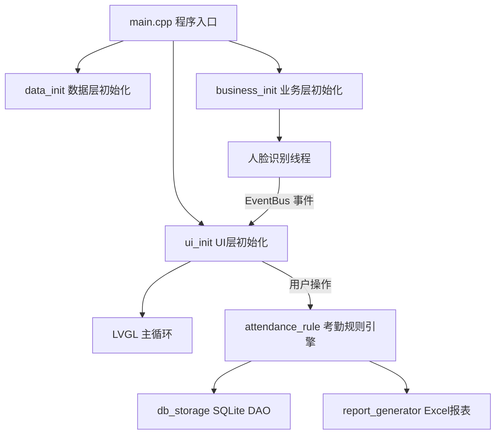

# SmartAttendance - 智能考勤系统

> 基于嵌入式 GUI 的智能人脸考勤系统原型（Phase 01）

---

## 项目简介

SmartAttendance 是一款运行在 Linux 嵌入式设备（如 FA03H 人脸考勤机）上的智能考勤系统。系统集成人脸识别、考勤规则引擎、数据持久化与报表导出功能，采用 LVGL 图形框架构建嵌入式 GUI 界面，通过 SQLite 本地数据库实现离线运行。

---

## 功能模块

```
智能考勤系统
├── 员工管理        → 人脸注册 / 信息维护 / 删除
├── 考勤执行        → 实时人脸识别 / 打卡记录
├── 考勤规则配置    → 部门管理 / 班次设置 / 排班管理
├── 考勤记录查询    → 按日期 / 按人员查询 / 明细导出
├── 考勤统计分析    → 日报 / 月报 / 部门汇总 / Excel 导出
└── 系统设置        → 设备信息 / 数据库管理 / 高级设置
```

---

## 技术栈

| 类别 | 技术 |
|------|------|
| 开发语言 | C11 / C++17 |
| GUI 框架 | LVGL v9.4（SDL2 + Freetype 渲染） |
| 人脸识别 | OpenCV 4（`objdetect`、`face` 模块） |
| 本地数据库 | SQLite 3 |
| 报表导出 | libxlsxwriter（Excel `.xlsx`） |
| 构建系统 | CMake 3.16+ |
| 线程支持 | POSIX Threads |

---

## 项目结构

```
SmartAttendance/
├── CMakeLists.txt              # CMake 构建脚本
├── lv_conf.h                   # LVGL 图形库配置
├── env/
│   └── env.sh                  # 开发环境快捷命令脚本
├── libs/
│   └── lvgl/                   # LVGL 第三方库（子模块）
├── src/
│   ├── main.cpp                # 程序入口（初始化 + 主循环）
│   ├── business/               # [业务层] 核心逻辑
│   │   ├── attendance_rule     # 考勤规则引擎（状态判定、迟到早退计算）
│   │   ├── auth_service        # 身份认证（登录、权限校验）
│   │   ├── event_bus           # 事件总线（组件间解耦通信）
│   │   ├── face_demo           # 人脸识别流程（采集 → 检测 → 识别）
│   │   └── report_generator    # Excel 报表生成器
│   ├── data/
│   │   └── db_storage          # [数据层] SQLite DAO 封装
│   └── ui/
│       ├── common/             # 通用组件（样式、控件、T9 键盘）
│       ├── managers/           # UI 管理器（页面跳转、按键组）
│       ├── screens/            # 各业务页面
│       │   ├── home/           # 待机主页（摄像头预览、时钟）
│       │   ├── menu/           # 九宫格主菜单
│       │   ├── user_mgmt/      # 员工管理
│       │   ├── record_query/   # 考勤记录查询
│       │   ├── att_stats/      # 考勤统计
│       │   ├── att_design/     # 考勤规则/排班设计
│       │   ├── system/         # 系统设置
│       │   └── sys_info/       # 系统信息
│       ├── ui_app              # UI 层入口
│       └── ui_controller       # 业务桥接层
├── docs/                       # 项目文档与产品资料
└── tools/                      # 辅助脚本
    ├── stability_test.sh        # 1小时稳定性测试
    ├── quick_stability_test.sh  # 10分钟快速测试
    ├── analyze_stability.py     # 测试结果分析
    └── stream/                  # 视频推流模拟工具
```

---

## 环境依赖

### 系统要求

- OS：Linux（Ubuntu 20.04 / 22.04 推荐）
- 摄像头：`/dev/video0`（USB 摄像头或 MIPI 摄像头）

### 依赖库安装

```bash
# 基础构建工具
sudo apt install cmake build-essential pkg-config

# SDL2 & Freetype（LVGL 渲染后端）
sudo apt install libsdl2-dev libfreetype-dev

# OpenCV 4（含人脸识别模块）
sudo apt install libopencv-dev

# SQLite 3
sudo apt install libsqlite3-dev

# libxlsxwriter（Excel 报表）
sudo apt install libxlsxwriter-dev
```

---

## 快速开始

### 1. 克隆仓库

```bash
git clone https://github.com/<your-username>/SmartAttendance.git
cd SmartAttendance
```

### 2. 加载开发环境（可选，提供快捷命令）

```bash
source env/env.sh
```

加载后可用以下快捷命令：

| 命令 | 说明 |
|------|------|
| `m` 或 `make` | 编译项目（cmake + make） |
| `r` 或 `run`  | 运行程序 |
| `cl` 或 `clean` | 清理构建目录 |
| `croot` | 回到项目根目录 |

### 3. 编译

```bash
mkdir -p build && cd build
cmake ..
make -j$(nproc)
```

### 4. 运行

```bash
cd build
./attendance_app
```

> **注意**：首次运行会自动创建 `attendance.db` 数据库并写入默认部门、班次数据。

---

## 考勤规则说明

系统遵循 FA03H 硬件规格定义的考勤计算逻辑：

1. **无排班** → 判定为"未排班"
2. **有排班、无打卡** → 判定为"旷工"
3. **打卡点归属（折中原则）**：每条打卡记录按与考勤点的距离折中判定归属
4. **多重记录处理**：上班点取最早记录，下班点取最晚记录
5. **状态判定**：正常 / 迟到 / 早退 / 未打卡

---

## U 盘导入排班

1. 在设备菜单中导出员工设置表至 U 盘（`员工设置报表.xls`）
2. 在电脑（支持 Office 2007+ / WPS 2012+）中填写班次与排班信息
3. 将修改后的 `.xls` 文件存回 U 盘，插入设备上传即可生效

> 时间格式要求：`HH:MM`（英文冒号，范围 `00:00`-`23:59`，不含前导空格）

---

## 稳定性测试

```bash
cd build

# 快速测试（10 分钟）
make quick_stability_test

# 完整稳定性测试（1 小时）
make stability_test

# 分析测试结果
make analyze_stability
```

---

## 架构设计



---

## 许可证

本项目仅用于学习与研究目的。
