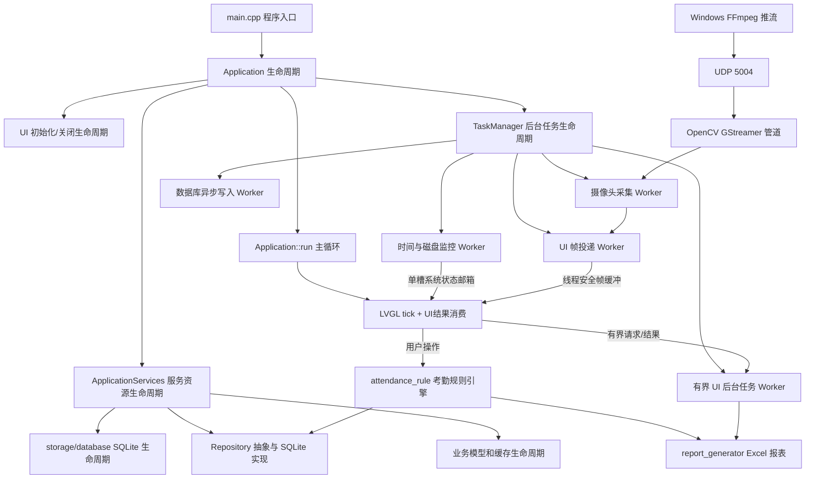

# SmartAttendance - 智能考勤系统

> 智能人脸考勤机软件层原型，当前仓库为 LVGL + SDL2 仿真版本。

---

## 项目简介

SmartAttendance 是一个智能人脸考勤机的软件层原型项目，当前仓库主要用于在 PC/WSL 环境下验证考勤机的软件功能、UI 交互、人脸识别流程、考勤规则和本地数据存储。

本项目使用 LVGL 构建嵌入式风格 GUI，使用 SDL2 在桌面环境中模拟屏幕与输入设备，使用 OpenCV 处理摄像头画面，使用 SQLite 保存员工、班次、排班和考勤记录，并通过 libxlsxwriter 导出 Excel 报表。

当前仓库不是最终直接烧录到 MPU 板子的完整工程。真实部署到考勤机硬件时，还需要补充板级硬件适配代码，并使用目标平台对应的交叉编译工具链编译后烧录到 MPU 板卡。

---

## 仓库定位

本仓库主要包含：

- LVGL 页面与交互逻辑
- 员工管理、考勤规则、记录查询、报表导出等业务逻辑
- SQLite 本地数据库封装
- OpenCV 人脸检测与 LBPH 识别流程
- SDL2 PC/WSL 仿真显示与输入
- Windows 摄像头推流到 WSL/Linux 的辅助脚本
- 稳定性测试和运行辅助脚本

本仓库不包含：

- MPU 目标板完整 BSP / SDK 工程
- LCD、摄像头、按键、GPIO 等真实硬件驱动适配代码
- 目标板交叉编译工具链配置
- 最终烧录镜像、板端启动脚本或部署包

---

## 功能模块

```text
智能考勤系统
├── 员工管理        -> 人脸注册 / 信息维护 / 删除
├── 考勤执行        -> 实时人脸识别 / 打卡记录
├── 考勤规则配置    -> 部门管理 / 班次设置 / 排班管理
├── 考勤记录查询    -> 按日期 / 按人员查询 / 明细导出
├── 考勤统计分析    -> 日报 / 月报 / 部门汇总 / Excel 导出
└── 系统设置        -> 设备信息 / 数据库管理 / 高级设置
```

---

## 技术栈

| 类别 | 当前仓库实现 |
|------|--------------|
| 开发语言 | C11 / C++17 |
| GUI 框架 | LVGL v9.4 |
| 显示与输入 | SDL2 仿真 |
| 字体渲染 | Freetype |
| 视频输入 | Windows FFmpeg RTP 推流 + OpenCV GStreamer 接收 |
| 人脸识别 | OpenCV 4 Haar + LBPHFaceRecognizer |
| 本地数据库 | SQLite 3 |
| 报表导出 | libxlsxwriter |
| 构建系统 | CMake 3.16+ |
| 线程支持 | POSIX Threads |
| 板端适配 | 预留接口，最终需替换 SDL/推流/输入等适配层 |

---

## 项目结构

```text
SmartAttendance/
├── CMakeLists.txt              # CMake 构建脚本
├── lv_conf.h                   # LVGL 图形库配置
├── env/
│   └── env.sh                  # 开发环境快捷命令脚本
├── libs/
│   └── lvgl/                   # LVGL 第三方库
├── src/
│   ├── main.cpp                # 程序入口（初始化 + 主循环）
│   ├── app/                    # 组合根、应用生命周期与后台任务所有权
│   ├── biometric/face/         # 人脸检测、预处理、LBPH识别与模型管理
│   ├── business/               # 业务层核心逻辑
│   │   ├── attendance_rule     # 考勤规则引擎（状态判定、迟到早退计算）
│   │   ├── auth_service        # 身份认证（登录、权限校验）
│   │   ├── face_capture_worker # 通过Camera/RTC HAL完成采集与识别任务
│   │   ├── face_punch_worker   # 识别结果到PunchService的有界异步边界
│   │   ├── face_demo           # 旧UI/C接口兼容门面
│   │   └── report_generator    # Excel 报表生成器
│   ├── services/               # 用例编排服务（员工查询、统一打卡）
│   ├── hal/                    # 摄像头、显示、键盘、时钟和存储的最小平台接口
│   ├── platform/pc/            # PC/WSL的SDL2、GStreamer、系统时钟和路径模拟实现
│   ├── storage/                # 数据库生命周期、Repository 抽象与 SQLite 实现
│   │   ├── database            # SQLite 初始化、Schema、播种和关闭
│   │   ├── repository/         # 员工、考勤、排班和配置抽象接口
│   │   └── sqlite/             # 按职责拆分的 SQLite DAO 与过渡适配器
│   ├── data/
│   │   └── db_storage.h        # 旧调用方兼容 API；不再承载 SQL 实现
│   └── ui/
│       ├── common/             # 通用组件（样式、控件、T9 键盘）
│       ├── managers/           # UI 管理器（页面跳转、按键组）
│       ├── screens/            # 各业务页面
│       │   ├── home/           # 待机主页（摄像头预览、时钟）
│       │   ├── menu/           # 九宫格主菜单
│       │   ├── user_mgmt/      # 员工管理
│       │   ├── record_query/   # 考勤记录查询
│       │   ├── att_stats/      # 考勤统计
│       │   ├── att_design/     # 考勤规则/排班设计
│       │   ├── system/         # 系统设置
│       │   └── sys_info/       # 系统信息
│       ├── ui_app              # UI 层入口（SDL 仿真初始化）
│       └── ui_controller       # UI 与业务/数据层桥接
├── docs/                       # 项目文档与产品资料
└── tools/                      # 辅助脚本
    ├── stream/                 # Windows 摄像头推流脚本
    │   ├── run.bat
    │   └── stream.ps1
    ├── stability_test.sh       # 1 小时稳定性测试
    ├── quick_stability_test.sh # 10 分钟快速测试
    ├── stress_test.sh          # 压力测试脚本
    └── analyze_stability.py    # 测试结果分析
```

---

## 环境依赖

### Linux / WSL 侧

推荐环境：

- Ubuntu 20.04 / 22.04
- 支持图形显示的桌面 Linux 或 WSLg 环境
- CMake 3.16+

安装依赖：

```bash
# 基础构建工具
sudo apt install cmake build-essential pkg-config

# SDL2 & Freetype（LVGL 仿真显示和字体渲染）
sudo apt install libsdl2-dev libfreetype-dev

# OpenCV 4（含人脸识别模块）
sudo apt install libopencv-dev

# SQLite 3
sudo apt install libsqlite3-dev

# libxlsxwriter（Excel 报表）
sudo apt install libxlsxwriter-dev

# GStreamer（OpenCV 通过 GStreamer 管道接收 RTP 视频流）
sudo apt install gstreamer1.0-tools \
                 gstreamer1.0-plugins-base \
                 gstreamer1.0-plugins-good \
                 gstreamer1.0-plugins-bad \
                 gstreamer1.0-libav
```

### Windows 推流侧

当前仿真版本的视频输入流程为：

```text
Windows 摄像头 -> FFmpeg/dshow -> RTP/UDP 5004 -> WSL/Linux -> OpenCV GStreamer -> 程序预览与识别
```

Windows 侧需要：

- 安装 FFmpeg
- 确保 `ffmpeg` 可以在 PowerShell 中直接执行
- 确认摄像头设备名称与 `tools/stream/stream.ps1` 中的 `$Device` 一致
- 确认 WSL 发行版名称与脚本中的 `$Distro` 一致，默认是 `Ubuntu-22.04`

---

## 快速开始

### 1. 克隆仓库

```bash
git clone https://github.com/<your-username>/SmartAttendance.git
cd SmartAttendance
```

### 2. 加载开发环境（可选）

```bash
source env/env.sh
```

加载后可用以下快捷命令：

| 命令 | 说明 |
|------|------|
| `m` 或 `make` | 编译项目（cmake + make） |
| `r` 或 `run` | 运行程序 |
| `cl` 或 `clean` | 清理构建目录 |
| `croot` | 回到项目根目录 |

### 3. 编译

```bash
cmake -S . -B build -DCMAKE_BUILD_TYPE=Debug -DSA_PLATFORM=pc
cmake --build build --parallel
ctest --test-dir build --output-on-failure
```

如果已经加载 `env/env.sh`，也可以在项目根目录直接执行：

```bash
m
```

### 4. 启动 Windows 摄像头推流

运行程序前，需要先在 Windows 侧启动摄像头推流。

在 Windows 中进入本仓库目录，执行：

```bat
tools\stream\run.bat
```

也可以手动执行 PowerShell 脚本：

```powershell
powershell -NoProfile -ExecutionPolicy Bypass -File tools\stream\stream.ps1
```

推流脚本默认配置：

| 配置项 | 默认值 |
|--------|--------|
| WSL 发行版 | `Ubuntu-22.04` |
| 摄像头名称 | `USB2.0 PC CAMERA` |
| 分辨率 | `640x480` |
| 帧率 | `30` |
| UDP 端口 | `5004` |

如果你的 WSL 发行版名称或摄像头名称不同，需要修改 `tools/stream/stream.ps1` 中的 `$Distro` 和 `$Device`。

### 5. 运行程序

在 Linux / WSL 侧执行：

```bash
cd build
./attendance_app
```

如果已经加载 `env/env.sh`，也可以在项目根目录直接执行：

```bash
r
```

> 注意：必须先启动 Windows 摄像头推流，再运行 `attendance_app`。否则 UI 可以启动，但摄像头预览和人脸识别会等待 UDP 5004 视频流。

首次运行会在可执行文件同级的 `runtime/` 目录中创建 `attendance.db` 数据库，并写入默认部门、班次和系统配置数据。使用标准构建目录时，无论从仓库根目录还是 `build/` 目录启动，运行文件都统一位于 `build/runtime/`。

---

## 运行时生成文件

程序运行过程中会在工作目录下生成一些本地数据文件：

| 路径 | 说明 |
|------|------|
| `build/runtime/attendance.db` | SQLite 本地数据库 |
| `build/runtime/face_model.xml` | OpenCV LBPH 人脸识别模型 |
| `build/runtime/captured_images/` | 打卡抓拍图片 |
| `build/runtime/registered_avatars/` | 员工注册头像 |
| `build/runtime/output/usb_sim/` | 模拟U盘的报表导出目录 |
| `build/runtime/output/usb_settings/` | 模拟U盘的员工设置表导入/导出目录 |

这些文件用于本地仿真和调试，不属于板端烧录工程。

---

## 考勤规则说明

系统按考勤机业务规则实现考勤状态计算，主要包括：

1. **无排班**：判定为未排班
2. **有排班、无打卡**：判定为旷工
3. **打卡点归属**：根据打卡时间与考勤点的接近程度判定归属
4. **多重记录处理**：上班点取最早记录，下班点取最晚记录
5. **状态判定**：正常 / 迟到 / 早退 / 未打卡

当前仓库实现的是软件层规则逻辑，真实硬件上的时间源、存储路径、外设输入等还需要在板端适配阶段确认。

---

## U 盘导入导出仿真

当前 PC/WSL 仿真版本使用本地目录模拟 U 盘导入导出流程：

- 考勤报表导出目录：`build/runtime/output/usb_sim/`
- 员工设置表目录：`build/runtime/output/usb_settings/`
- 员工设置表文件名：`员工设置表.xlsx`

基本流程：

1. 在设备菜单中导出员工设置表，程序会生成 `build/runtime/output/usb_settings/员工设置表.xlsx`
2. 在电脑中填写或修改员工、部门、班次与排班信息
3. 将修改后的 `员工设置表.xlsx` 放回 `build/runtime/output/usb_settings/`
4. 在程序菜单中执行上传，导入数据库

时间格式要求：`HH:MM`，使用英文冒号，范围为 `00:00` 到 `23:59`，不要包含前导空格。

---

## 稳定性测试

```bash
cd build

# 快速测试（10 分钟）
make quick_stability_test

# 完整稳定性测试（1 小时）
make stability_test

# 分析测试结果
make analyze_stability
```

稳定性测试会启动 `attendance_app` 并监控运行时间、进程状态、内存占用和 CPU 占用。测试期间仍然建议先启动 Windows 推流，避免摄像头输入一直处于等待状态。

---

## 架构设计


```mermaid
graph TD
    A[main.cpp 程序入口] --> B[Application 生命周期]
    B --> AS[ApplicationServices 服务资源生命周期]
    AS --> C[storage/database SQLite 生命周期]
    AS --> P[Repository 抽象与 SQLite 实现]
    AS --> S[业务模型和缓存生命周期]
    B --> D[UI 初始化/关闭生命周期]
    B --> E[TaskManager 后台任务生命周期]
    B --> F[Application::run 主循环]

    F --> R[LVGL tick + UI结果消费]
    E --> G[时间与磁盘监控 Worker]
    E --> H[有界 UI 后台任务 Worker]
    E --> I[UI 帧投递 Worker]
    E --> J[摄像头采集 Worker]
    E --> K[数据库异步写入 Worker]

    L[Windows FFmpeg 推流] --> M[UDP 5004]
    M --> N[OpenCV GStreamer 管道]
    N --> J
    J --> I

    G -->|单槽系统状态邮箱| R
    I -->|线程安全帧缓冲| R
    R -->|有界请求/结果| H
    R -->|用户操作| O[attendance_rule 考勤规则引擎]
    O --> P
    O --> Q[report_generator Excel 报表]
    H --> Q
```

---

## 真实硬件部署说明

当前仓库主要用于软件功能验证和 UI 仿真。若要部署到真实 MPU 考勤机板卡，需要完成以下适配工作：

1. 替换 SDL2 显示后端，接入目标板 LCD / framebuffer / DRM 显示驱动。
2. 替换 Windows RTP 推流输入，接入目标板真实摄像头驱动，如 V4L2、MIPI CSI 或厂商 SDK。
3. 替换或启用真实按键、矩阵键盘、GPIO 输入适配层。
4. 根据目标板工具链修改 CMake 交叉编译配置。
5. 将 SQLite 数据库、抓拍图片、模型文件和导出目录映射到板端实际存储路径。
6. 完成板端性能、稳定性和外设联调后，再生成烧录镜像或应用包。

因此，本仓库不是最终烧录到板子的完整代码，而是考勤机软件部分的仿真开发版本。

---

## 许可证

本项目仅用于学习与研究目的。
